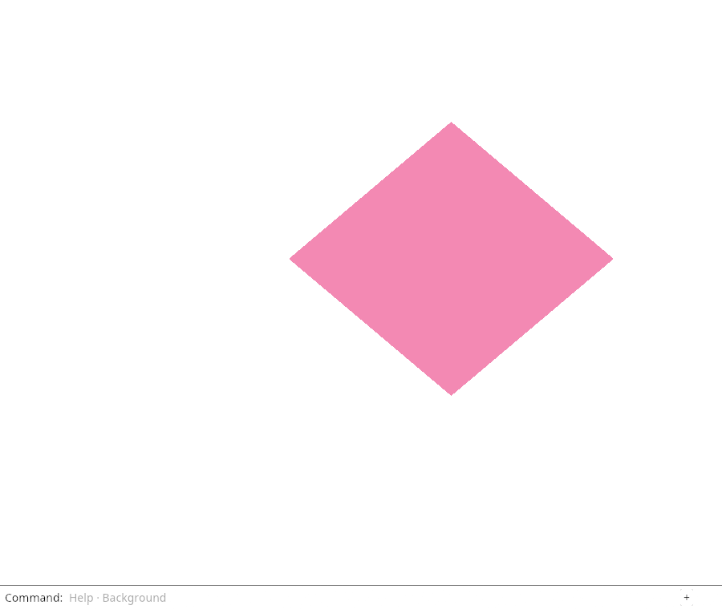
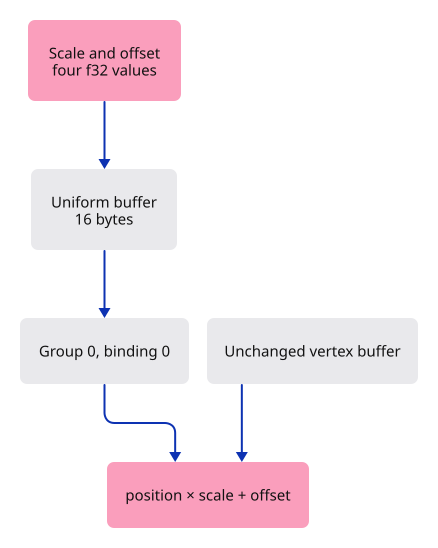

# 07 · Send one view setting to every corner

**Typing: 16–32 minutes.** [Estimate](typing-load.md).

Move the diamond by uploading one setting shared by all its vertices. Four floats describe horizontal and vertical scale and offset. The shader applies `position * scale + offset`.

A uniform buffer stores the values. Its bind group connects that buffer to shader group 0, binding 0. Derive this small pipeline's layout from the shader, then use its group layout when creating the bind group.

## Type

Continue from [Share a corner between triangles](06-indices.md). [Save or recover your work](recovery.md).

### 1. `src/triangle.wgsl`

Declare the uniform resource before the vertex function. Its group and binding identify a resource slot.

<details>
<summary>Locate the existing block</summary>

```wgsl
@vertex
```

</details>

Replace that block with:

```wgsl
--8<-- "journey/code/07-uniforms-01.wgsl"
```

### 2. `src/triangle.wgsl`

Use the first pair as scale and the second pair as offset. The swizzles xy and zw select those pairs.

<details>
<summary>Locate the existing block</summary>

```wgsl
    return vec4<f32>(position, 0.0, 1.0);
```

</details>

Replace that block with:

```wgsl
--8<-- "journey/code/07-uniforms-02.wgsl"
```

### 3. `src/renderer.rs`

Retain the uniform buffer and bind group.

<details>
<summary>Locate the existing block</summary>

```rust
    pipeline: wgpu::RenderPipeline,
    vertices: wgpu::Buffer,
    indices: wgpu::Buffer,
}

impl Renderer {
```

</details>

Replace that block with:

```rust
--8<-- "journey/code/07-uniforms-fullscreen-6.rs"
```

### 4. `src/renderer.rs`

Allocate the uniform buffer and bind it at the shader’s resource slot.

<details>
<summary>Locate the existing block</summary>

```rust
            multiview_mask: None,
            cache: None,
        });
        Self { device, queue, pipeline, vertices, indices }
    }

    pub fn draw(&self, view: &wgpu::TextureView, background: &crate::background::Background) {
        let [r, g, b] = background.rgb();
        let mut encoder = self.device.create_command_encoder(&Default::default());
        {
```

</details>

Replace that block with:

```rust
--8<-- "journey/code/07-uniforms-fullscreen-7.rs"
```

### 5. `src/renderer.rs`

Bind the view settings before drawing.

<details>
<summary>Locate the existing block</summary>

```rust
                ..Default::default()
            });
            pass.set_pipeline(&self.pipeline);
            pass.set_vertex_buffer(0, self.vertices.slice(..));
            pass.set_index_buffer(self.indices.slice(..), wgpu::IndexFormat::Uint16);
            pass.draw_indexed(0..INDICES.len() as u32, 0, 0..1);
```

</details>

Replace that block with:

```rust
--8<-- "journey/code/07-uniforms-fullscreen-8.rs"
```

### 6. `src/browser.rs`

Set the initial scale and translation for presentation.

<details>
<summary>Locate the existing block</summary>

```rust
    );
    panel.update(None, &canvas)?;
    let mut background = Background::default();
    present(&surface, &renderer, &background, &mut panel)?;
    let input_canvas = canvas.clone();
    let click = Closure::<dyn FnMut(web_sys::Event)>::new(move |event: web_sys::Event| {
        let line = match panel.update(Some(&event), &input_canvas) {
```

</details>

Replace that block with:

```rust
--8<-- "journey/code/07-uniforms-window-1.rs"
```

### 7. `src/browser.rs`

Redraw with the same transform after a command.

<details>
<summary>Locate the existing block</summary>

```rust
            report(&format!("Cannot lay out commands: {error:?}"));
            return;
        }
        if let Err(error) = present(&surface, &renderer, &background, &mut panel) {
            report(&format!("Cannot redraw: {error:?}"));
        }
    });
```

</details>

Replace that block with:

```rust
--8<-- "journey/code/07-uniforms-window-2.rs"
```

### 8. `src/browser.rs`

Report the shared view setting.

<details>
<summary>Locate the existing block</summary>

```rust
    )?;
    // The page has one listener for its lifetime; JavaScript must retain the Rust callback.
    click.forget();
    report("Four shared corners make two triangles.");
    Ok(())
}
```

</details>

Replace that block with:

```rust
--8<-- "journey/code/07-uniforms-window-3.rs"
```

### 9. `src/browser.rs`

Accept the transform at the presentation boundary.

<details>
<summary>Locate the existing block</summary>

```rust
    surface: &wgpu::Surface<'_>,
    renderer: &Renderer,
    background: &Background,
    panel: &mut crate::panel::Panel,
) -> Result<(), JsValue> {
    let frame = match surface.get_current_texture() {
```

</details>

Replace that block with:

```rust
--8<-- "journey/code/07-uniforms-window-4.rs"
```

### 10. `src/browser.rs`

Pass the transform to the renderer.

<details>
<summary>Locate the existing block</summary>

```rust
        format: Some(frame.texture.format().add_srgb_suffix()),
        ..Default::default()
    });
    renderer.draw(&view, background);
    panel.draw(renderer, &view);
    frame.present();
    Ok(())
```

</details>

Replace that block with:

```rust
--8<-- "journey/code/07-uniforms-window-5.rs"
```

## Run and check

In your project:

```sh
cd workspace/journey
cargo build --lib --locked --target wasm32-unknown-unknown -j4
CARGO_BUILD_JOBS=4 trunk serve --port 8780
```

Open `http://127.0.0.1:8780/`. Keep an existing Trunk server running; saving rebuilds it.

Change the uniform’s scale or offset, save, and compare the diamond. Its stored vertex positions stay unchanged. Restore the original uniform.

**Verified checkpoint in Chrome.**



[Verification scope](release.md).

<details>
<summary>Code explanation and diagram</summary>

A WGSL `vec4<f32>` requires 16 bytes with 16-byte alignment. Four Rust floats starting at byte zero match it. Larger structures will need explicit padding checks.

`UNIFORM` permits shader reads; `COPY_DST` permits uploads. `write_buffer` schedules new values before the next submission. Changing the view therefore keeps both the geometry buffer and pipeline.

View values → uniform buffer → bind group 0 → shader binding 0 → transformed position.



If the diamond moves, must its position buffer have changed?

No. The position buffer still contains the same four corners. A separate uniform supplies scale and offset. Every vertex invocation reads those shared values and transforms its corner before the GPU decides which pixels are covered.

Study estimate, including typing and experiments: 2–3 hours.

</details>

<details>
<summary>Optional experiment</summary>

Predict the result of changing only the first scale from 0.75 to 0.25. The diamond should become narrower without becoming shorter. Then restore it and set the horizontal offset to -0.25: the diamond moves left. Explain why neither experiment edits POSITIONS or INDICES.

</details>

<details>
<summary>Check and save your work</summary>

Restore experimental edits, then run from `session_viewer`:

```sh
npm --prefix ../session_tests run course -- check 07-uniforms
npm --prefix ../session_tests run course -- save 07-uniforms
```

Source comparison leaves your project untouched. [Save and recovery instructions](recovery.md).

</details>

<details>
<summary>Viewer coverage and verification</summary>

The full viewer sends camera and viewport information through frame uniforms. This is the same boundary: application state calculates values; the renderer uploads them; shaders use them while drawing unchanged geometry.


[Full validation scope](release.md).

</details>
