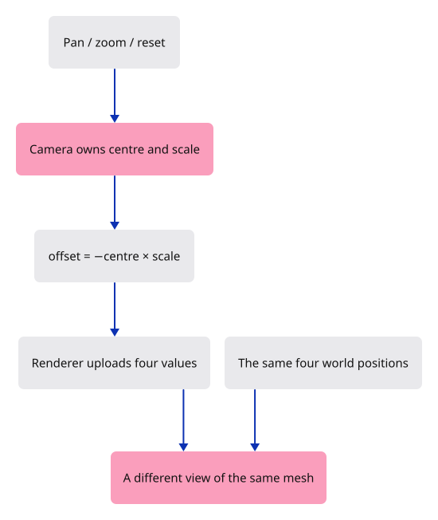
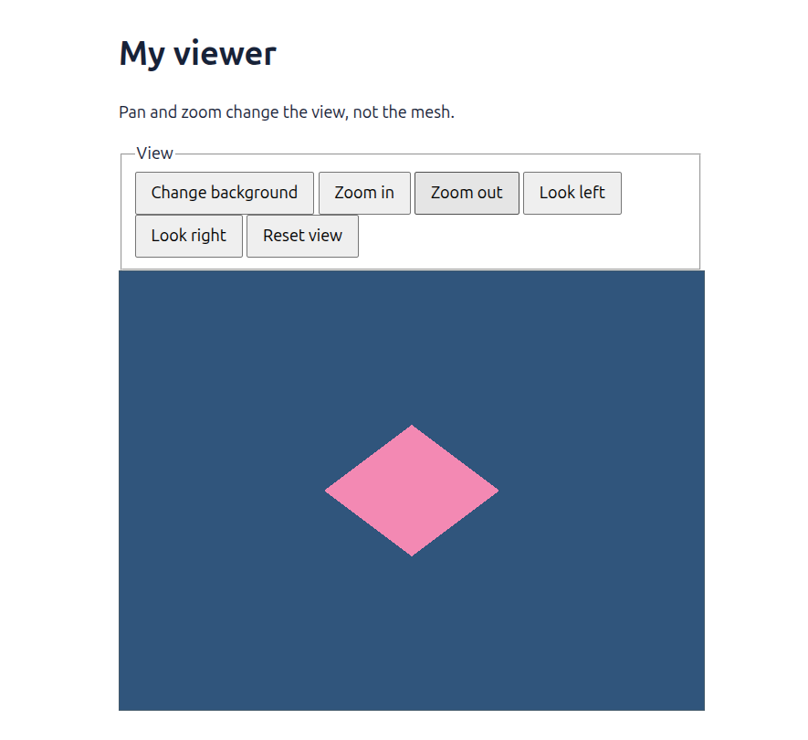

# 08 · Move the view, keep the geometry

**Plan about 2–3 hours.** 91 lines to type, including comments and blank lines. Allow time to read, predict and experiment; this is an estimate, not a deadline.

**Today:** Pan, zoom and reset a flat view through camera state.

**In the whole viewer:** Connect the browser, drawing and input, then extend the same project. [See the destination](../journey.md#the-destination).

**Follow:** Button → camera centre or scale → four uniform values → existing renderer → unchanged mesh in a different view.

**Before you finish, explain:** When the camera centre moves right, why does the diamond move left on the screen?

Place a drawing under a small window cut in a sheet of paper. Slide the window right. The drawing appears to move left inside it, although the drawing stayed on the table. A camera changes the place from which we see the scene.

We begin with a flat view so that one subtraction explains pan. `Camera.center` says which world point appears at the middle of the picture. `scale` says how large distances appear. The camera converts those choices into the four uniform values we already know how to upload.



Follow the formula: `(position - center) * scale`. Our shader already accepts `position * scale + offset`, so the camera supplies `offset = -center * scale`. A centre of 0.25 and scale of 2 produce an offset of -0.5. The world point 0.25 then appears at screen x = 0, exactly where it should.

The first edit adds several buttons inside one disabled `fieldset`. Once setup succeeds, enabling that fieldset enables all its controls. Their click events bubble to a single listener. That listener owns the background, camera, renderer and surface; we do not need several callbacks sharing mutable camera data.

The listener inspects the clicked element's id, changes the appropriate state, and requests a frame. An unrecognised target does nothing. The renderer still accepts four numbers rather than a browser element or a Camera: it has no reason to know how the user chose this view.

Two tests protect the meaning of that state. One proves that the point we look at remains at the centre after zooming. The other keeps zoom positive and bounded, including invalid input. These checks exercise the camera without creating a window or opening a GPU.

## Type the change

Continue [Send one view setting to every corner](07-uniforms.md). From `session_viewer`, save your files with `npm --prefix ../session_tests run course -- save before-08-camera`. A save keeps your own work; it does not fill in the next lesson.

### 1. `index.html`

Replace the single button with a labelled group of controls. Native buttons also support keyboard activation.

Find this exact block:

```html
  <button id="background" type="button" disabled>Change background</button>
```

Replace that block with:

```html
--8<-- "journey/code/08-camera-01.html"
```

### 2. `src/camera.rs`

Create the camera state and its two tests. There are no browser or wgpu types in this file.

Create the file and type:

```rust
--8<-- "journey/code/08-camera-02.rs"
```

### 3. `src/lib.rs`

Register the camera module so the browser and native tests can use it.

Find this exact block:

```rust
pub mod background;
```

Replace that block with:

```rust
--8<-- "journey/code/08-camera-03.rs"
```

### 4. `src/browser.rs`

Bring the camera type into the browser coordinator.

Find this exact block:

```rust
use crate::background::Background;
```

Replace that block with:

```rust
--8<-- "journey/code/08-camera-04.rs"
```

### 5. `src/browser.rs`

Replace the fixed transform and single-button listener with camera state and one listener for the group.

Find this exact block:

```rust
    let mut background = Background::default();
    let transform = [0.75, 0.75, 0.25, 0.15];
    present(&surface, &renderer, &background, &transform)?;
    let button = document.get_element_by_id("background").ok_or("Missing button")?;
    let click = Closure::<dyn FnMut(web_sys::Event)>::new(move |_| {
        background.toggle();
        if let Err(error) = present(&surface, &renderer, &background, &transform) {
            report(&format!("Cannot redraw: {error:?}"));
        }
    });
    button.add_event_listener_with_callback("click", click.as_ref().unchecked_ref())?;
    button.remove_attribute("disabled")?;
```

Replace that block with:

```rust
--8<-- "journey/code/08-camera-05.rs"
```

### 6. `src/browser.rs`

Show which interaction is now available.

Find this exact block:

```rust
    report("One view setting moves all four corners.");
```

Replace that block with:

```rust
--8<-- "journey/code/08-camera-06.rs"
```

## Run and look

From `session_viewer`, enter your project folder:

```sh
cd workspace/journey
cargo build --lib --locked --target wasm32-unknown-unknown -j4
CARGO_BUILD_JOBS=4 trunk serve --port 8780
```

Open `http://127.0.0.1:8780/`. If Trunk is already running in this project, leave it running; it rebuilds when you save.

The page starts with the centred diamond. Zoom out makes it smaller. Look right moves it left; look left brings it back. Reset view restores the camera and leaves your background choice alone.

**Actual Chrome screenshot.**



*Captured from this checkpoint’s browser bundle after its browser checks passed. [Check scope and environment](release.md).*

Run the state checks from your project folder:

```sh
cargo test --lib --locked -j4
```

## Try one small experiment

Zoom out once, look right once, then look left once. Predict what Reset view will change. Now change the background and reset again: the background should stay as you chose it. This checks that camera state and background state have separate responsibilities.

## Explain it in your own words

Trace the values through the files without reading the answer first. If you lose the connection, stop at the last value you can follow.

<details>
<summary>Compare your explanation</summary>

The shader receives an offset equal to minus the camera centre times the scale. It therefore draws each world position relative to the camera centre. Looking farther right places the stationary diamond farther left in our view; its stored positions have not moved.

</details>

## Keep your working result

Return to `session_viewer` in a second terminal. Restore experimental edits before comparing:

```sh
npm --prefix ../session_tests run course -- check 08-camera
npm --prefix ../session_tests run course -- save 08-camera
```

The comparison spots typing differences; it does not prove behaviour. Keep three notes: what I changed; the values I followed; the question I still have. [Recover a checkpoint](recovery.md) if an experiment gets tangled.

## Where this grows

A full 3D camera also owns a target and a viewing scale or distance. Its orientation and projection add the third dimension. We will extend this view model before connecting orbit gestures, while preserving the separation between camera state, document geometry and GPU resources.

[Validation status and course release](release.md).
