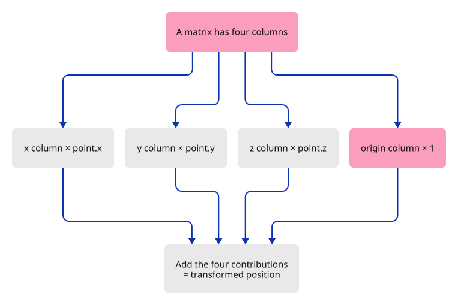
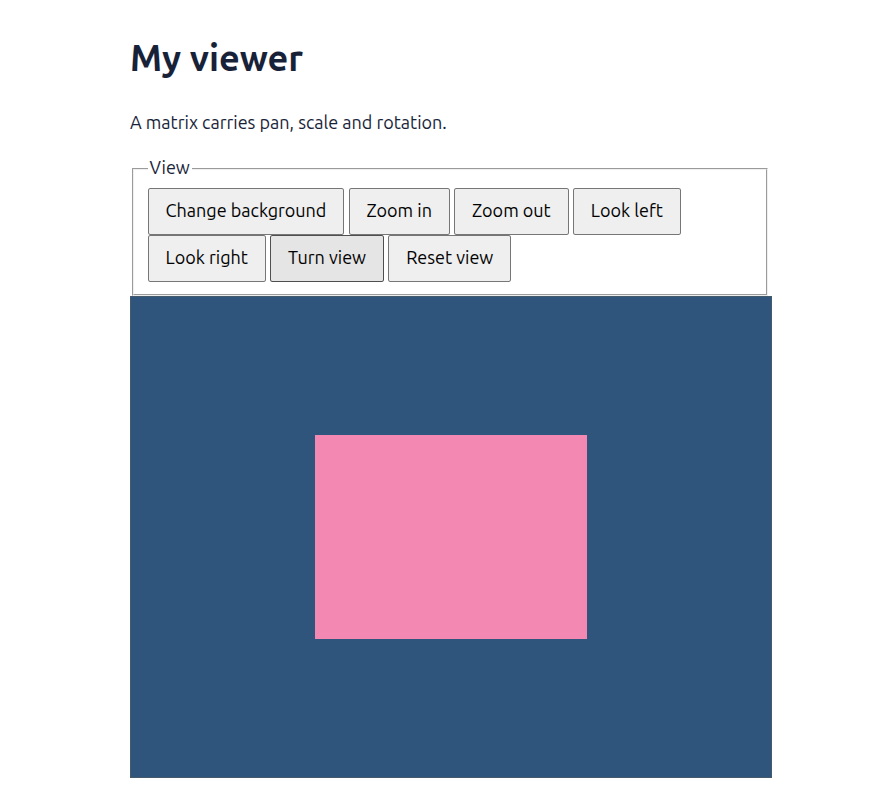

# 09 · Let one matrix describe the view

**Plan about 2–4 hours.** 33 lines to type, including comments and blank lines. Allow time to read, predict and experiment; this is an estimate, not a deadline.

**Today:** Rotate the flat view using a matrix, ready for the third dimension.

**In the whole viewer:** Connect the browser, drawing and input, then extend the same project. [See the destination](../journey.md#the-destination).

**Follow:** Camera centre, angle and scale → four matrix columns → uniform buffer → matrix × world position.

**Before you finish, explain:** Which matrix column moves a point, and why does its input position end with a 1?

Scale and offset described our flat view, but they cannot turn it. A matrix gives us one consistent way to combine those operations. We will use the same kind of matrix for a 3D camera later.

Do not try to memorise sixteen numbers. Read the four columns as four answers: where does one step along x go, where does one step along y go, where does one step along z go, and where does the origin go? A point combines those answers with its x, y, z and final 1.



Our scene is still flat, so z stays unchanged. Turning the camera by angle θ turns the scene by −θ. Write `a = scale × cos(θ)` and `b = scale × sin(θ)`. A world point then appears at `(a×x + b×y, −b×x + a×y)`, before accounting for the camera centre.

The centre must still land at the middle of the picture. That gives the fourth column: subtract the rotated, scaled centre. This is why translation uses both a and b. Merely appending the old offset would be wrong after rotation.

WGSL stores these columns consecutively. Four `vec4<f32>` columns take 64 bytes. Rust supplies those same sixteen floats, column by column. The shader now multiplies the matrix by a four-component position; it no longer knows the separate pan, rotation and scale formula.

A full turn is 2π radians. `FRAC_PI_4` means π/4, or 45 degrees. The camera test now includes a rotation, so a mistaken translation column cannot hide behind an angle of zero.

## Type the change

Continue [Move the view, keep the geometry](08-camera.md). From `session_viewer`, save your files with `npm --prefix ../session_tests run course -- save before-09-matrices`. A save keeps your own work; it does not fill in the next lesson.

### 1. `src/camera.rs`

Keep the viewing angle in radians beside the centre and scale.

Find this exact block:

```rust
    pub scale: f32,
```

Replace that block with:

```rust
--8<-- "journey/code/09-matrices-01.rs"
```

### 2. `src/camera.rs`

Start without rotation and make Reset view restore that angle.

Find this exact block:

```rust
        Self { center: [0.0, 0.0], scale: 1.0 }
```

Replace that block with:

```rust
--8<-- "journey/code/09-matrices-02.rs"
```

### 3. `src/camera.rs`

Replace the four-number uniform with a column-major matrix and add rotation.

Find this exact block:

```rust
    pub fn uniform(&self) -> [f32; 4] {
        // Subtract the camera centre before scaling the world position.
        [self.scale, self.scale, -self.center[0] * self.scale, -self.center[1] * self.scale]
    }
```

Replace that block with:

```rust
--8<-- "journey/code/09-matrices-03.rs"
```

### 4. `src/camera.rs`

Strengthen the camera test: its target must stay centred after both zooming and rotation.

Find this exact block:

```rust
        let [sx, sy, ox, oy] = camera.uniform();
        assert_eq!(camera.center[0] * sx + ox, 0.0);
        assert_eq!(camera.center[1] * sy + oy, 0.0);
```

Replace that block with:

```rust
--8<-- "journey/code/09-matrices-04.rs"
```

### 5. `src/triangle.wgsl`

Change the resource type to four columns of four floats.

Find this exact block:

```wgsl
var<uniform> transform: vec4<f32>;
```

Replace that block with:

```wgsl
--8<-- "journey/code/09-matrices-05.wgsl"
```

### 6. `src/triangle.wgsl`

Multiply a world position by the matrix. Its final component 1 lets the translation column contribute.

Find this exact block:

```wgsl
    return vec4<f32>(position * transform.xy + transform.zw, 0.0, 1.0);
```

Replace that block with:

```wgsl
--8<-- "journey/code/09-matrices-06.wgsl"
```

### 7. `src/renderer.rs`

Allocate enough space for all sixteen floats. A smaller buffer would violate the shader binding layout.

Find this exact block:

```rust
            size: 16,
```

Replace that block with:

```rust
--8<-- "journey/code/09-matrices-07.rs"
```

### 8. `src/renderer.rs`

Accept the complete matrix for upload. The existing byte conversion handles all sixteen entries.

Find this exact block:

```rust
        transform: &[f32; 4],
```

Replace that block with:

```rust
--8<-- "journey/code/09-matrices-08.rs"
```

### 9. `src/browser.rs`

Forward the complete matrix when presenting a frame.

Find this exact block:

```rust
    transform: &[f32; 4],
```

Replace that block with:

```rust
--8<-- "journey/code/09-matrices-09.rs"
```

### 10. `index.html`

Add one button to the existing event group.

Find this exact block:

```html
    <button id="reset" type="button">Reset view</button>
```

Replace that block with:

```html
--8<-- "journey/code/09-matrices-10.html"
```

### 11. `src/browser.rs`

Connect that button to the camera angle. The next present call already uploads the new matrix.

Find this exact block:

```rust
            "reset" => camera = Camera::default(),
```

Replace that block with:

```rust
--8<-- "journey/code/09-matrices-11.rs"
```

### 12. `src/browser.rs`

Describe the new camera capability.

Find this exact block:

```rust
    report("Pan and zoom change the view, not the mesh.");
```

Replace that block with:

```rust
--8<-- "journey/code/09-matrices-12.rs"
```

## Run and look

From `session_viewer`, enter your project folder:

```sh
cd workspace/journey
cargo build --lib --locked --target wasm32-unknown-unknown -j4
CARGO_BUILD_JOBS=4 trunk serve --port 8780
```

Open `http://127.0.0.1:8780/`. If Trunk is already running in this project, leave it running; it rebuilds when you save.

The Turn view button rotates the diamond by 45 degrees per click. After one click it appears as a rectangle aligned with the screen. Pan, zoom and reset still work; reset also clears the angle.

**Actual Chrome screenshot.**



*Captured from this checkpoint’s browser bundle after its browser checks passed. [Check scope and environment](release.md).*

Run the state checks from your project folder:

```sh
cargo test --lib --locked -j4
```

## Try one small experiment

Look right, then turn the view. Predict where the origin will appear before you run it. Reset, turn twice, and locate the original right-hand corner: a 90-degree camera turn places it below the centre. The position buffer must remain unchanged throughout.

## Explain it in your own words

Trace the values through the files without reading the answer first. If you lose the connection, stop at the last value you can follow.

<details>
<summary>Compare your explanation</summary>

The fourth column contains translation. Multiplication adds that column multiplied by the input’s last component. A position ends with 1, so translation affects it. A direction would end with 0, so translation would not move it. The first three columns describe how the coordinate axes are transformed.

</details>

## Keep your working result

Return to `session_viewer` in a second terminal. Restore experimental edits before comparing:

```sh
npm --prefix ../session_tests run course -- check 09-matrices
npm --prefix ../session_tests run course -- save 09-matrices
```

The comparison spots typing differences; it does not prove behaviour. Keep three notes: what I changed; the values I followed; the question I still have. [Recover a checkpoint](recovery.md) if an experiment gets tangled.

## Where this grows

Frame uniforms in the complete renderer carry view and projection matrices. Reading a matrix as transformed axes plus an origin helps diagnose a transposed upload, a wrong multiplication order or geometry that drifts while orbiting.

[Validation status and course release](release.md).
