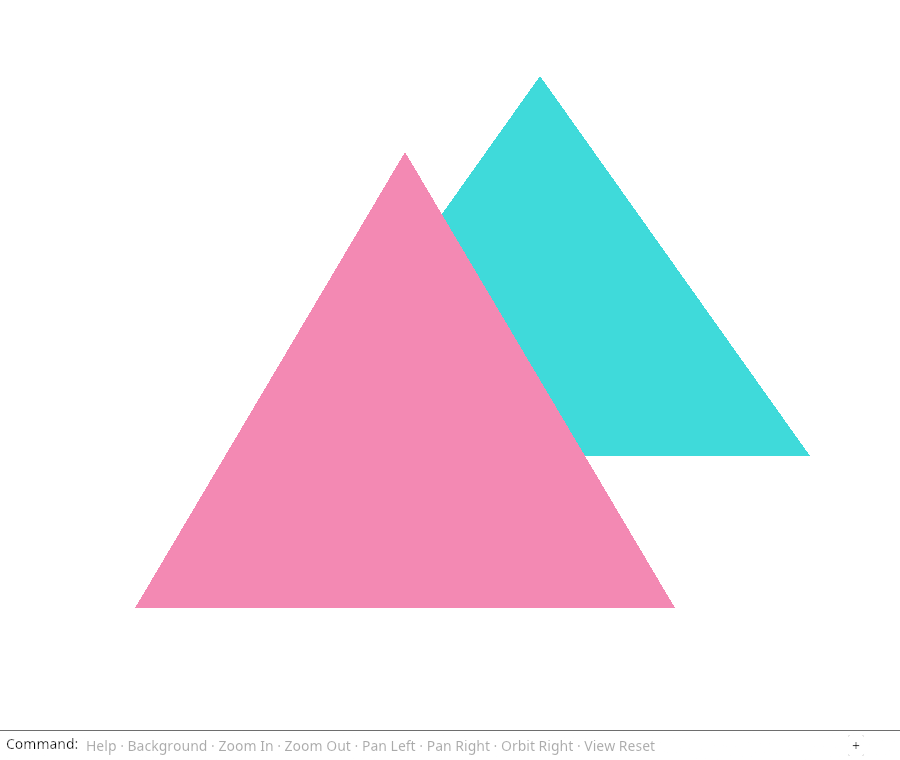
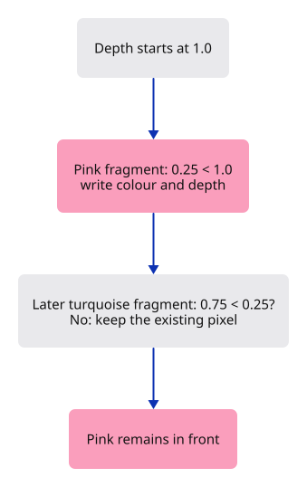

# 10 · Keep the nearest surface

**Typing: 28–56 minutes.** [Estimate](typing-load.md).

Keep the nearer triangle even when the farther triangle is drawn last. Give pink depth 0.25 and turquoise depth 0.75; draw pink first.

Attach a depth texture alongside colour. Clear depth to 1 and use `Less` with depth writes: a fragment passes only when it is nearer than the stored depth. Its dimensions and sample count must match the colour image.

## Type

Continue from [Let one matrix describe the view](09-matrices.md). [Save or recover your work](recovery.md).

### 1. `src/triangle.wgsl`

Pass transformed 3D positions and vertex colours to the rasterizer. The fragment function uses the interpolated colour.

<details>
<summary>Locate the existing block</summary>

```wgsl
@group(0) @binding(0) var<uniform> transform: mat4x4<f32>;

@vertex
fn vertex(@location(0) position: vec2<f32>) -> @builtin(position) vec4<f32> {
    return transform * vec4<f32>(position, 0.0, 1.0);
}

@fragment
fn fragment() -> @location(0) vec4<f32> {
    return vec4<f32>(0.9, 0.25, 0.45, 1.0);
}
```

</details>

Replace that block with:

```wgsl
--8<-- "journey/code/10-depth-09.wgsl"
```

### 2. `src/renderer.rs`

Replace the flat diamond with two coloured triangles at different depths.

<details>
<summary>Locate the existing block</summary>

```rust
use wgpu::util::DeviceExt;

const POSITIONS: [[f32; 2]; 4] = [
    [-0.6, 0.0], [0.0, -0.6], [0.6, 0.0], [0.0, 0.6],
];
const INDICES: [u16; 6] = [0, 1, 2, 0, 2, 3];

pub struct Renderer {
    pub device: wgpu::Device,
```

</details>

Replace that block with:

```rust
--8<-- "journey/code/10-depth-fullscreen-3.rs"
```

### 3. `src/renderer.rs`

Replace the flat diamond with two coloured triangles at different depths.

<details>
<summary>Locate the existing block</summary>

```rust
    indices: wgpu::Buffer,
    uniform: wgpu::Buffer,
    view_group: wgpu::BindGroup,
}

impl Renderer {
    pub fn new(device: wgpu::Device, queue: wgpu::Queue, format: wgpu::TextureFormat) -> Self {
        let bytes: Vec<u8> = POSITIONS.iter().flatten()
            .flat_map(|value| value.to_ne_bytes()).collect();
        let vertices = device.create_buffer_init(&wgpu::util::BufferInitDescriptor {
            label: Some("rectangle positions"),
```

</details>

Replace that block with:

```rust
--8<-- "journey/code/10-depth-fullscreen-4.rs"
```

### 4. `src/renderer.rs`

Replace the flat diamond with two coloured triangles at different depths.

<details>
<summary>Locate the existing block</summary>

```rust
                entry_point: Some("vertex"),
                compilation_options: Default::default(),
                buffers: &[wgpu::VertexBufferLayout {
                    array_stride: 8,
                    step_mode: wgpu::VertexStepMode::Vertex,
                    attributes: &wgpu::vertex_attr_array![0 => Float32x2],
                }],
            },
            fragment: Some(wgpu::FragmentState {
```

</details>

Replace that block with:

```rust
--8<-- "journey/code/10-depth-fullscreen-5.rs"
```

### 5. `src/renderer.rs`

Replace the flat diamond with two coloured triangles at different depths.

<details>
<summary>Locate the existing block</summary>

```rust
                targets: &[Some(format.into())],
            }),
            primitive: Default::default(),
            depth_stencil: None,
            multisample: Default::default(),
            multiview_mask: None,
            cache: None,
```

</details>

Replace that block with:

```rust
--8<-- "journey/code/10-depth-fullscreen-6.rs"
```

### 6. `src/renderer.rs`

Replace the flat diamond with two coloured triangles at different depths.

<details>
<summary>Locate the existing block</summary>

```rust
                resource: uniform.as_entire_binding(),
            }],
        });
        Self { device, queue, pipeline, vertices, indices, uniform, view_group }
    }

    pub fn draw(
```

</details>

Replace that block with:

```rust
--8<-- "journey/code/10-depth-fullscreen-7.rs"
```

### 7. `src/renderer.rs`

Replace the flat diamond with two coloured triangles at different depths.

<details>
<summary>Locate the existing block</summary>

```rust
            // The pass borrows the encoder. This scope ends that borrow before finish takes it.
            let mut pass = encoder.begin_render_pass(&wgpu::RenderPassDescriptor {
                label: Some("canvas"),
                color_attachments: &[Some(wgpu::RenderPassColorAttachment {
                    view,
                    depth_slice: None,
```

</details>

Replace that block with:

```rust
--8<-- "journey/code/10-depth-fullscreen-8.rs"
```

### 8. `src/browser.rs`

Allocate depth storage at the canvas size.

<details>
<summary>Locate the existing block</summary>

```rust
        .ok_or("No compatible surface format")?;
    config.view_formats = vec![config.format.add_srgb_suffix()];
    surface.configure(&device, &config);
    let renderer = Renderer::new(device, queue, config.format.add_srgb_suffix());
    let mut panel = crate::panel::Panel::new(
        &renderer,
        config.format.add_srgb_suffix(),
```

</details>

Replace that block with:

```rust
--8<-- "journey/code/10-depth-window-1.rs"
```

### 9. `src/browser.rs`

Report which triangle wins the overlap.

<details>
<summary>Locate the existing block</summary>

```rust
    )?;
    // The page has one listener for its lifetime; JavaScript must retain the Rust callback.
    click.forget();
    report("A matrix carries pan, scale and rotation.");
    Ok(())
}
```

</details>

Replace that block with:

```rust
--8<-- "journey/code/10-depth-window-2.rs"
```

## Run and check

In your project:

```sh
cd workspace/journey
cargo build --lib --locked --target wasm32-unknown-unknown -j4
CARGO_BUILD_JOBS=4 trunk serve --port 8780
```

Open `http://127.0.0.1:8780/`. Keep an existing Trunk server running; saving rebuilds it.

Look at the overlapping triangles. The nearer triangle must cover the farther one even though it is drawn first. Reverse their draw order: the overlap should stay the same. Restore the order.

**Verified checkpoint in Chrome.**



[Verification scope](release.md).

Run the state checks from your project folder:

```sh
cargo test --lib --locked -j4
```

<details>
<summary>Code explanation and diagram</summary>

A vertex now contains position and colour: six `f32` values, 24 bytes. Shader locations 0 and 1 read those two groups. The vertex shader passes colour to the fragment shader.

The browser supplies the startup dimensions to `renderer.resize`. Later resize handling updates both attachments. This depth rule handles opaque visibility; transparency comes later.

Vertex z → transformed depth → depth comparison → colour written only for the nearer fragment.



Why is it not enough to draw the far triangle first?

A particular draw order might work for these two flat triangles, but a real scene can overlap differently from each viewpoint. A depth attachment remembers the nearest depth at each pixel. The comparison chooses visibility there, so drawing an opaque farther surface later does not cover a nearer one.

Study estimate, including typing and experiments: 2–4 hours.

</details>

<details>
<summary>Optional experiment</summary>

Temporarily change the near triangle’s three z values from 0.25 to 0.9. Predict which colour will appear at the shared centre. Turquoise should now win. Restore the values, then reverse the two groups of indices: the picture should stay the same. Restore the original order before comparing.

</details>

<details>
<summary>Check and save your work</summary>

Restore experimental edits, then run from `session_viewer`:

```sh
npm --prefix ../session_tests run course -- check 10-depth
npm --prefix ../session_tests run course -- save 10-depth
```

Source comparison leaves your project untouched. [Save and recovery instructions](recovery.md).

</details>

<details>
<summary>Viewer coverage and verification</summary>

The finished viewer uses depth attachments for opaque visibility, then adds the rules needed for strokes, CAD boundaries and transparency. This lesson establishes why those rules must refer to visible surfaces rather than draw order.


[Full validation scope](release.md).

</details>
