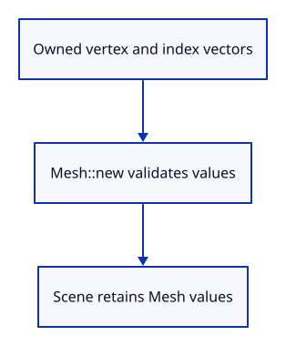

# 10a · Give geometry a validated CPU owner

**Typing: 24–47 minutes.** [Estimate](typing-load.md).

Mesh owns vertex and index vectors. Its constructor rejects missing vertices, incomplete triangles and nonfinite values. Scene owns a collection of those validated meshes.

Vec owns its allocation; a slice borrows existing elements. Result returns either the constructed Mesh or the reason it was refused. GPU upload consumes these slices in the next step.

## Type

Continue from [Keep the nearest surface](10-depth.md). [Save or recover your work](recovery.md).

### 1. `src/mesh.rs`

Create validated CPU mesh data. The vertex record layout is the same six floats used in the depth lesson.

Create the file and type:

```rust
--8<-- "journey/code/11-scene-01.rs"
```

### 2. `src/scene.rs`

Move the demonstration geometry into a scene and add its third-mesh toggle.

Create the file and type:

```rust
--8<-- "journey/code/11-scene-02.rs"
```

### 3. `src/lib.rs`

Register the CPU mesh and scene modules.

<details>
<summary>Locate the existing block</summary>

```rust
pub mod background;
pub mod camera;
pub mod renderer;
#[cfg(target_arch = "wasm32")]
mod browser;
```

</details>

Replace that block with:

```rust
--8<-- "journey/code/10a-mesh-register.rs"
```

## Run and check

In your project:

```sh
cd workspace/journey
cargo build --lib --locked --target wasm32-unknown-unknown -j4
CARGO_BUILD_JOBS=4 trunk serve --port 8780
```

Open `http://127.0.0.1:8780/`. Keep an existing Trunk server running; saving rebuilds it.

Run the state checks below. Valid triangles are accepted; missing vertices, incomplete triangles and NaN values are rejected.

**Verified checkpoint in Chrome.**


[Verification scope](release.md).

Run the state checks on your computer from your project folder:

```sh
cargo test --lib --locked --target host-tuple -j4
```

<details>
<summary>Code explanation and diagram</summary>


Mesh::new validates owned vectors → Scene retains Mesh values.



Why return slices rather than mutable vectors?

A borrowed slice lets upload read the values without transferring ownership or allowing invalid indices to be inserted.

Study estimate, including typing and experiments: 0.75–1.25 hours.

</details>

<details>
<summary>Optional experiment</summary>

In the constructor test, replace the invalid index 3 with 2. That case becomes valid, so its is_err assertion should fail. Restore 3.

</details>

<details>
<summary>Check and save your work</summary>

Restore experimental edits, then run from `session_viewer`:

```sh
npm --prefix ../session_tests run course -- check 10a-mesh
npm --prefix ../session_tests run course -- save 10a-mesh
```

Source comparison leaves your project untouched. [Save and recovery instructions](recovery.md).

</details>

<details>
<summary>Viewer coverage and verification</summary>

The viewer validates source geometry before deriving GPU data. This checkpoint establishes CPU ownership and constructor checks; the next checkpoint connects that data to drawing.

The browser retains the preceding depth image and command dock. Native constructor and scene-collection checks establish the new CPU behavior; browser upload is connected next.

[Full validation scope](release.md).

</details>
