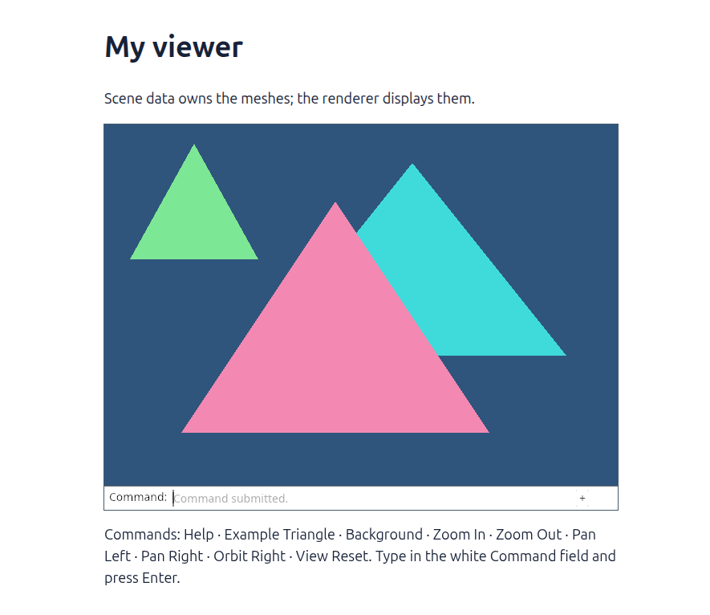
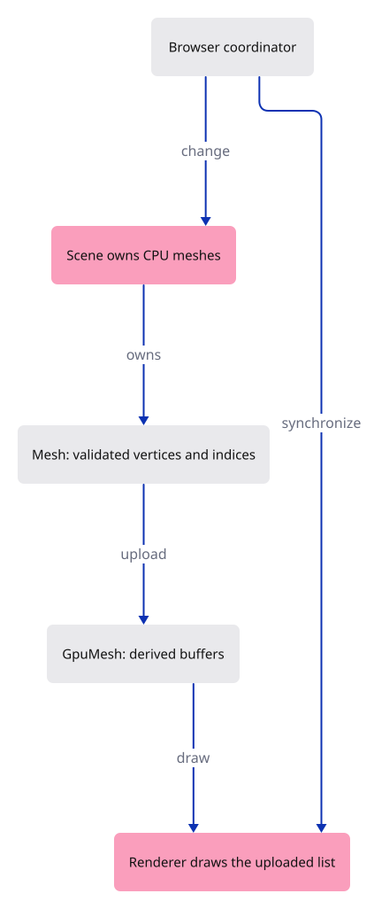

# 11 · Give the scene an owner

**Typing: 47–93 minutes.** [Estimate](typing-load.md).

**Splitting required:** this verified checkpoint exceeds the one-hour typing target. Smaller runnable lessons are still being prepared.

Move geometry out of the renderer. `Mesh` owns validated CPU vertices and indices; `Scene` owns meshes. `GpuMesh` owns an uploaded representation; `Renderer` draws those representations.

An add command changes `Scene`, uploads it, then redraws. Camera commands only upload a view uniform. Neither path creates a new renderer or resets the camera.

## Type

Continue from [Keep the nearest surface](10-depth.md). [Save or recover your work](recovery.md).

### 1. `src/mesh.rs`

Create validated CPU mesh data. The vertex record layout is the same six floats used in the depth lesson.

Create the file and type:

```rust
--8<-- "journey/code/11-scene-01.rs"
```

### 2. `src/scene.rs`

Move the demonstration geometry into a scene and add its third-mesh toggle.

Create the file and type:

```rust
--8<-- "journey/code/11-scene-02.rs"
```

### 3. `src/gpu_mesh.rs`

Move mesh upload and indexed drawing into the owner of those GPU buffers.

Create the file and type:

```rust
--8<-- "journey/code/11-scene-03.rs"
```

### 4. `src/lib.rs`

Register the three new owners.

<details>
<summary>Locate the existing block</summary>

```rust
pub mod background;
pub mod camera;
pub mod renderer;
#[cfg(target_arch = "wasm32")]
mod browser;
```

</details>

Replace that block with:

```rust
--8<-- "journey/code/11-scene-fullscreen-1.rs"
```

### 5. `src/renderer.rs`

Own uploaded GpuMesh values and build them from Scene.

<details>
<summary>Locate the existing block</summary>

```rust
use wgpu::util::DeviceExt;

// Each vertex stores x, y, z, then red, green and blue.
const VERTICES: [[f32; 6]; 6] = [
    [-0.7, -0.6, 0.25, 0.9, 0.25, 0.45],
    [ 0.5, -0.6, 0.25, 0.9, 0.25, 0.45],
    [-0.1,  0.6, 0.25, 0.9, 0.25, 0.45],
    [-0.4, -0.2, 0.75, 0.05, 0.7, 0.7],
    [ 0.8, -0.2, 0.75, 0.05, 0.7, 0.7],
    [ 0.2,  0.8, 0.75, 0.05, 0.7, 0.7],
];
const INDICES: [u16; 6] = [0, 1, 2, 3, 4, 5];

pub struct Renderer {
    pub device: wgpu::Device,
    pub queue: wgpu::Queue,
    pipeline: wgpu::RenderPipeline,
    vertices: wgpu::Buffer,
    indices: wgpu::Buffer,
    uniform: wgpu::Buffer,
    view_group: wgpu::BindGroup,
    depth: wgpu::TextureView,
}

impl Renderer {
    pub fn new(device: wgpu::Device, queue: wgpu::Queue, format: wgpu::TextureFormat) -> Self {
        let bytes: Vec<u8> = VERTICES.iter().flatten()
            .flat_map(|value| value.to_ne_bytes()).collect();
        let vertices = device.create_buffer_init(&wgpu::util::BufferInitDescriptor {
            label: Some("rectangle positions"),
            contents: &bytes,
            usage: wgpu::BufferUsages::VERTEX,
        });
        let bytes: Vec<u8> = INDICES.iter().flat_map(|index| index.to_ne_bytes()).collect();
        let indices = device.create_buffer_init(&wgpu::util::BufferInitDescriptor {
            label: Some("diamond indices"),
            contents: &bytes,
            usage: wgpu::BufferUsages::INDEX,
        });
        let shader = device.create_shader_module(wgpu::ShaderModuleDescriptor {
            label: Some("triangle"),
            source: wgpu::ShaderSource::Wgsl(include_str!("triangle.wgsl").into()),
```

</details>

Replace that block with:

```rust
--8<-- "journey/code/11-scene-fullscreen-6.rs"
```

### 6. `src/renderer.rs`

Rebuild uploaded meshes when the scene changes.

<details>
<summary>Locate the existing block</summary>

```rust
            }],
        });
        let depth = Self::depth(&device, 640, 480);
        Self { device, queue, pipeline, vertices, indices, uniform, view_group, depth }
    }

    fn depth(device: &wgpu::Device, width: u32, height: u32) -> wgpu::TextureView {
```

</details>

Replace that block with:

```rust
--8<-- "journey/code/11-scene-fullscreen-7.rs"
```

### 7. `src/renderer.rs`

Draw each uploaded mesh through GpuMesh::draw.

<details>
<summary>Locate the existing block</summary>

```rust
            });
            pass.set_pipeline(&self.pipeline);
            pass.set_bind_group(0, &self.view_group, &[]);
            pass.set_vertex_buffer(0, self.vertices.slice(..));
            pass.set_index_buffer(self.indices.slice(..), wgpu::IndexFormat::Uint16);
            pass.draw_indexed(0..INDICES.len() as u32, 0, 0..1);
        }
        self.queue.submit([encoder.finish()]);
    }
```

</details>

Replace that block with:

```rust
--8<-- "journey/code/11-scene-fullscreen-8.rs"
```

### 8. `src/browser.rs`

Import the scene owner.

<details>
<summary>Locate the existing block</summary>

```rust
use crate::background::Background;
use crate::camera::Camera;
use crate::renderer::Renderer;
use wasm_bindgen::{JsCast, JsValue, closure::Closure};

pub fn report(message: &str) {
```

</details>

Replace that block with:

```rust
--8<-- "journey/code/11-scene-window-1.rs"
```

### 9. `src/browser.rs`

Create the demo scene and add Example Triangle to the vocabulary.

<details>
<summary>Locate the existing block</summary>

```rust
        .ok_or("No compatible surface format")?;
    config.view_formats = vec![config.format.add_srgb_suffix()];
    surface.configure(&device, &config);
    let mut renderer = Renderer::new(device, queue, config.format.add_srgb_suffix());
    renderer.resize(width, height);
    let mut panel = crate::panel::Panel::new(
        &renderer,
        config.format.add_srgb_suffix(),
        &[
            "Help",
            "Background",
            "Zoom In",
            "Zoom Out",
```

</details>

Replace that block with:

```rust
--8<-- "journey/code/11-scene-window-2.rs"
```

### 10. `src/browser.rs`

Toggle the example object and synchronize the renderer.

<details>
<summary>Locate the existing block</summary>

```rust

        if let Some(line) = line {
            match line.as_str() {
                "background" => background.toggle(),
                "zoom in" => camera.zoom(2.0),
                "zoom out" => camera.zoom(0.5),
```

</details>

Replace that block with:

```rust
--8<-- "journey/code/11-scene-window-3.rs"
```

### 11. `src/browser.rs`

Report the separation between scene data and drawing.

<details>
<summary>Locate the existing block</summary>

```rust
    )?;
    // The page has one listener for its lifetime; JavaScript must retain the Rust callback.
    click.forget();
    report("The nearer pink triangle wins the overlap.");
    Ok(())
}
```

</details>

Replace that block with:

```rust
--8<-- "journey/code/11-scene-window-4.rs"
```

## Run and check

In your project:

```sh
cd workspace/journey
cargo build --lib --locked --target wasm32-unknown-unknown -j4
CARGO_BUILD_JOBS=4 trunk serve --port 8780
```

Open `http://127.0.0.1:8780/`. Keep an existing Trunk server running; saving rebuilds it.

Type `Example Triangle` twice. A green triangle appears, then disappears. Your camera stays where it was.

**Verified checkpoint in Chrome.**



[Verification scope](release.md).

Run the state checks from your project folder:

```sh
cargo test --lib --locked -j4
```

<details>
<summary>Code explanation and diagram</summary>

`Mesh::new` returns `Result` because invalid indices must be rejected before drawing. Private fields and read-only slice accessors preserve that contract. Fixed example coordinates use `expect`; file data will need recoverable errors.

For this small scene, a document change replaces all mesh buffers. Later lessons update only changed objects. The extra green triangle makes add → upload → draw visible.

command → Scene adds or removes Mesh → GpuMesh uploads → Renderer draws the current list.



Which values should survive if we recreate all GPU mesh buffers?

The Scene and its Mesh data should survive, along with camera and background state. GPU buffers are a display representation derived from those values. Rebuilding that representation must not lose the document or move the camera.

Study estimate, including typing and experiments: 3–5 hours.

</details>

<details>
<summary>Optional experiment</summary>

Zoom Out and change the background, then toggle the third triangle twice. Predict the final image. It should be exactly the same as before those two toggles. In the command handler, locate the one branch that uploads scene data and explain why the camera branches do not need it.

</details>

<details>
<summary>Check and save your work</summary>

Restore experimental edits, then run from `session_viewer`:

```sh
npm --prefix ../session_tests run course -- check 11-scene
npm --prefix ../session_tests run course -- save 11-scene
```

Source comparison leaves your project untouched. [Save and recovery instructions](recovery.md).

</details>

<details>
<summary>Viewer coverage and verification</summary>

The production viewer keeps source geometry and document state separate from packed GPU data. Later lessons add stable identity, incremental synchronization, shared buffers and undo. This ownership boundary allows a GPU rebuild without rebuilding the document.


[Full validation scope](release.md).

</details>
