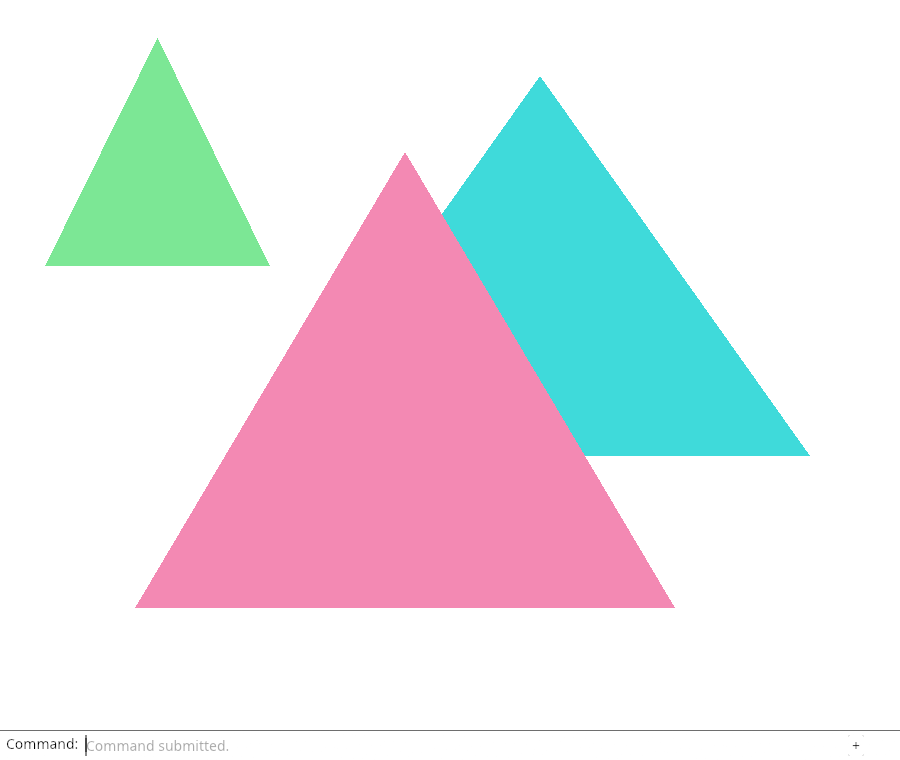
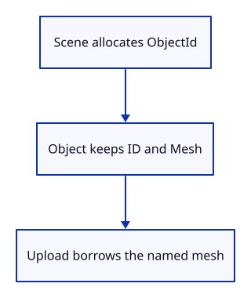

# 11a · Name objects independently of their rows

**Typing: 29–57 minutes.** [Estimate](typing-load.md).

ObjectId names an object independently of its vector row. Scene allocates IDs, looks up objects by those names, and remembers the extra triangle by ID.

The wrapper type prevents confusing an ID with an index. checked_add returns an error before the counter can wrap and reuse a name.

## Type

Continue from [Draw the scene through GPU mesh owners](11-scene.md). [Save or recover your work](recovery.md).

### 1. `src/scene.rs`

Replace the scene with stable object IDs and named insertion, removal and lookup operations. Keep the two existing demonstration meshes unchanged.

<details>
<summary>Locate the existing block</summary>

```rust
use crate::mesh::Mesh;

pub struct Scene {
    pub meshes: Vec<Mesh>,
}

impl Scene {
    pub fn demo() -> Self {
        let near = Mesh::new(vec![
            [-0.7, -0.6, 0.25, 0.9, 0.25, 0.45],
            [ 0.5, -0.6, 0.25, 0.9, 0.25, 0.45],
            [-0.1,  0.6, 0.25, 0.9, 0.25, 0.45],
        ], vec![0, 1, 2]).expect("Valid near triangle");
        let far = Mesh::new(vec![
            [-0.4, -0.2, 0.75, 0.05, 0.7, 0.7],
            [ 0.8, -0.2, 0.75, 0.05, 0.7, 0.7],
            [ 0.2,  0.8, 0.75, 0.05, 0.7, 0.7],
        ], vec![0, 1, 2]).expect("Valid far triangle");
        Self { meshes: vec![near, far] }
    }

    pub fn toggle_extra(&mut self) {
        if self.meshes.len() == 3 {
            self.meshes.pop();
        } else {
            let extra = Mesh::new(vec![
                [-0.9, 0.3, 0.5, 0.2, 0.8, 0.3],
                [-0.4, 0.3, 0.5, 0.2, 0.8, 0.3],
                [-0.65, 0.9, 0.5, 0.2, 0.8, 0.3],
            ], vec![0, 1, 2]).expect("Valid extra triangle");
            self.meshes.push(extra);
        }
    }
}
```

</details>

Replace that block with:

```rust
--8<-- "journey/code/12-identity-01.rs"
```

### 2. `src/renderer.rs`

Upload the mesh borrowed from each named object.

<details>
<summary>Locate the existing block</summary>

```rust
        let meshes = scene.meshes.iter().map(|mesh| GpuMesh::upload(&device, mesh)).collect();
```

</details>

Replace that block with:

```rust
--8<-- "journey/code/11a-identity-upload-1.rs"
```

### 3. `src/renderer.rs`

Upload the mesh borrowed from each named object.

<details>
<summary>Locate the existing block</summary>

```rust
        self.meshes = scene.meshes.iter().map(|mesh| GpuMesh::upload(&self.device, mesh)).collect();
```

</details>

Replace that block with:

```rust
--8<-- "journey/code/11a-identity-upload-2.rs"
```

## Run and check

In your project:

```sh
cd workspace/journey
cargo build --lib --locked --target wasm32-unknown-unknown -j4
CARGO_BUILD_JOBS=4 trunk serve --port 8780
```

Open `http://127.0.0.1:8780/`. Keep an existing Trunk server running; saving rebuilds it.

Run the state checks below. Removing the first object moves the next row without changing its ID; toggling the extra object still removes that object.

**Verified checkpoint in Chrome.**



[Verification scope](release.md).

Run the state checks on your computer from your project folder:

```sh
cargo test --lib --locked --target host-tuple -j4
```

<details>
<summary>Code explanation and diagram</summary>


Scene allocates ObjectId → Object retains Mesh → GPU upload borrows that mesh.



Does moving to row zero create a new object?

No. The vector position changes; the ObjectId assigned at insertion stays the same.

Study estimate, including typing and experiments: 0.75–1.5 hours.

</details>

<details>
<summary>Optional experiment</summary>

In the removal test, compare the second object’s ID before and after deleting the first. The ID should match even though its row changes.

</details>

<details>
<summary>Check and save your work</summary>

Restore experimental edits, then run from `session_viewer`:

```sh
npm --prefix ../session_tests run course -- check 11a-identity
npm --prefix ../session_tests run course -- save 11a-identity
```

Source comparison leaves your project untouched. [Save and recovery instructions](recovery.md).

</details>

<details>
<summary>Viewer coverage and verification</summary>

Source identities and GPU row positions have different lifetimes. This checkpoint keeps the source name stable while the existing upload borrows each object’s mesh.

The browser independently verifies the retained add/remove drawing and command dock. Native tests establish stable IDs and removal after row changes; selection display is connected next.

[Full validation scope](release.md).

</details>
