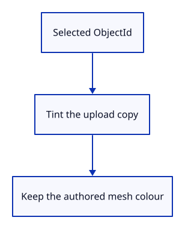

# 12 · Display selection by object identity

**Typing: 16–32 minutes.** [Estimate](typing-load.md).

Selection stores Option<ObjectId>, so it follows the object through row changes. GpuMesh uploads a yellow copy for the selected ID while Scene retains its original colours.

Delete removes the selected ID and clears selection. The CPU mesh is borrowed during upload; only the copied display colours change.

## Type

Continue from [Name objects independently of their rows](11a-identity.md). [Save or recover your work](recovery.md).

### 1. `src/gpu_mesh.rs`

Let the uploaded representation know whether to show selection.

<details>
<summary>Locate the existing block</summary>

```rust
    pub fn upload(device: &wgpu::Device, mesh: &Mesh) -> Self {
```

</details>

Replace that block with:

```rust
--8<-- "journey/code/12-identity-02.rs"
```

### 2. `src/gpu_mesh.rs`

Apply the yellow tint to an upload copy. Never overwrite the CPU mesh’s original colour.

<details>
<summary>Locate the existing block</summary>

```rust
        let bytes: Vec<u8> = mesh.vertices().iter().flatten()
            .flat_map(|value| value.to_ne_bytes()).collect();
```

</details>

Replace that block with:

```rust
--8<-- "journey/code/12-identity-03.rs"
```

### 3. `src/renderer.rs`

Import ObjectId at the renderer boundary.

<details>
<summary>Locate the existing block</summary>

```rust
use crate::{gpu_mesh::GpuMesh, scene::Scene};

pub struct Renderer {
    pub device: wgpu::Device,
```

</details>

Replace that block with:

```rust
--8<-- "journey/code/12-identity-fullscreen-5.rs"
```

### 4. `src/renderer.rs`

Upload each scene object without selection highlighting initially.

<details>
<summary>Locate the existing block</summary>

```rust
        format: wgpu::TextureFormat,
        scene: &Scene,
    ) -> Self {
        let meshes = scene.objects().iter().map(|object| GpuMesh::upload(&device, &object.mesh)).collect();
        let shader = device.create_shader_module(wgpu::ShaderModuleDescriptor {
            label: Some("triangle"),
            source: wgpu::ShaderSource::Wgsl(include_str!("triangle.wgsl").into()),
```

</details>

Replace that block with:

```rust
--8<-- "journey/code/12-identity-fullscreen-6.rs"
```

### 5. `src/renderer.rs`

Highlight the uploaded object whose stable ID matches the selection.

<details>
<summary>Locate the existing block</summary>

```rust
        Self { device, queue, pipeline, meshes, uniform, view_group, depth }
    }

    pub fn set_scene(&mut self, scene: &Scene) {
        self.meshes = scene.objects().iter().map(|object| GpuMesh::upload(&self.device, &object.mesh)).collect();
    }

    fn depth(device: &wgpu::Device, width: u32, height: u32) -> wgpu::TextureView {
```

</details>

Replace that block with:

```rust
--8<-- "journey/code/12-identity-fullscreen-7.rs"
```

### 6. `src/browser.rs`

Add Select Next and Delete to the vocabulary.

<details>
<summary>Locate the existing block</summary>

```rust
        &[
            "Help",
            "Example Triangle",
            "Background",
            "Zoom In",
            "Zoom Out",
```

</details>

Replace that block with:

```rust
--8<-- "journey/code/12-identity-window-1.rs"
```

### 7. `src/browser.rs`

Start without a selected object.

<details>
<summary>Locate the existing block</summary>

```rust
        ],
    );
    panel.update(None, &canvas)?;
    let mut background = Background::default();
    let mut camera = Camera::default();
    present(
```

</details>

Replace that block with:

```rust
--8<-- "journey/code/12-identity-window-2.rs"
```

### 8. `src/browser.rs`

Preserve valid selection, cycle by identity, and delete the selected object.

<details>
<summary>Locate the existing block</summary>

```rust
            match line.as_str() {
                "example triangle" => {
                    scene.toggle_extra();
                    renderer.set_scene(&scene);
                }
                "background" => background.toggle(),
                "zoom in" => camera.zoom(2.0),
```

</details>

Replace that block with:

```rust
--8<-- "journey/code/12-identity-window-3.rs"
```

### 9. `src/browser.rs`

Report that selection follows object identity.

<details>
<summary>Locate the existing block</summary>

```rust
    )?;
    // The page has one listener for its lifetime; JavaScript must retain the Rust callback.
    click.forget();
    report("Scene data owns the meshes; the renderer displays them.");
    Ok(())
}
```

</details>

Replace that block with:

```rust
--8<-- "journey/code/12-identity-window-4.rs"
```

## Run and check

In your project:

```sh
cd workspace/journey
cargo build --lib --locked --target wasm32-unknown-unknown -j4
CARGO_BUILD_JOBS=4 trunk serve --port 8780
```

Open `http://127.0.0.1:8780/`. Keep an existing Trunk server running; saving rebuilds it.

Type Select Next. The first object turns yellow; its stored mesh colour remains pink.

**Verified checkpoint in Chrome.**


[Verification scope](release.md).

Run the state checks from your project folder:

```sh
cargo test --lib --locked -j4
```

<details>
<summary>Code explanation and diagram</summary>


selected ObjectId → upload copy → yellow display vertices.



Why tint a copy rather than the retained mesh?

The scene keeps the authored colour. Clearing selection must recover that colour instead of replacing source data.

Study estimate, including typing and experiments: 0.5–1 hours.

</details>

<details>
<summary>Optional experiment</summary>

Select the first object, then Delete. Add the extra triangle and toggle it off. Only the original far triangle should remain.

</details>

<details>
<summary>Check and save your work</summary>

Restore experimental edits, then run from `session_viewer`:

```sh
npm --prefix ../session_tests run course -- check 12-identity
npm --prefix ../session_tests run course -- save 12-identity
```

Source comparison leaves your project untouched. [Save and recovery instructions](recovery.md).

</details>

<details>
<summary>Viewer coverage and verification</summary>

The complete viewer distinguishes document identity, displayed object rows and source sub-elements. Picking and undo must cross those mappings explicitly. This lesson establishes the first rule: a storage index cannot serve as a permanent object name.


[Full validation scope](release.md).

</details>
