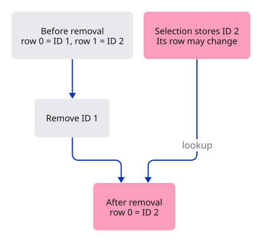
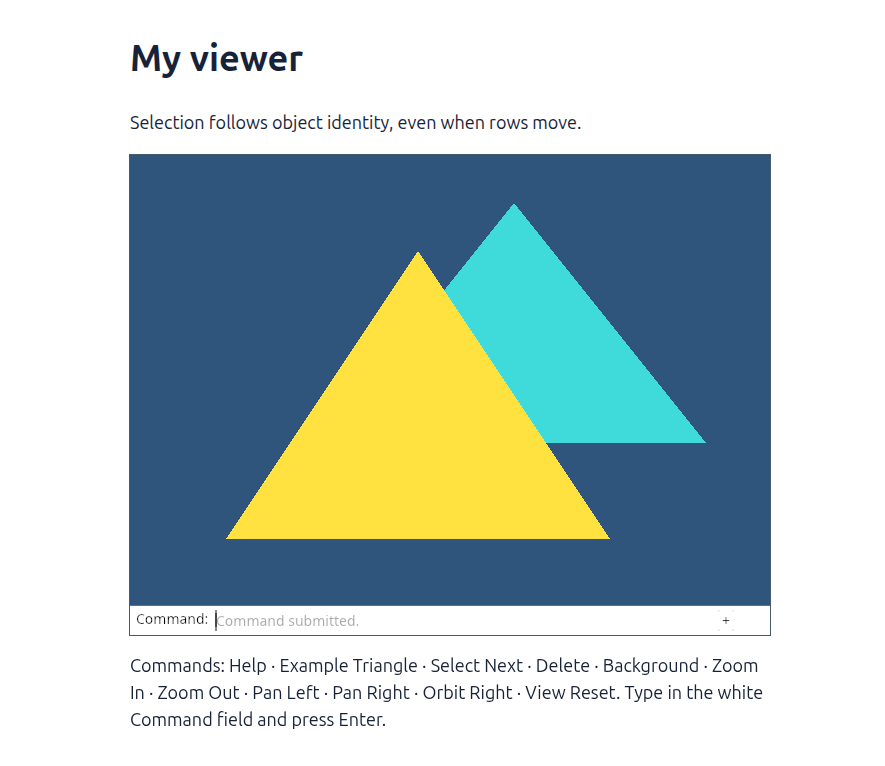

# 12 · Name objects without depending on their row

**Plan about 3–5 hours.** 175 lines to type, including comments and blank lines. Allow time to read, predict and experiment; this is an estimate, not a deadline.

**Today:** Select and delete objects using stable identities, then highlight the selected object.

**In the whole viewer:** Connect the browser, drawing and input, then extend the same project. [See the destination](../journey.md#the-destination).

**Follow:** ObjectId → scene lookup → selected display colour → uploaded mesh → yellow highlight.

**Before you finish, explain:** After deleting the first object, is the object now at row zero a new object?

A seat number tells you where someone sits today. Their name still belongs to them after they change seats. Our vector rows are seats; object IDs are names.

The third-triangle helper previously relied on there being exactly two or three meshes. Deleting an earlier mesh would break that assumption. We will give each object an ID and remember the extra object's ID explicitly. Removing it then works even when other rows have moved.



`ObjectId` is a small wrapper around a number. It is a distinct Rust type, so a function expecting an ID cannot accidentally accept an ordinary row index. Its inner number is private. Only Scene creates IDs, and the counter advances even when objects are deleted.

The scene keeps its vector private too. A read-only slice lets the renderer inspect objects; insert and remove methods protect the identity rules. `checked_add` returns no value if the counter would overflow, and `ok_or` turns that absence into a clear error. Exhaustion must not wrap around and reuse an existing name.

Selection belongs to the view's interaction state, so the browser callback retains an `Option<ObjectId>` beside the camera. The scene answers whether an ID exists. When its selected object is deleted, the callback clears selection. Camera actions keep the same selected ID.

For now, the GPU upload gives selected vertices a yellow display colour. The Mesh's original colours stay unchanged. This is intentionally a small-scene implementation: later an object-data buffer will change selection without uploading all vertex data again.

## Type the change

Continue [Give the scene an owner](11-scene.md). From `session_viewer`, save your files with `npm --prefix ../session_tests run course -- save before-12-identity`. A save keeps your own work; it does not fill in the next lesson.

### 1. `src/scene.rs`

Replace the scene with stable object IDs and named insertion, removal and lookup operations. Keep the two existing demonstration meshes unchanged.

Find this exact block:

```rust
use crate::mesh::Mesh;

pub struct Scene {
    pub meshes: Vec<Mesh>,
}

impl Scene {
    pub fn demo() -> Self {
        let near = Mesh::new(vec![
            [-0.7, -0.6, 0.25, 0.9, 0.25, 0.45],
            [ 0.5, -0.6, 0.25, 0.9, 0.25, 0.45],
            [-0.1,  0.6, 0.25, 0.9, 0.25, 0.45],
        ], vec![0, 1, 2]).expect("Valid near triangle");
        let far = Mesh::new(vec![
            [-0.4, -0.2, 0.75, 0.05, 0.7, 0.7],
            [ 0.8, -0.2, 0.75, 0.05, 0.7, 0.7],
            [ 0.2,  0.8, 0.75, 0.05, 0.7, 0.7],
        ], vec![0, 1, 2]).expect("Valid far triangle");
        Self { meshes: vec![near, far] }
    }

    pub fn toggle_extra(&mut self) {
        if self.meshes.len() == 3 {
            self.meshes.pop();
        } else {
            let extra = Mesh::new(vec![
                [-0.9, 0.3, 0.5, 0.2, 0.8, 0.3],
                [-0.4, 0.3, 0.5, 0.2, 0.8, 0.3],
                [-0.65, 0.9, 0.5, 0.2, 0.8, 0.3],
            ], vec![0, 1, 2]).expect("Valid extra triangle");
            self.meshes.push(extra);
        }
    }
}
```

Replace that block with:

```rust
--8<-- "journey/code/12-identity-01.rs"
```

### 2. `src/gpu_mesh.rs`

Let the uploaded representation know whether to show selection.

Find this exact block:

```rust
    pub fn upload(device: &wgpu::Device, mesh: &Mesh) -> Self {
```

Replace that block with:

```rust
--8<-- "journey/code/12-identity-02.rs"
```

### 3. `src/gpu_mesh.rs`

Apply the yellow tint to an upload copy. Never overwrite the CPU mesh’s original colour.

Find this exact block:

```rust
        let bytes: Vec<u8> = mesh.vertices().iter().flatten()
            .flat_map(|value| value.to_ne_bytes()).collect();
```

Replace that block with:

```rust
--8<-- "journey/code/12-identity-03.rs"
```

### 4. `src/renderer.rs`

Use the identity type at the renderer’s scene synchronization boundary.

Find this exact block:

```rust
use crate::{gpu_mesh::GpuMesh, scene::Scene};
```

Replace that block with:

```rust
--8<-- "journey/code/12-identity-04.rs"
```

### 5. `src/renderer.rs`

Upload the scene’s objects with no initial selection.

Find this exact block:

```rust
        let meshes = scene.meshes.iter().map(|mesh| GpuMesh::upload(&device, mesh)).collect();
```

Replace that block with:

```rust
--8<-- "journey/code/12-identity-05.rs"
```

### 6. `src/renderer.rs`

Compare identities while uploading so the selected object receives the display tint.

Find this exact block:

```rust
    pub fn set_scene(&mut self, scene: &Scene) {
        self.meshes = scene.meshes.iter().map(|mesh| GpuMesh::upload(&self.device, mesh)).collect();
    }
```

Replace that block with:

```rust
--8<-- "journey/code/12-identity-06.rs"
```

### 7. `src/browser.rs`

Connect name objects without depending on their row to the typed command path. Keep the scene state in its existing owner and redraw the dock after applying an action.

Find this exact block:

```rust
        &[
            "Help",
            "Example Triangle",
            "Background",
            "Zoom In",
            "Zoom Out",
```

Replace that block with:

```rust
--8<-- "journey/code/12-identity-dock-01.rs"
```

### 8. `src/browser.rs`

Connect name objects without depending on their row to the typed command path. Keep the scene state in its existing owner and redraw the dock after applying an action.

Find this exact block:

```rust
        ],
    );
    panel.update(None, &canvas)?;
    let mut background = Background::default();
    let mut camera = Camera::default();
    present(
```

Replace that block with:

```rust
--8<-- "journey/code/12-identity-dock-02.rs"
```

### 9. `src/browser.rs`

Connect name objects without depending on their row to the typed command path. Keep the scene state in its existing owner and redraw the dock after applying an action.

Find this exact block:

```rust
            match line.as_str() {
                "example triangle" => {
                    scene.toggle_extra();
                    renderer.set_scene(&scene);
                }
                "background" => background.toggle(),
                "zoom in" => camera.zoom(2.0),
```

Replace that block with:

```rust
--8<-- "journey/code/12-identity-dock-03.rs"
```

### 10. `src/browser.rs`

Connect name objects without depending on their row to the typed command path. Keep the scene state in its existing owner and redraw the dock after applying an action.

Find this exact block:

```rust
    )?;
    // The page has one listener for its lifetime; JavaScript must retain the Rust callback.
    click.forget();
    report("Scene data owns the meshes; the renderer displays them.");
    Ok(())
}
```

Replace that block with:

```rust
--8<-- "journey/code/12-identity-dock-04.rs"
```

### 11. `index.html`

Keep the HTML page small. Feature input belongs to the command dock drawn inside the canvas.

Find this exact block:

```html
  <h1>My viewer</h1>
  <p id="status" role="status">Waiting for Rust…</p>
  <canvas id="canvas" tabindex="0" width="640" height="480" aria-label="Viewer drawing"></canvas>
  <p>Commands: Help · Example Triangle · Background · Zoom In · Zoom Out · Pan Left · Pan Right · Orbit Right · View Reset. Type in the white Command field and press Enter.</p>
</body>
</html>
```

Replace that block with:

```html
--8<-- "journey/code/12-identity-page-1.html"
```

## Run and look

From `session_viewer`, enter your project folder:

```sh
cd workspace/journey
cargo build --lib --locked --target wasm32-unknown-unknown -j4
CARGO_BUILD_JOBS=4 trunk serve --port 8780
```

Open `http://127.0.0.1:8780/`. If Trunk is already running in this project, leave it running; it rebuilds when you save.

Run `Select Next` to cycle the yellow selection. `Delete` removes that object. Add or remove the third triangle with `Example Triangle`; the remaining objects keep their IDs.

**Actual Chrome screenshot.**



*Captured from this checkpoint’s browser bundle after its browser checks passed. [Check scope and environment](release.md).*

Run the state checks from your project folder:

```sh
cargo test --lib --locked -j4
```

## Try one small experiment

Add the third triangle, select the first object and delete it. Toggle the third triangle off. Only the original far triangle should remain. Read the identity test before running it: which ID moves to row zero, and why must it keep its old value?

## Explain it in your own words

Trace the values through the files without reading the answer first. If you lose the connection, stop at the last value you can follow.

<details>
<summary>Compare your explanation</summary>

No. Its storage row moved, but its ObjectId stayed the same. A row is a current location in a vector; an ID is the name we assigned when the object entered the scene. Selection retains that name, and a deleted name is never silently reused.

</details>

## Keep your working result

Return to `session_viewer` in a second terminal. Restore experimental edits before comparing:

```sh
npm --prefix ../session_tests run course -- check 12-identity
npm --prefix ../session_tests run course -- save 12-identity
```

The comparison spots typing differences; it does not prove behaviour. Keep three notes: what I changed; the values I followed; the question I still have. [Recover a checkpoint](recovery.md) if an experiment gets tangled.

## Where this grows

The complete viewer distinguishes document identity, displayed object rows and source sub-elements. Picking and undo must cross those mappings explicitly. This lesson establishes the first rule: a storage index cannot serve as a permanent object name.

[Validation status and course release](release.md).
