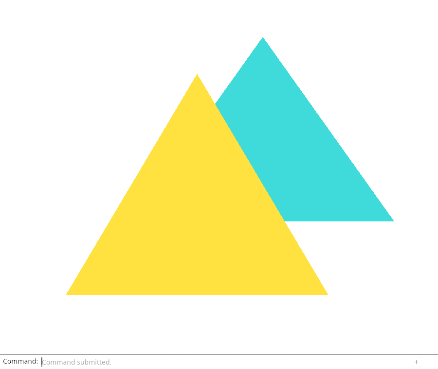
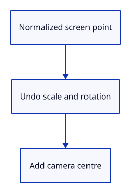

# 12a · Convert screen positions back to the scene

**Typing: 10–19 minutes.** [Estimate](typing-load.md).

Divide a screen point by camera scale, reverse rotation, then add the camera centre. world_from_screen returns the corresponding scene point.

A round-trip check transforms a known scene point into the view and restores it after pan, zoom and rotation.

## Type

Continue from [Display selection by object identity](12-identity.md). [Save or recover your work](recovery.md).

### 1. `src/camera.rs`

Add the inverse conversion for our flat camera. Rust’s sin_cos returns the sine and cosine as a pair.

<details>
<summary>Locate the existing block</summary>

```rust
    pub fn uniform(&self) -> [f32; 16] {
```

</details>

Replace that block with:

```rust
--8<-- "journey/code/13-picking-03.rs"
```

### 2. `src/camera.rs`

Check that pan, zoom and rotation preserve the coordinate round trip.

<details>
<summary>Locate the existing block</summary>

```rust
#[cfg(test)]
mod tests {
```

</details>

Replace that block with:

```rust
--8<-- "journey/code/12a-coordinates-test.rs"
```

## Run and check

In your project:

```sh
cd workspace/journey
cargo build --lib --locked --target wasm32-unknown-unknown -j4
CARGO_BUILD_JOBS=4 trunk serve --port 8780
```

Open `http://127.0.0.1:8780/`. Keep an existing Trunk server running; saving rebuilds it.

Run the state checks below. The new round-trip test restores a known scene point after pan, zoom and rotation.

**Verified checkpoint in Chrome.**



[Verification scope](release.md).

Run the state checks from your project folder:

```sh
cargo test --lib --locked -j4
```

<details>
<summary>Code explanation and diagram</summary>


Screen point → divide scale → reverse rotation → add scene centre.



Why reverse the camera before testing geometry?

The click is in the displayed view; mesh positions are in scene coordinates. The conversion puts both in the same coordinates.

Study estimate, including typing and experiments: 0.5–0.75 hours.

</details>

<details>
<summary>Optional experiment</summary>

Trace the point [0.4, 0.0] through the native round-trip check. Undoing scale and rotation must recover both coordinates within 0.000001.

</details>

<details>
<summary>Check and save your work</summary>

Restore experimental edits, then run from `session_viewer`:

```sh
npm --prefix ../session_tests run course -- check 12a-coordinates
npm --prefix ../session_tests run course -- save 12a-coordinates
```

Source comparison leaves your project untouched. [Save and recovery instructions](recovery.md).

</details>

<details>
<summary>Viewer coverage and verification</summary>

Picking must compare view input with geometry in a common coordinate system. The later perspective lesson replaces this flat conversion with a ray.

Chrome independently verifies the existing command and selection drawing. The new inverse conversion is checked natively; mouse selection is connected in 13.

[Full validation scope](release.md).

</details>
