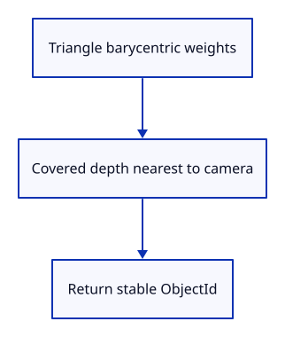

# 12b · Find the nearest triangle at a scene point

**Typing: 28–56 minutes.** [Estimate](typing-load.md).

Test each indexed triangle with barycentric weights. Nonnegative weights with a sum at most one place the point inside it; those weights also interpolate depth. Retain the nearest covered object.

The query borrows Scene and returns Option<ObjectId>. It does not change selection. None means no triangle covers the point.

## Type

Continue from [Convert screen positions back to the scene](12a-coordinates.md). [Save or recover your work](recovery.md).

### 1. `src/picking.rs`

Create the CPU query and tests. It reads scene data and returns identity without changing selection or GPU resources.

Create the file and type:

```rust
--8<-- "journey/code/13-picking-04.rs"
```

### 2. `src/lib.rs`

Register the query module.

<details>
<summary>Locate the existing block</summary>

```rust
pub mod camera;
pub mod mesh;
pub mod scene;
pub mod gpu_mesh;
pub mod renderer;
#[cfg(target_arch = "wasm32")]
```

</details>

Replace that block with:

```rust
--8<-- "journey/code/13-picking-fullscreen-1.rs"
```

## Run and check

In your project:

```sh
cd workspace/journey
cargo build --lib --locked --target wasm32-unknown-unknown -j4
CARGO_BUILD_JOBS=4 trunk serve --port 8780
```

Open `http://127.0.0.1:8780/`. Keep an existing Trunk server running; saving rebuilds it.

Run the state checks below. The nearer object wins the overlap; removing it reveals the far object; empty and invalid positions return None.

**Verified checkpoint in Chrome.**


[Verification scope](release.md).

Run the state checks from your project folder:

```sh
cargo test --lib --locked -j4
```

<details>
<summary>Code explanation and diagram</summary>


Scene point → barycentric coverage → interpolated depth → nearest ObjectId.



Why return an ObjectId rather than a row?

Rows can move after removal. Returning the stable name lets the caller retain the same object.

Study estimate, including typing and experiments: 0.75–1.5 hours.

</details>

<details>
<summary>Optional experiment</summary>

In the overlap test, remove the near object before the first query. The far object should now win at the same scene point.

</details>

<details>
<summary>Check and save your work</summary>

Restore experimental edits, then run from `session_viewer`:

```sh
npm --prefix ../session_tests run course -- check 12b-picking
npm --prefix ../session_tests run course -- save 12b-picking
```

Source comparison leaves your project untouched. [Save and recovery instructions](recovery.md).

</details>

<details>
<summary>Viewer coverage and verification</summary>

The finished viewer uses asynchronous integer-ID GPU picking. This small-scene query establishes coverage, nearest depth and the identity returned to input.

The native checkpoint calls the new query and draws its far-object result. Chrome retains typed selection until the next step connects actual clicks.

[Full validation scope](release.md).

</details>
