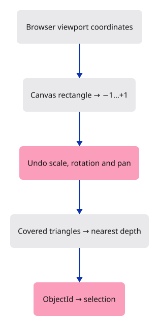
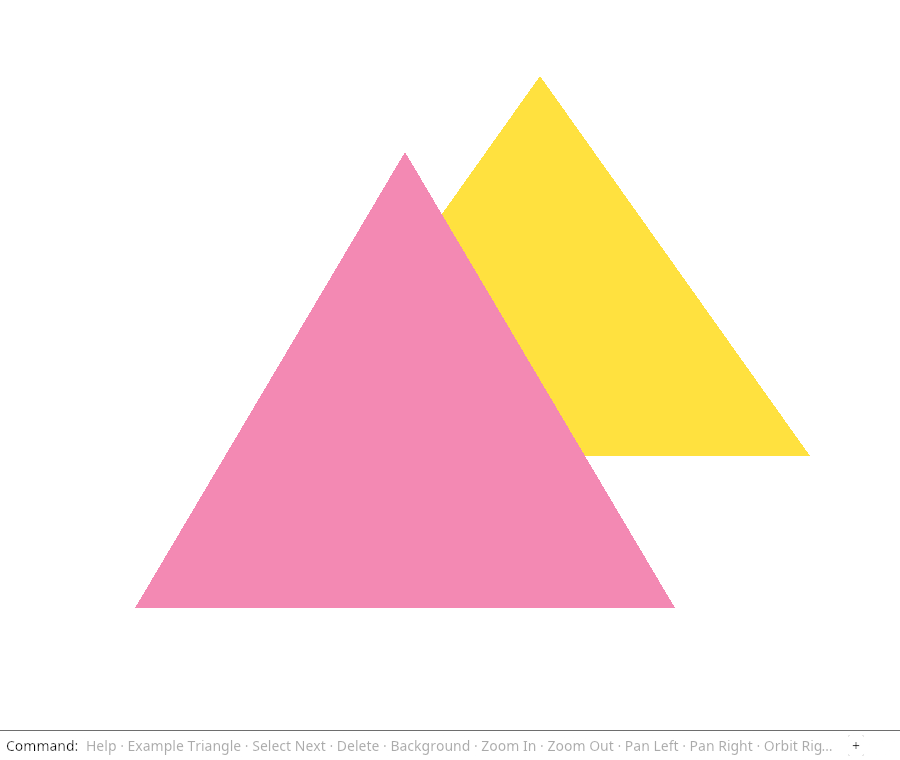

# 13 · Ask which object is under the pointer

**Combined study estimate: 2–4 hours.** Includes reading, typing, reasoning and experiments.

**Typing estimate: 47–93 minutes.** 116 added or changed lines; unchanged context is excluded. [How this is estimated](typing-load.md).

**Splitting required:** this verified checkpoint exceeds the one-hour typing target. Smaller runnable lessons are still being prepared.

**Today:** Click a visible triangle to select its stable object ID, including after camera movement.

**Follow:** Browser click → canvas-relative coordinates → inverse camera → triangle coverage and depth → ObjectId → highlight.

Resolve a click to the nearest covered object's ID. Convert viewport CSS pixels to canvas coordinates, map them to −1 through +1, and reverse y because browser y points downward.

Undo the camera transform: divide by scale, rotate back, then add the centre. A round-trip test checks the two coordinate conversions agree.

For this flat view, test triangles on the CPU. Write a point as `a + u×(b−a) + v×(c−a)`. Coverage requires nonnegative u and v with sum at most 1. Use those weights to interpolate depth and retain the nearest hit.

Return `ObjectId`, preserving selection through row changes. Empty space returns `None`. Later GPU picking replaces this small-scene query while keeping the same input-to-identity boundary.



## Type the change

Continue from [Name objects without depending on their row](12-identity.md). Save your own work first: `npm --prefix ../session_tests run course -- save before-13-picking` (from `session_viewer`).

### 1. `src/camera.rs`

Add the inverse conversion for our flat camera. Rust’s sin_cos returns the sine and cosine as a pair.

<details>
<summary>Locate the existing block</summary>

```rust
    pub fn uniform(&self) -> [f32; 16] {
```

</details>

Replace that block with:

```rust
--8<-- "journey/code/13-picking-03.rs"
```

### 2. `src/picking.rs`

Create the CPU query and tests. It reads scene data and returns identity without changing selection or GPU resources.

Create the file and type:

```rust
--8<-- "journey/code/13-picking-04.rs"
```

### 3. `Cargo.toml`

Enable the browser event bindings used by the command dock.

<details>
<summary>Locate the existing block</summary>

```toml

[dependencies]
wasm-bindgen = "=0.2.128"
web-sys = { version = "=0.3.105", features = ["Window", "Document", "Element", "HtmlCanvasElement", "EventTarget", "AddEventListenerOptions", "Event", "PointerEvent", "MouseEvent", "KeyboardEvent", "WheelEvent", "FocusOptions", "DomRect", "HtmlElement"] }
console_error_panic_hook = "=0.1.7"
wasm-bindgen-futures = "=0.4.78"
wgpu = "=29.0.4"
```

</details>

Replace that block with:

```toml
--8<-- "journey/code/13-picking-dock-01.toml"
```

### 4. `src/lib.rs`

Register the query module.

<details>
<summary>Locate the existing block</summary>

```rust
pub mod camera;
pub mod mesh;
pub mod scene;
pub mod gpu_mesh;
pub mod renderer;
#[cfg(target_arch = "wasm32")]
```

</details>

Replace that block with:

```rust
--8<-- "journey/code/13-picking-fullscreen-1.rs"
```

### 5. `src/browser.rs`

Convert an unconsumed canvas click into a picking request.

<details>
<summary>Locate the existing block</summary>

```rust
            }
        };

        if let Some(line) = line {
            match line.as_str() {
                "example triangle" => {
                    scene.toggle_extra();
                    selected = selected.filter(|id| scene.contains(*id));
```

</details>

Replace that block with:

```rust
--8<-- "journey/code/13-picking-window-1.rs"
```

### 6. `src/browser.rs`

Listen for canvas clicks.

<details>
<summary>Locate the existing block</summary>

```rust
        "keydown",
        "keyup",
        "blur",
    ] {
        canvas.add_event_listener_with_callback(name, click.as_ref().unchecked_ref())?;
    }
```

</details>

Replace that block with:

```rust
--8<-- "journey/code/13-picking-window-2.rs"
```

### 7. `src/browser.rs`

Report the visible selection result.

<details>
<summary>Locate the existing block</summary>

```rust
    )?;
    // The page has one listener for its lifetime; JavaScript must retain the Rust callback.
    click.forget();
    report("Selection follows object identity, even when rows move.");
    Ok(())
}
```

</details>

Replace that block with:

```rust
--8<-- "journey/code/13-picking-window-3.rs"
```

## Run and look

From `session_viewer`, enter your project folder:

```sh
cd workspace/journey
cargo build --lib --locked --target wasm32-unknown-unknown -j4
CARGO_BUILD_JOBS=4 trunk serve --port 8780
```

Open `http://127.0.0.1:8780/`. If Trunk is already running in this project, leave it running; it rebuilds when you save.

Click the visible triangle, then type `Delete`. The clicked object disappears. Pan the view and try again: picking must follow the picture.

**Verified checkpoint in Chrome.**



[What this screenshot checks](release.md).

Run the state checks from your project folder:

```sh
cargo test --lib --locked -j4
```

<details>
<summary>Optional experiment</summary>

Select the front triangle at the overlap and delete it. Click that same place again. The far triangle should now be selected with its original ID. Then move the camera and repeat: explain the coordinate conversions rather than memorising a pixel position.

</details>

## Explain the change

Why must picking undo the camera transform before testing the stored triangles?

<details>
<summary>Compare your explanation</summary>

The click describes a place on the displayed image, while the mesh vertices describe positions in the scene. Undoing camera rotation, scale and translation brings the click into the same coordinate system as those vertices. Comparing them without that conversion would select the wrong place after moving the view.

</details>

## Keep your working result

Return to `session_viewer` in a second terminal. Restore experimental edits before comparing:

```sh
npm --prefix ../session_tests run course -- check 13-picking
npm --prefix ../session_tests run course -- save 13-picking
```

Check compares your typed source; run the focused check above for behavior. [Recover your work](recovery.md).

<details>
<summary>Where this fits in the finished viewer</summary>

Production picking renders integer identifiers, reads a small result asynchronously, rejects stale results and resolves the displayed row back to source identity. The conversion and ownership questions introduced here remain the same when the implementation becomes more capable.

</details>
