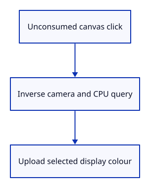

# 13 · Select the visible object with a mouse click

**Typing: 14–27 minutes.** [Estimate](typing-load.md).

Convert an unconsumed canvas click from CSS pixels to normalized screen coordinates. Reverse y, undo the camera, then ask the query for the visible ObjectId.

The command dock handles its own input first. A scene click updates selection and uploads its display colour.

## Type

Continue from [Find the nearest triangle at a scene point](12b-picking.md). [Save or recover your work](recovery.md).

### 1. `src/browser.rs`

Convert an unconsumed canvas click into a picking request.

<details>
<summary>Locate the existing block</summary>

```rust
            }
        };

        if let Some(line) = line {
            match line.as_str() {
                "example triangle" => {
                    scene.toggle_extra();
                    selected = selected.filter(|id| scene.contains(*id));
```

</details>

Replace that block with:

```rust
--8<-- "journey/code/13-picking-window-1.rs"
```

### 2. `src/browser.rs`

Listen for canvas clicks.

<details>
<summary>Locate the existing block</summary>

```rust
        "keydown",
        "keyup",
        "blur",
    ] {
        canvas.add_event_listener_with_callback(name, click.as_ref().unchecked_ref())?;
    }
```

</details>

Replace that block with:

```rust
--8<-- "journey/code/13-picking-window-2.rs"
```

### 3. `src/browser.rs`

Report the visible selection result.

<details>
<summary>Locate the existing block</summary>

```rust
    )?;
    // The page has one listener for its lifetime; JavaScript must retain the Rust callback.
    click.forget();
    report("Selection follows object identity, even when rows move.");
    Ok(())
}
```

</details>

Replace that block with:

```rust
--8<-- "journey/code/13-picking-window-3.rs"
```

## Run and check

In your project:

```sh
cd workspace/journey
cargo build --lib --locked --target wasm32-unknown-unknown -j4
CARGO_BUILD_JOBS=4 trunk serve --port 8780
```

Open `http://127.0.0.1:8780/`. Keep an existing Trunk server running; saving rebuilds it.

Click the visible far triangle. It turns yellow.

**Verified checkpoint in Chrome.**


[Verification scope](release.md).

Run the state checks on your computer from your project folder:

```sh
cargo test --lib --locked --target host-tuple -j4
```

<details>
<summary>Code explanation and diagram</summary>


Canvas click → normalized point → inverse camera → pick → selected display.



Why test whether the command dock consumed the click?

Clicking or editing the dock must not also select scene geometry.

Study estimate, including typing and experiments: 0.5–1 hours.

</details>

<details>
<summary>Optional experiment</summary>

Select the front triangle at the overlap and delete it. Click that same place again. The far triangle should now be selected with its original ID. Then move the camera and repeat: explain the coordinate conversions rather than memorising a pixel position.

</details>

<details>
<summary>Check and save your work</summary>

Restore experimental edits, then run from `session_viewer`:

```sh
npm --prefix ../session_tests run course -- check 13-picking
npm --prefix ../session_tests run course -- save 13-picking
```

Source comparison leaves your project untouched. [Save and recovery instructions](recovery.md).

</details>

<details>
<summary>Viewer coverage and verification</summary>

Production picking renders integer identifiers, reads a small result asynchronously, rejects stale results and resolves the displayed row back to source identity. The conversion and ownership questions introduced here remain the same when the implementation becomes more capable.


[Full validation scope](release.md).

</details>
