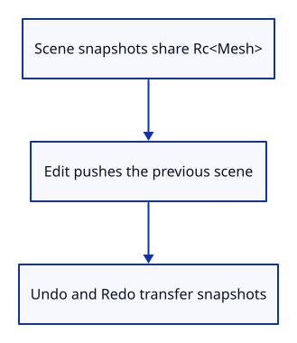

# 13a · Retain reversible scene snapshots

**Typing: 28–55 minutes.** [Estimate](typing-load.md).

History retains scene snapshots before an edit. Undo and Redo transfer snapshots between two stacks; a new edit clears Redo. Keep the latest 64 edits.

## Type

Continue from [Select the visible object with a mouse click](13-picking.md). [Save or recover your work](recovery.md).

### 1. `src/scene.rs`

Use shared ownership for immutable mesh data.

<details>
<summary>Locate the existing block</summary>

```rust
use crate::mesh::Mesh;
```

</details>

Replace that block with:

```rust
--8<-- "journey/code/14-history-01.rs"
```

### 2. `src/scene.rs`

Allow scene snapshots to clone the object record.

<details>
<summary>Locate the existing block</summary>

```rust
pub struct Object {
```

</details>

Replace that block with:

```rust
--8<-- "journey/code/14-history-02.rs"
```

### 3. `src/scene.rs`

Share the mesh allocation between object snapshots.

<details>
<summary>Locate the existing block</summary>

```rust
    pub mesh: Mesh,
```

</details>

Replace that block with:

```rust
--8<-- "journey/code/14-history-03.rs"
```

### 4. `src/scene.rs`

Clone the small scene records for a snapshot. Rc prevents a deep copy of each mesh.

<details>
<summary>Locate the existing block</summary>

```rust
pub struct Scene {
```

</details>

Replace that block with:

```rust
--8<-- "journey/code/14-history-04.rs"
```

### 5. `src/scene.rs`

Give a newly inserted mesh its first shared owner.

<details>
<summary>Locate the existing block</summary>

```rust
        self.objects.push(Object { id, mesh });
```

</details>

Replace that block with:

```rust
--8<-- "journey/code/14-history-05.rs"
```

### 6. `src/scene.rs`

Restore document contents while preserving the highest ID counter reached.

<details>
<summary>Locate the existing block</summary>

```rust
    pub fn objects(&self) -> &[Object] {
```

</details>

Replace that block with:

```rust
--8<-- "journey/code/14-history-06.rs"
```

### 7. `src/history.rs`

Create bounded undo and redo stacks, plus tests for identity, shared data and a new editing branch.

Create the file and type:

```rust
--8<-- "journey/code/14-history-07.rs"
```

### 8. `src/lib.rs`

Register history as a document operation, independent of the browser and GPU.

<details>
<summary>Locate the existing block</summary>

```rust
pub mod mesh;
pub mod scene;
pub mod picking;
pub mod gpu_mesh;
pub mod renderer;
#[cfg(target_arch = "wasm32")]
```

</details>

Replace that block with:

```rust
--8<-- "journey/code/14-history-fullscreen-1.rs"
```

## Run and check

In your project:

```sh
cd workspace/journey
cargo build --lib --locked --target wasm32-unknown-unknown -j4
CARGO_BUILD_JOBS=4 trunk serve --port 8780
```

Open `http://127.0.0.1:8780/`. Keep an existing Trunk server running; saving rebuilds it.

Run the state checks below. Undo restores the same ID and mesh allocation; a new branch clears Redo without reusing IDs; history keeps 64 edits.

**Verified checkpoint in Chrome.**


[Verification scope](release.md).

Run the state checks on your computer from your project folder:

```sh
cargo test --lib --locked --target host-tuple -j4
```

<details>
<summary>Code explanation and diagram</summary>

Rc shares immutable Mesh values across snapshots. FnOnce accepts an action called once with the scene. Restoring contents preserves the highest ID counter reached.

Edit saves Scene → undo/redo transfer snapshots → restore keeps the highest ID counter.



Does cloning a scene copy every vertex array?

No. Object records clone Rc<Mesh> handles. The snapshots share the same immutable mesh allocation.

Study estimate, including typing and experiments: 0.75–1.5 hours.

</details>

<details>
<summary>Optional experiment</summary>

Read the pointer-equality assertion before running the history checks. Undo should restore the original Rc allocation rather than a copied mesh.

</details>

<details>
<summary>Check and save your work</summary>

Restore experimental edits, then run from `session_viewer`:

```sh
npm --prefix ../session_tests run course -- check 13a-history
npm --prefix ../session_tests run course -- save 13a-history
```

Source comparison leaves your project untouched. [Save and recovery instructions](recovery.md).

</details>

<details>
<summary>Viewer coverage and verification</summary>

Document snapshots preserve source identity and immutable geometry owners. Camera and background remain outside document history.

Native tests establish the snapshot, sharing and branching behavior. Chrome retains picking and typed selection until Undo/Redo commands are connected next.

[Full validation scope](release.md).

</details>
