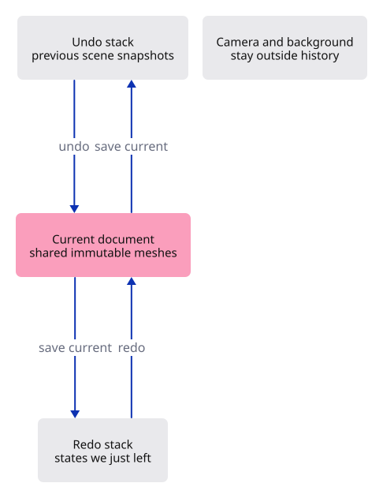
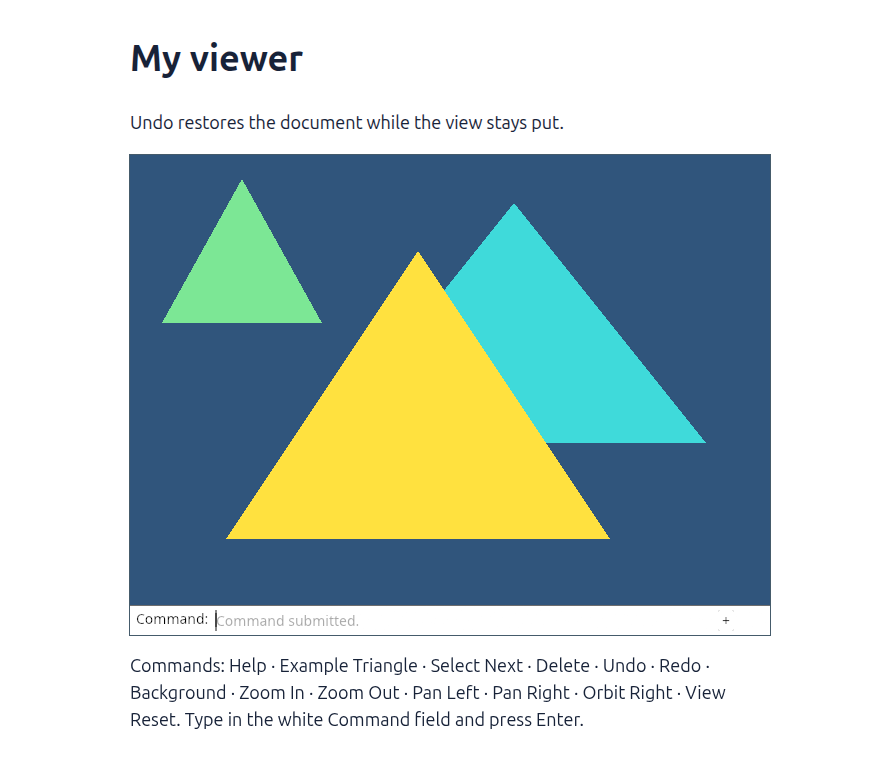

# 14 · Make document changes reversible

**Plan about 2–4 hours.** 166 lines to type, including comments and blank lines. Allow time to read, predict and experiment; this is an estimate, not a deadline.

**Today:** Undo and redo adding or deleting an object without changing the camera or losing identity.

**In the whole viewer:** Connect the browser, drawing and input, then extend the same project. [See the destination](../journey.md#the-destination).

**Follow:** Document edit → prior scene snapshot → undo or redo → restored scene → selection repair → GPU synchronization.

**Before you finish, explain:** Why must restoring an old scene not reset the object-ID counter to its old value?

You should be able to try an edit without fearing that one mistake will ruin your work. Today an edit remembers the scene as it was just before the change. Undo brings that scene back; redo restores the scene we just left.

Think of two small stacks of bookmarks. Undo takes one bookmark from the past and places the current scene on the future stack. Redo does the same journey in the opposite direction. A new edit starts a different future, so it clears the redo stack.



A snapshot must not copy every vertex array. Each Object will hold an `Rc<Mesh>`: a shared owner of immutable mesh data. Cloning a scene copies its small object list and clones these shared handles. The mesh allocation stays the same, as the pointer-equality test demonstrates. `Rc` is suitable for our single-threaded application state; the GPU continues to manage its own resource lifetimes.

`History::edit` accepts an action that receives the scene once. `FnOnce` describes that promise. It records the previous scene, executes the action and clears redo. Our two actions here are already valid operations: toggle the demonstration object, or remove a selected object that exists. Validation of a new mesh still happens before insertion.

Undo restores document contents, not camera or background. Selection is interaction state too: it remains selected if its ID still exists, otherwise it becomes None. Restoring a deleted object does not automatically select it. After restoration, the renderer uploads the restored scene through the same synchronization method used by an ordinary edit.

We retain the most recent 64 edits. Sharing mesh data makes these snapshots useful for a small document, but object lists still take memory. The later resource-accounting and transaction lessons will address larger documents, grouping a gesture into one edit and handling cancelled previews.

## Type the change

Continue [Ask which object is under the pointer](13-picking.md). From `session_viewer`, save your files with `npm --prefix ../session_tests run course -- save before-14-history`. A save keeps your own work; it does not fill in the next lesson.

### 1. `src/scene.rs`

Use shared ownership for immutable mesh data.

Find this exact block:

```rust
use crate::mesh::Mesh;
```

Replace that block with:

```rust
--8<-- "journey/code/14-history-01.rs"
```

### 2. `src/scene.rs`

Allow scene snapshots to clone the object record.

Find this exact block:

```rust
pub struct Object {
```

Replace that block with:

```rust
--8<-- "journey/code/14-history-02.rs"
```

### 3. `src/scene.rs`

Share the mesh allocation between object snapshots.

Find this exact block:

```rust
    pub mesh: Mesh,
```

Replace that block with:

```rust
--8<-- "journey/code/14-history-03.rs"
```

### 4. `src/scene.rs`

Clone the small scene records for a snapshot. Rc prevents a deep copy of each mesh.

Find this exact block:

```rust
pub struct Scene {
```

Replace that block with:

```rust
--8<-- "journey/code/14-history-04.rs"
```

### 5. `src/scene.rs`

Give a newly inserted mesh its first shared owner.

Find this exact block:

```rust
        self.objects.push(Object { id, mesh });
```

Replace that block with:

```rust
--8<-- "journey/code/14-history-05.rs"
```

### 6. `src/scene.rs`

Restore document contents while preserving the highest ID counter reached.

Find this exact block:

```rust
    pub fn objects(&self) -> &[Object] {
```

Replace that block with:

```rust
--8<-- "journey/code/14-history-06.rs"
```

### 7. `src/history.rs`

Create bounded undo and redo stacks, plus tests for identity, shared data and a new editing branch.

Create the file and type:

```rust
--8<-- "journey/code/14-history-07.rs"
```

### 8. `src/lib.rs`

Register history as a document operation, independent of the browser and GPU.

Find this exact block:

```rust
pub mod mesh;
pub mod scene;
pub mod picking;
pub mod gpu_mesh;
pub mod renderer;
#[cfg(target_arch = "wasm32")]
```

Replace that block with:

```rust
--8<-- "journey/code/14-history-dock-01.rs"
```

### 9. `src/browser.rs`

Connect make document changes reversible to the typed command path. Keep the scene state in its existing owner and redraw the dock after applying an action.

Find this exact block:

```rust
use crate::background::Background;
use crate::camera::Camera;
use crate::renderer::Renderer;
use crate::scene::Scene;
use wasm_bindgen::{JsCast, JsValue, closure::Closure};
```

Replace that block with:

```rust
--8<-- "journey/code/14-history-dock-02.rs"
```

### 10. `src/browser.rs`

Connect make document changes reversible to the typed command path. Keep the scene state in its existing owner and redraw the dock after applying an action.

Find this exact block:

```rust
            "Example Triangle",
            "Select Next",
            "Delete",
            "Background",
            "Zoom In",
            "Zoom Out",
```

Replace that block with:

```rust
--8<-- "journey/code/14-history-dock-03.rs"
```

### 11. `src/browser.rs`

Connect make document changes reversible to the typed command path. Keep the scene state in its existing owner and redraw the dock after applying an action.

Find this exact block:

```rust
        ],
    );
    panel.update(None, &canvas)?;
    let mut selected = None;
    let mut background = Background::default();
    let mut camera = Camera::default();
```

Replace that block with:

```rust
--8<-- "journey/code/14-history-dock-04.rs"
```

### 12. `src/browser.rs`

Connect make document changes reversible to the typed command path. Keep the scene state in its existing owner and redraw the dock after applying an action.

Find this exact block:

```rust
                    renderer.set_scene(&scene, selected);
                }
                "example triangle" => {
                    scene.toggle_extra();
                    selected = selected.filter(|id| scene.contains(*id));
                    renderer.set_scene(&scene, selected);
                }
```

Replace that block with:

```rust
--8<-- "journey/code/14-history-dock-05.rs"
```

### 13. `src/browser.rs`

Connect make document changes reversible to the typed command path. Keep the scene state in its existing owner and redraw the dock after applying an action.

Find this exact block:

```rust
                }
                "delete" => {
                    if let Some(id) = selected.take() {
                        scene.remove(id);
                        renderer.set_scene(&scene, selected);
                    }
                }
                "background" => background.toggle(),
                "zoom in" => camera.zoom(2.0),
                "zoom out" => camera.zoom(0.5),
```

Replace that block with:

```rust
--8<-- "journey/code/14-history-dock-06.rs"
```

### 14. `src/browser.rs`

Connect make document changes reversible to the typed command path. Keep the scene state in its existing owner and redraw the dock after applying an action.

Find this exact block:

```rust
    )?;
    // The page has one listener for its lifetime; JavaScript must retain the Rust callback.
    click.forget();
    report("Click a triangle; the visible object is selected.");
    Ok(())
}
```

Replace that block with:

```rust
--8<-- "journey/code/14-history-dock-07.rs"
```

### 15. `index.html`

Keep the HTML page small. Feature input belongs to the command dock drawn inside the canvas.

Find this exact block:

```html
  <h1>My viewer</h1>
  <p id="status" role="status">Waiting for Rust…</p>
  <canvas id="canvas" tabindex="0" width="640" height="480" aria-label="Viewer drawing"></canvas>
  <p>Commands: Help · Example Triangle · Select Next · Delete · Background · Zoom In · Zoom Out · Pan Left · Pan Right · Orbit Right · View Reset. Type in the white Command field and press Enter.</p>
</body>
</html>
```

Replace that block with:

```html
--8<-- "journey/code/14-history-page-1.html"
```

## Run and look

From `session_viewer`, enter your project folder:

```sh
cd workspace/journey
cargo build --lib --locked --target wasm32-unknown-unknown -j4
CARGO_BUILD_JOBS=4 trunk serve --port 8780
```

Open `http://127.0.0.1:8780/`. If Trunk is already running in this project, leave it running; it rebuilds when you save.

Run `Example Triangle`, `Undo`, then `Redo`. The object and its original colour return. Change the view or background and undo a document edit: those view choices stay put. A new document edit after Undo removes the abandoned redo path.

**Actual Chrome screenshot.**



*Captured from this checkpoint’s browser bundle after its browser checks passed. [Check scope and environment](release.md).*

Run the state checks from your project folder:

```sh
cargo test --lib --locked -j4
```

## Try one small experiment

Add the third triangle, undo that addition, then add it again. It looks similar, but the new addition must receive a new ID. Read the branching-history test and explain why. Next pan the camera, delete an object and undo: the camera should stay where you put it.

## Explain it in your own words

Trace the values through the files without reading the answer first. If you lose the connection, stop at the last value you can follow.

<details>
<summary>Compare your explanation</summary>

IDs created after that snapshot may still be remembered by a tool or earlier result. If the counter moved backward, a new object could receive one of those names. We restore the old scene contents but keep the highest counter reached, so an undo followed by a new edit cannot silently reuse an ID.

</details>

## Keep your working result

Return to `session_viewer` in a second terminal. Restore experimental edits before comparing:

```sh
npm --prefix ../session_tests run course -- check 14-history
npm --prefix ../session_tests run course -- save 14-history
```

The comparison spots typing differences; it does not prove behaviour. Keep three notes: what I changed; the values I followed; the question I still have. [Recover a checkpoint](recovery.md) if an experiment gets tangled.

## Where this grows

The full viewer groups document operations into transactions and coordinates restoration with displayed rows and tool state. This lesson establishes reversible document changes, shared immutable data, preserved identity and the boundary between an edit and a view change.

[Validation status and course release](release.md).
