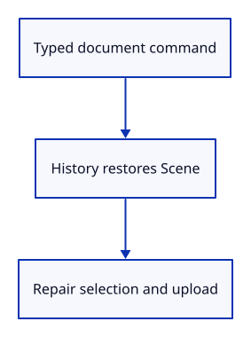

# 14 · Run Undo and Redo from the command line

**Typing: 8–16 minutes.** [Estimate](typing-load.md).

Route Example Triangle and Delete through History::edit. Undo and Redo restore the scene, retain only valid selection, then upload the restored display.

## Type

Continue from [Retain reversible scene snapshots](13a-history.md). [Save or recover your work](recovery.md).

### 1. `src/browser.rs`

Import the history owner.

<details>
<summary>Locate the existing block</summary>

```rust
use crate::background::Background;
use crate::camera::Camera;
use crate::renderer::Renderer;
use crate::scene::Scene;
use wasm_bindgen::{JsCast, JsValue, closure::Closure};
```

</details>

Replace that block with:

```rust
--8<-- "journey/code/14-history-window-1.rs"
```

### 2. `src/browser.rs`

Add Undo and Redo to the vocabulary.

<details>
<summary>Locate the existing block</summary>

```rust
            "Example Triangle",
            "Select Next",
            "Delete",
            "Background",
            "Zoom In",
            "Zoom Out",
```

</details>

Replace that block with:

```rust
--8<-- "journey/code/14-history-window-2.rs"
```

### 3. `src/browser.rs`

Create document history beside the scene.

<details>
<summary>Locate the existing block</summary>

```rust
        ],
    );
    panel.update(None, &canvas)?;
    let mut selected = None;
    let mut background = Background::default();
    let mut camera = Camera::default();
```

</details>

Replace that block with:

```rust
--8<-- "journey/code/14-history-window-3.rs"
```

### 4. `src/browser.rs`

Record the example toggle as a history edit.

<details>
<summary>Locate the existing block</summary>

```rust
                    renderer.set_scene(&scene, selected);
                }
                "example triangle" => {
                    scene.toggle_extra();
                    selected = selected.filter(|id| scene.contains(*id));
                    renderer.set_scene(&scene, selected);
                }
```

</details>

Replace that block with:

```rust
--8<-- "journey/code/14-history-window-4.rs"
```

### 5. `src/browser.rs`

Record deletion and route Undo/Redo through history; retain only valid selection.

<details>
<summary>Locate the existing block</summary>

```rust
                }
                "delete" => {
                    if let Some(id) = selected.take() {
                        scene.remove(id);
                        renderer.set_scene(&scene, selected);
                    }
                }
                "background" => background.toggle(),
                "zoom in" => camera.zoom(2.0),
                "zoom out" => camera.zoom(0.5),
```

</details>

Replace that block with:

```rust
--8<-- "journey/code/14-history-window-5.rs"
```

### 6. `src/browser.rs`

Report the undo result.

<details>
<summary>Locate the existing block</summary>

```rust
    )?;
    // The page has one listener for its lifetime; JavaScript must retain the Rust callback.
    click.forget();
    report("Click a triangle; the visible object is selected.");
    Ok(())
}
```

</details>

Replace that block with:

```rust
--8<-- "journey/code/14-history-window-6.rs"
```

## Run and check

In your project:

```sh
cd workspace/journey
cargo build --lib --locked --target wasm32-unknown-unknown -j4
CARGO_BUILD_JOBS=4 trunk serve --port 8780
```

Open `http://127.0.0.1:8780/`. Keep an existing Trunk server running; saving rebuilds it.

Type Example Triangle, then Undo and Redo. The third triangle disappears and returns.

**Verified checkpoint in Chrome.**


[Verification scope](release.md).

Run the state checks on your computer from your project folder:

```sh
cargo test --lib --locked --target host-tuple -j4
```

<details>
<summary>Code explanation and diagram</summary>

The callback keeps camera and background outside history. A document restoration redraws with the current view.

Typed edit → History → restored Scene → selection repair → set_scene.



Why repair selection after restoration?

Selection stores an ID. The restored scene may not contain that ID, so retain it only when it still exists.

Study estimate, including typing and experiments: 0.25–0.5 hours.

</details>

<details>
<summary>Optional experiment</summary>

Add the third triangle, undo that addition, then add it again. It looks similar, but the new addition must receive a new ID. Read the branching-history test and explain why. Next pan the camera, delete an object and undo: the camera should stay where you put it.

</details>

<details>
<summary>Check and save your work</summary>

Restore experimental edits, then run from `session_viewer`:

```sh
npm --prefix ../session_tests run course -- check 14-history
npm --prefix ../session_tests run course -- save 14-history
```

Source comparison leaves your project untouched. [Save and recovery instructions](recovery.md).

</details>

<details>
<summary>Viewer coverage and verification</summary>

The full viewer groups document operations into transactions and coordinates restoration with displayed rows and tool state. This lesson establishes reversible document changes, shared immutable data, preserved identity and the boundary between an edit and a view change.


[Full validation scope](release.md).

</details>
