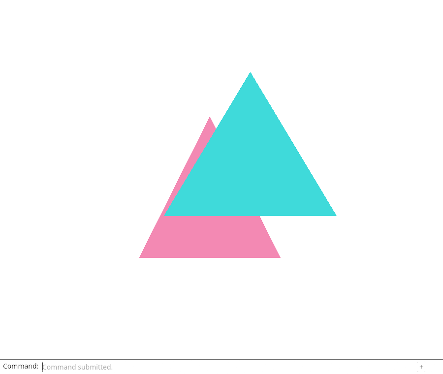
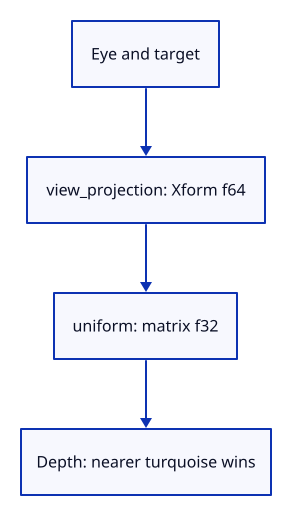

# 14a · Draw through a perspective camera

**Typing: 20–40 minutes.** [Estimate](typing-load.md).

Look from z = 3 toward z = 0 with a 60-degree vertical field of view. The nearer turquoise triangle covers pink at their overlap.

Xform calculates the view and projection in double precision. to_f32 supplies the existing GPU uniform; the shader divides clip coordinates by w. Keep aspect equal to window width divided by height.

## Type

Continue from [Run Undo and Redo from the command line](14-history.md). [Save or recover your work](recovery.md).

### 1. `Cargo.toml`

Add the geometry kernel and browser-compatible random number support.

<details>
<summary>Locate the existing block</summary>

```toml
console_error_panic_hook = "=0.1.7"
wasm-bindgen-futures = "=0.4.78"
wgpu = "=29.0.4"

egui = { version = "=0.34.3", default-features = false }
egui-wgpu = { version = "=0.34.3", default-features = false }
```

</details>

Replace that block with:

```toml
--8<-- "journey/code/15-perspective-dock-01.toml"
```

### 2. `src/camera.rs`

Give the camera an eye distance, view-projection matrix and GPU uniform. Check the transformed target stays centred.

<details>
<summary>Locate the existing block</summary>

```rust
pub struct Camera {
    pub center: [f32; 2],
    pub scale: f32,
    pub angle: f32,
}

impl Default for Camera {
    fn default() -> Self {
        Self { center: [0.0, 0.0], scale: 1.0, angle: 0.0 }
    }
}

impl Camera {
    pub fn pan(&mut self, dx: f32, dy: f32) {
        self.center[0] += dx;
        self.center[1] += dy;
    }

    pub fn zoom(&mut self, factor: f32) {
        if factor.is_finite() && factor > 0.0 {
            self.scale = (self.scale * factor).clamp(0.1, 10.0);
        }
    }

    pub fn rotate(&mut self, radians: f32) {
        self.angle += radians;
    }

    pub fn world_from_screen(&self, point: [f32; 2]) -> [f32; 2] {
        let x = point[0] / self.scale;
        let y = point[1] / self.scale;
        let (sin, cos) = self.angle.sin_cos();
        [self.center[0] + x * cos - y * sin, self.center[1] + x * sin + y * cos]
    }

    pub fn uniform(&self) -> [f32; 16] {
        let a = self.scale * self.angle.cos();
        let b = self.scale * self.angle.sin();
        let [x, y] = self.center;
        // WGSL matrices are uploaded column by column.
        [
            a, -b, 0.0, 0.0,
            b,  a, 0.0, 0.0,
            0.0, 0.0, 1.0, 0.0,
            -a * x - b * y, b * x - a * y, 0.0, 1.0,
        ]
    }
}

#[cfg(test)]
mod coordinate_tests {
    use super::Camera;

    #[test]
    fn moving_the_view_preserves_the_coordinate_round_trip() {
        let mut camera = Camera::default();
        camera.pan(0.1, -0.2);
        camera.zoom(0.5);
        camera.rotate(0.7);
        let world = [0.4, 0.0];
        let matrix = camera.uniform();
        let screen = [matrix[0] * world[0] + matrix[4] * world[1] + matrix[12],
            matrix[1] * world[0] + matrix[5] * world[1] + matrix[13]];
        let restored = camera.world_from_screen(screen);
        assert!((restored[0] - world[0]).abs() < 1.0e-6);
        assert!((restored[1] - world[1]).abs() < 1.0e-6);
    }
}

#[cfg(test)]
mod tests {
    use super::*;

    #[test]
    fn panned_target_stays_at_the_screen_centre_when_zooming() {
        let mut camera = Camera::default();
        camera.pan(0.25, -0.5);
        camera.zoom(2.0);
        camera.rotate(std::f32::consts::FRAC_PI_4);
        let m = camera.uniform();
        let [x, y] = camera.center;
        assert!((m[0] * x + m[4] * y + m[12]).abs() < 1.0e-6);
        assert!((m[1] * x + m[5] * y + m[13]).abs() < 1.0e-6);
    }

    #[test]
    fn zoom_stays_positive_and_bounded() {
        let mut camera = Camera::default();
        camera.zoom(0.0001);
        assert_eq!(camera.scale, 0.1);
        camera.zoom(1_000.0);
        assert_eq!(camera.scale, 10.0);
        camera.zoom(f32::NAN);
        camera.zoom(-1.0);
        assert_eq!(camera.scale, 10.0);
    }
}
```

</details>

Replace that block with:

```rust
--8<-- "journey/code/14a-perspective-camera.rs"
```

### 3. `src/scene.rs`

Name the mesh by colour; which surface is nearer now depends on the camera.

<details>
<summary>Locate the existing block</summary>

```rust
        let near = Mesh::new(vec![
```

</details>

Replace that block with:

```rust
--8<-- "journey/code/15-perspective-05.rs"
```

### 4. `src/scene.rs`

Give the other mesh a camera-independent name.

<details>
<summary>Locate the existing block</summary>

```rust
        let far = Mesh::new(vec![
```

</details>

Replace that block with:

```rust
--8<-- "journey/code/15-perspective-06.rs"
```

### 5. `src/scene.rs`

Name the pink triangle in its validation error.

<details>
<summary>Locate the existing block</summary>

```rust
expect("Valid near triangle")
```

</details>

Replace that block with:

```rust
--8<-- "journey/code/15-perspective-07.rs"
```

### 6. `src/scene.rs`

Name the turquoise triangle in its validation error.

<details>
<summary>Locate the existing block</summary>

```rust
expect("Valid far triangle")
```

</details>

Replace that block with:

```rust
--8<-- "journey/code/15-perspective-08.rs"
```

### 7. `src/scene.rs`

Insert the same two mesh data sets in the same order. Their identities are unchanged.

<details>
<summary>Locate the existing block</summary>

```rust
        scene.insert(near).expect("ID available");
        scene.insert(far).expect("ID available");
```

</details>

Replace that block with:

```rust
--8<-- "journey/code/15-perspective-09.rs"
```

### 8. `src/browser.rs`

Initialize camera aspect from the canvas size.

<details>
<summary>Locate the existing block</summary>

```rust
    let mut history = History::default();
    let mut selected = None;
    let mut background = Background::default();
    let mut camera = Camera::default();
    present(
        &surface,
        &renderer,
```

</details>

Replace that block with:

```rust
--8<-- "journey/code/15-perspective-window-1.rs"
```

### 9. `src/browser.rs`

Preserve aspect when resetting the camera.

<details>
<summary>Locate the existing block</summary>

```rust
                "pan left" => camera.pan(-0.25, 0.0),
                "pan right" => camera.pan(0.25, 0.0),
                "orbit right" => camera.rotate(std::f32::consts::FRAC_PI_4),
                "view reset" => camera = Camera::default(),
                _ => return,
            }
        }
```

</details>

Replace that block with:

```rust
--8<-- "journey/code/15-perspective-window-3.rs"
```

### 10. `src/lib.rs`

Pause the flat picking module until the camera-ray query is introduced.

Find this exact block:

```rust
pub mod picking;
```

Delete this block.

### 11. `src/browser.rs`

Pause canvas selection while the camera changes; typed selection still works.

<details>
<summary>Locate the existing block</summary>

```rust
                "canvas" => {
                    let Some(event) = event.dyn_ref::<web_sys::MouseEvent>() else {
                        return;
                    };
                    let rect = input_canvas.get_bounding_client_rect();
                    if rect.width() <= 0.0 || rect.height() <= 0.0 {
                        return;
                    }
                    let screen = [
                        (2.0 * (event.client_x() as f64 - rect.left()) / rect.width() - 1.0) as f32,
                        (1.0 - 2.0 * (event.client_y() as f64 - rect.top()) / rect.height()) as f32,
                    ];
                    selected = crate::picking::pick(&scene, camera.world_from_screen(screen));
                    renderer.set_scene(&scene, selected);
                }
```

</details>

Replace that block with:

```rust
--8<-- "journey/code/14a-perspective-canvas.rs"
```

### 12. `src/browser.rs`

Report that perspective drawing is ready.

<details>
<summary>Locate the existing block</summary>

```rust
    report("Undo restores the document while the view stays put.");
```

</details>

Replace that block with:

```rust
--8<-- "journey/code/14a-perspective-status.rs"
```

## Run and check

After typing the manifest, run this from `session_viewer` to select the fixed dependency versions. It updates Cargo.lock, preserves the previous lock, and installs any supplied binary font assets. It does not write implementation code:

```sh
npm --prefix ../session_tests run course -- dependencies 14a-perspective
```

In your project:

```sh
cd workspace/journey
REGEN_PROTO=0 cargo build --lib --locked --target wasm32-unknown-unknown -j4
REGEN_PROTO=0 CARGO_BUILD_JOBS=4 trunk serve --port 8780
```

Open `http://127.0.0.1:8780/`. Keep an existing Trunk server running; saving rebuilds it.

Refresh the viewer. Turquoise covers pink at the centre of the view.

**Verified checkpoint in Chrome.**



[Verification scope](release.md).

Run the state checks on your computer from your project folder:

```sh
REGEN_PROTO=0 cargo test --lib --locked --target host-tuple -j4
```

<details>
<summary>Code explanation and diagram</summary>


Eye and target → view_projection → f32 uniform → GPU depth test.



Why is turquoise nearer even though its world z is larger?

The eye is at positive z and looks toward zero. The turquoise triangle at z = 0.75 is closer to that eye than pink at z = 0.25.

Study estimate, including typing and experiments: 0.75–1.25 hours.

</details>

<details>
<summary>Optional experiment</summary>

Type Zoom In, then View Reset. The eye moves closer and resets; geometry positions stay unchanged.

</details>

<details>
<summary>Check and save your work</summary>

Restore experimental edits, then run from `session_viewer`:

```sh
npm --prefix ../session_tests run course -- check 14a-perspective
npm --prefix ../session_tests run course -- save 14a-perspective
```

Source comparison leaves your project untouched. [Save and recovery instructions](recovery.md).

</details>

<details>
<summary>Viewer coverage and verification</summary>

The viewer calculates camera geometry in double precision and supplies float matrices to the GPU. This step establishes perspective drawing; the next two steps restore canvas picking with a matching ray.

This checkpoint verifies perspective drawing and typed commands. Canvas selection is paused while the old flat-coordinate query is replaced; it returns in the ray-picking step.

[Full validation scope](release.md).

To reproduce the scripted acceptance of the reference checkpoint, run from `session_viewer` with the [course bundle server](release.md#reproduce) running on port 8781:

```sh
npm --prefix ../session_tests run course -- capture 14a-perspective
```

This uses the verified reference bundle; it does not check or change your typed project.

</details>
