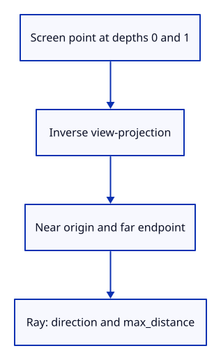

# 14b · Turn a screen point into a bounded ray

**Typing: 14–28 minutes.** [Estimate](typing-load.md).

Invert the view-projection matrix. A screen point at depths zero and one gives the near and far ends of a ray through the view.

Option returns None for invalid coordinates or an inverse that cannot be computed. Normalize the direction and retain the segment length.

## Type

Continue from [Draw through a perspective camera](14a-perspective.md). [Save or recover your work](recovery.md).

### 1. `src/camera.rs`

Keep the near origin, normalized direction and segment length together.

<details>
<summary>Locate the existing block</summary>

```rust
pub struct Camera {
```

</details>

Replace that block with:

```rust
--8<-- "journey/code/14b-ray-type.rs"
```

### 2. `src/camera.rs`

Inverse-transform the screen point at both depth boundaries; reject invalid coordinates and invalid segment length.

<details>
<summary>Locate the existing block</summary>

```rust
}

#[cfg(test)]
```

</details>

Replace that block with:

```rust
--8<-- "journey/code/14b-ray-method.rs"
```

### 3. `src/camera.rs`

Check that a projected point lies on its recovered ray and invalid screen coordinates are rejected.

<details>
<summary>Locate the existing block</summary>

```rust
        assert!((0.0..1.0).contains(&screen[2]));
    }

}
```

</details>

Replace that block with:

```rust
--8<-- "journey/code/14b-ray-test.rs"
```

## Run and check

In your project:

```sh
cd workspace/journey
REGEN_PROTO=0 cargo build --lib --locked --target wasm32-unknown-unknown -j4
REGEN_PROTO=0 CARGO_BUILD_JOBS=4 trunk serve --port 8780
```

Open `http://127.0.0.1:8780/`. Keep an existing Trunk server running; saving rebuilds it.

Run the state checks. A projected point lies on its recovered ray; invalid screen coordinates are rejected.

**Verified checkpoint in Chrome.**


[Verification scope](release.md).

Run the state checks from your project folder:

```sh
REGEN_PROTO=0 cargo test --lib --locked -j4
```

<details>
<summary>Code explanation and diagram</summary>


Screen depth 0 and 1 → inverse view-projection → origin, direction and max_distance.



Why retain max_distance beside a normalized direction?

Normalization removes length. max_distance keeps the far-plane boundary so picking can reject objects outside the visible segment.

Study estimate, including typing and experiments: 0.5–0.75 hours.

</details>

<details>
<summary>Optional experiment</summary>

Change the round-trip test screen x to NaN. ray should return None; restore the valid point.

</details>

<details>
<summary>Check and save your work</summary>

Restore experimental edits, then run from `session_viewer`:

```sh
npm --prefix ../session_tests run course -- check 14b-ray
npm --prefix ../session_tests run course -- save 14b-ray
```

Source comparison leaves your project untouched. [Save and recovery instructions](recovery.md).

</details>

<details>
<summary>Viewer coverage and verification</summary>

Drawing and picking use the same view-projection transform. This step verifies the bounded ray before the next query chooses an object.

The browser retains the independently captured perspective drawing. Native tests establish the new ray conversion; canvas picking is connected next.

[Full validation scope](release.md).

To reproduce the scripted acceptance of the reference checkpoint, run from `session_viewer` with the [course bundle server](release.md#reproduce) running on port 8781:

```sh
npm --prefix ../session_tests run course -- capture 14b-ray
```

This uses the verified reference bundle; it does not check or change your typed project.

</details>
