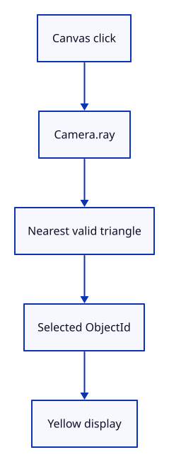

# 15 · Pick the nearest surface through the view

**Typing: 30–59 minutes.** [Estimate](typing-load.md).

Intersect the camera ray with each triangle. Keep the nearest hit inside the near-to-far segment and return its ObjectId.

## Type

Continue from [Turn a screen point into a bounded ray](14b-ray.md). [Save or recover your work](recovery.md).

### 1. `src/picking.rs`

Replace the flat coverage query with ray–triangle intersections and update the visibility tests for the new camera.

<details>
<summary>Locate the existing block</summary>

```rust
use crate::scene::{ObjectId, Scene};

pub fn pick(scene: &Scene, point: [f32; 2]) -> Option<ObjectId> {
    let mut nearest = 1.0;
    let mut hit = None;
    for object in scene.objects() {
        let vertices = object.mesh.vertices();
        for triangle in object.mesh.indices().chunks_exact(3) {
            let a = vertices[triangle[0] as usize];
            let b = vertices[triangle[1] as usize];
            let c = vertices[triangle[2] as usize];
            if let Some(depth) = triangle_depth(point, a, b, c) {
                if depth >= 0.0 && depth < nearest {
                    nearest = depth;
                    hit = Some(object.id);
                }
            }
        }
    }
    hit
}

fn triangle_depth(p: [f32; 2], a: [f32; 6], b: [f32; 6], c: [f32; 6]) -> Option<f32> {
    let cross = |u: [f32; 2], v: [f32; 2]| u[0] * v[1] - u[1] * v[0];
    let ab = [b[0] - a[0], b[1] - a[1]];
    let ac = [c[0] - a[0], c[1] - a[1]];
    let ap = [p[0] - a[0], p[1] - a[1]];
    let area = cross(ab, ac);
    if area.abs() < 1.0e-8 {
        return None;
    }
    let u = cross(ap, ac) / area;
    let v = cross(ab, ap) / area;
    if u >= 0.0 && v >= 0.0 && u + v <= 1.0 {
        Some((1.0 - u - v) * a[2] + u * b[2] + v * c[2])
    } else {
        None
    }
}

#[cfg(test)]
mod tests {
    use super::*;
    use crate::camera::Camera;

    #[test]
    fn overlap_chooses_the_visible_object_and_deletion_reveals_the_next() {
        let mut scene = Scene::demo();
        let near = scene.objects()[0].id;
        let far = scene.objects()[1].id;
        assert_eq!(pick(&scene, [0.0, 0.0]), Some(near));
        assert_eq!(pick(&scene, [0.4, 0.0]), Some(far));
        scene.remove(near);
        assert_eq!(pick(&scene, [0.0, 0.0]), Some(far));
        assert_eq!(pick(&scene, [-0.9, -0.9]), None);
    }

    #[test]
    fn picking_follows_a_panned_zoomed_and_rotated_camera() {
        let scene = Scene::demo();
        let mut camera = Camera::default();
        camera.pan(0.1, -0.2);
        camera.zoom(0.5);
        camera.rotate(0.7);
        let world = [0.4, 0.0];
        let m = camera.uniform();
        let screen = [m[0] * world[0] + m[4] * world[1] + m[12],
            m[1] * world[0] + m[5] * world[1] + m[13]];
        let restored = camera.world_from_screen(screen);
        assert!((restored[0] - world[0]).abs() < 1.0e-6);
        assert!((restored[1] - world[1]).abs() < 1.0e-6);
        assert_eq!(pick(&scene, restored), Some(scene.objects()[1].id));
    }

    #[test]
    fn an_edge_on_or_invalid_triangle_cannot_be_picked() {
        assert_eq!(triangle_depth([0.0, 0.0], [0.0; 6], [0.0; 6], [0.0; 6]), None);
        assert_eq!(pick(&Scene::demo(), [f32::NAN, 0.0]), None);
    }
}
```

</details>

Replace that block with:

```rust
--8<-- "journey/code/15-perspective-03.rs"
```

### 2. `src/lib.rs`

Register the camera-ray query now that its input is available.

<details>
<summary>Locate the existing block</summary>

```rust
pub mod scene;
```

</details>

Replace that block with:

```rust
--8<-- "journey/code/15-perspective-picking-module.rs"
```

### 3. `src/browser.rs`

Convert a canvas click to a camera ray and highlight its nearest valid object.

<details>
<summary>Locate the existing block</summary>

```rust
                "canvas" => return,
```

</details>

Replace that block with:

```rust
--8<-- "journey/code/15-perspective-canvas-ray.rs"
```

### 4. `src/browser.rs`

Report that perspective picking is ready.

<details>
<summary>Locate the existing block</summary>

```rust
    report("Perspective drawing uses the current camera.");
```

</details>

Replace that block with:

```rust
--8<-- "journey/code/15-perspective-status.rs"
```

## Run and check

In your project:

```sh
cd workspace/journey
REGEN_PROTO=0 cargo build --lib --locked --target wasm32-unknown-unknown -j4
REGEN_PROTO=0 CARGO_BUILD_JOBS=4 trunk serve --port 8780
```

Open `http://127.0.0.1:8780/`. Keep an existing Trunk server running; saving rebuilds it.

Click the overlap. The turquoise triangle becomes yellow.

**Verified checkpoint in Chrome.**


[Verification scope](release.md).

Run the state checks on your computer from your project folder:

```sh
REGEN_PROTO=0 cargo test --lib --locked --target host-tuple -j4
```

<details>
<summary>Code explanation and diagram</summary>

The barycentric values u and v test triangle coverage. The browser converts a canvas click to a ray, stores the selected ID, then uploads its yellow display colour.

Canvas click → Camera::ray → nearest valid triangle → ObjectId → yellow display.



Why compare ray distances rather than world z?

The camera can pan, rotate and zoom. Distance along its ray describes which valid surface the viewer sees first. World z alone does not.

Study estimate, including typing and experiments: 1–1.5 hours.

</details>

<details>
<summary>Optional experiment</summary>

Type Zoom In, select the overlap, then Delete and Undo. Picking should follow the camera and history should restore the same object.

</details>

<details>
<summary>Check and save your work</summary>

Restore experimental edits, then run from `session_viewer`:

```sh
npm --prefix ../session_tests run course -- check 15-perspective
npm --prefix ../session_tests run course -- save 15-perspective
```

Source comparison leaves your project untouched. [Save and recovery instructions](recovery.md).

</details>

<details>
<summary>Viewer coverage and verification</summary>

The full viewer uses this same geometry kernel, view-projection boundary and identity resolution. Its later camera adds world-up orbit, units, fit, floating origins and reversed depth for large scenes; those are extensions of the responsibilities introduced here.


[Full validation scope](release.md).

To reproduce the scripted acceptance of the reference checkpoint, run from `session_viewer` with the [course bundle server](release.md#reproduce) running on port 8781:

```sh
npm --prefix ../session_tests run course -- capture 15-perspective
```

This uses the verified reference bundle; it does not check or change your typed project.

</details>
