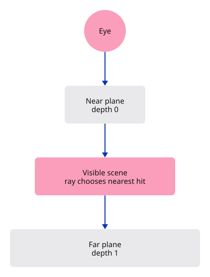
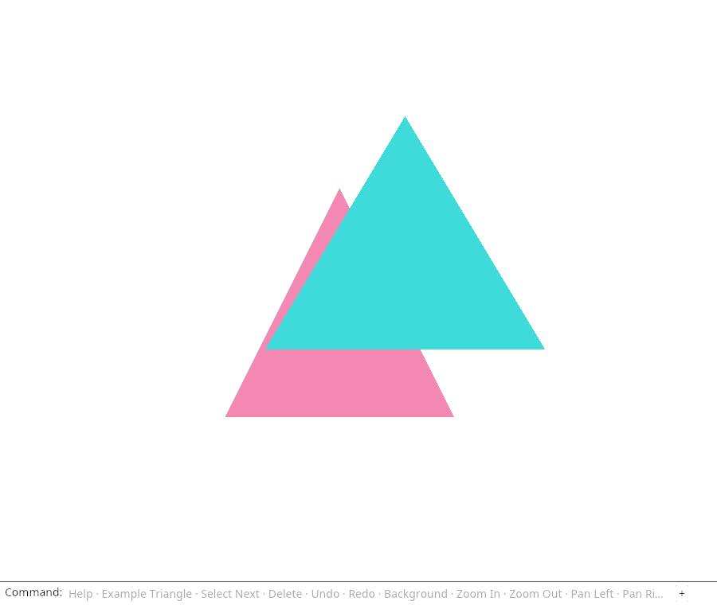

# 15 · Look through a perspective camera

**Plan about 4–7 hours.** 214 lines to type, including comments and blank lines. Allow time to read, predict and experiment; this is an estimate, not a deadline.

**Today:** View the scene in perspective and select surfaces with a ray that agrees with the camera.

**In the whole viewer:** Connect the browser, drawing and input, then extend the same project. [See the destination](../journey.md#the-destination).

**Follow:** World point → view matrix → projection → divide by w → canvas; click → inverse projection → clipped ray → object ID.

**Before you finish, explain:** Why can a larger world z value now belong to the nearer triangle?

Our earlier view treated distance like a flat drawing. Perspective makes the same object appear larger when it is closer to the eye. Today the camera looks from z = 3 toward z = 0, with a 60-degree vertical field of view.

The matrix now has two jobs. The **view matrix** describes positions relative to the eye and its right, up and forward directions. The **projection matrix** produces clip coordinates. The GPU divides x, y and z by w before mapping them into the image. Farther points have a larger divisor, so they appear smaller.



The shader already multiplies a four-component position by a matrix. It does not need to change. The depth attachment also keeps its existing Less rule. The matrix now calculates depth from the camera rather than using world z directly. Notice the result: the turquoise triangle is nearer from this camera position, so it wins the overlap.

We now use `Point`, `Vector` and `Xform` from the repository's Rust geometry kernel, the same library used by the finished viewer. These are geometry-library operations, not a hidden viewer implementation. `to_f32` supplies the column-major bytes our uniform already expects. The kernel uses double precision for calculations; the GPU still receives floats. The path in Cargo.toml points from your handwritten project to the existing `session_rust` crate.

A click is no longer one world point. It describes a line of sight. Transform that screen location at depth 0 and depth 1 through the inverse view-projection matrix: these are its near and far points. Their difference gives a direction, and their separation limits the ray to the visible depth interval. We therefore reject hits behind the near point or beyond the far point.

The triangle query solves `origin + t×direction = a + u×edge1 + v×edge2`. u and v retain the coverage meaning from the last lesson; t is now distance along the ray. The cross products let each dot product isolate one unknown. A determinant close to zero means the ray and triangle cannot provide a reliable intersection. After finding coverage, compare t across objects and keep the nearest valid hit.

The fixed field of view and clipping planes are enough for this small specimen. Later lessons add orbit, fit-to-scene, dynamic viewport size and the precision policy of the full viewer.

Set the camera’s aspect to the initial window width divided by its height. The projection then agrees with the full-window image. Resetting the camera keeps this aspect: changing the view must not change the window’s proportions.

## Type the change

Continue [Make document changes reversible](14-history.md). From `session_viewer`, save your files with `npm --prefix ../session_tests run course -- save before-15-perspective`. A save keeps your own work; it does not fill in the next lesson.

### 1. `src/camera.rs`

Replace the flat camera conversion with a perspective view and a clipped world-space ray. Retain the same pan, zoom, rotate and uniform entry points.

Find this exact block:

```rust
pub struct Camera {
    pub center: [f32; 2],
    pub scale: f32,
    pub angle: f32,
}

impl Default for Camera {
    fn default() -> Self {
        Self { center: [0.0, 0.0], scale: 1.0, angle: 0.0 }
    }
}

impl Camera {
    pub fn pan(&mut self, dx: f32, dy: f32) {
        self.center[0] += dx;
        self.center[1] += dy;
    }

    pub fn zoom(&mut self, factor: f32) {
        if factor.is_finite() && factor > 0.0 {
            self.scale = (self.scale * factor).clamp(0.1, 10.0);
        }
    }

    pub fn rotate(&mut self, radians: f32) {
        self.angle += radians;
    }

    pub fn world_from_screen(&self, point: [f32; 2]) -> [f32; 2] {
        let x = point[0] / self.scale;
        let y = point[1] / self.scale;
        let (sin, cos) = self.angle.sin_cos();
        [self.center[0] + x * cos - y * sin, self.center[1] + x * sin + y * cos]
    }

    pub fn uniform(&self) -> [f32; 16] {
        let a = self.scale * self.angle.cos();
        let b = self.scale * self.angle.sin();
        let [x, y] = self.center;
        // WGSL matrices are uploaded column by column.
        [
            a, -b, 0.0, 0.0,
            b,  a, 0.0, 0.0,
            0.0, 0.0, 1.0, 0.0,
            -a * x - b * y, b * x - a * y, 0.0, 1.0,
        ]
    }
}

#[cfg(test)]
mod tests {
    use super::*;

    #[test]
    fn panned_target_stays_at_the_screen_centre_when_zooming() {
        let mut camera = Camera::default();
        camera.pan(0.25, -0.5);
        camera.zoom(2.0);
        camera.rotate(std::f32::consts::FRAC_PI_4);
        let m = camera.uniform();
        let [x, y] = camera.center;
        assert!((m[0] * x + m[4] * y + m[12]).abs() < 1.0e-6);
        assert!((m[1] * x + m[5] * y + m[13]).abs() < 1.0e-6);
    }

    #[test]
    fn zoom_stays_positive_and_bounded() {
        let mut camera = Camera::default();
        camera.zoom(0.0001);
        assert_eq!(camera.scale, 0.1);
        camera.zoom(1_000.0);
        assert_eq!(camera.scale, 10.0);
        camera.zoom(f32::NAN);
        camera.zoom(-1.0);
        assert_eq!(camera.scale, 10.0);
    }
}
```

Replace that block with:

```rust
--8<-- "journey/code/15-perspective-02.rs"
```

### 2. `src/picking.rs`

Replace the flat coverage query with ray–triangle intersections and update the visibility tests for the new camera.

Find this exact block:

```rust
use crate::scene::{ObjectId, Scene};

pub fn pick(scene: &Scene, point: [f32; 2]) -> Option<ObjectId> {
    let mut nearest = 1.0;
    let mut hit = None;
    for object in scene.objects() {
        let vertices = object.mesh.vertices();
        for triangle in object.mesh.indices().chunks_exact(3) {
            let a = vertices[triangle[0] as usize];
            let b = vertices[triangle[1] as usize];
            let c = vertices[triangle[2] as usize];
            if let Some(depth) = triangle_depth(point, a, b, c) {
                if depth >= 0.0 && depth < nearest {
                    nearest = depth;
                    hit = Some(object.id);
                }
            }
        }
    }
    hit
}

fn triangle_depth(p: [f32; 2], a: [f32; 6], b: [f32; 6], c: [f32; 6]) -> Option<f32> {
    let cross = |u: [f32; 2], v: [f32; 2]| u[0] * v[1] - u[1] * v[0];
    let ab = [b[0] - a[0], b[1] - a[1]];
    let ac = [c[0] - a[0], c[1] - a[1]];
    let ap = [p[0] - a[0], p[1] - a[1]];
    let area = cross(ab, ac);
    if area.abs() < 1.0e-8 {
        return None;
    }
    let u = cross(ap, ac) / area;
    let v = cross(ab, ap) / area;
    if u >= 0.0 && v >= 0.0 && u + v <= 1.0 {
        Some((1.0 - u - v) * a[2] + u * b[2] + v * c[2])
    } else {
        None
    }
}

#[cfg(test)]
mod tests {
    use super::*;
    use crate::camera::Camera;

    #[test]
    fn overlap_chooses_the_visible_object_and_deletion_reveals_the_next() {
        let mut scene = Scene::demo();
        let near = scene.objects()[0].id;
        let far = scene.objects()[1].id;
        assert_eq!(pick(&scene, [0.0, 0.0]), Some(near));
        assert_eq!(pick(&scene, [0.4, 0.0]), Some(far));
        scene.remove(near);
        assert_eq!(pick(&scene, [0.0, 0.0]), Some(far));
        assert_eq!(pick(&scene, [-0.9, -0.9]), None);
    }

    #[test]
    fn picking_follows_a_panned_zoomed_and_rotated_camera() {
        let scene = Scene::demo();
        let mut camera = Camera::default();
        camera.pan(0.1, -0.2);
        camera.zoom(0.5);
        camera.rotate(0.7);
        let world = [0.4, 0.0];
        let m = camera.uniform();
        let screen = [m[0] * world[0] + m[4] * world[1] + m[12],
            m[1] * world[0] + m[5] * world[1] + m[13]];
        let restored = camera.world_from_screen(screen);
        assert!((restored[0] - world[0]).abs() < 1.0e-6);
        assert!((restored[1] - world[1]).abs() < 1.0e-6);
        assert_eq!(pick(&scene, restored), Some(scene.objects()[1].id));
    }

    #[test]
    fn an_edge_on_or_invalid_triangle_cannot_be_picked() {
        assert_eq!(triangle_depth([0.0, 0.0], [0.0; 6], [0.0; 6], [0.0; 6]), None);
        assert_eq!(pick(&Scene::demo(), [f32::NAN, 0.0]), None);
    }
}
```

Replace that block with:

```rust
--8<-- "journey/code/15-perspective-03.rs"
```

### 3. `src/scene.rs`

Name the mesh by colour; which surface is nearer now depends on the camera.

Find this exact block:

```rust
        let near = Mesh::new(vec![
```

Replace that block with:

```rust
--8<-- "journey/code/15-perspective-05.rs"
```

### 4. `src/scene.rs`

Give the other mesh a camera-independent name.

Find this exact block:

```rust
        let far = Mesh::new(vec![
```

Replace that block with:

```rust
--8<-- "journey/code/15-perspective-06.rs"
```

### 5. `src/scene.rs`

Keep the diagnostic name consistent.

Find this exact block:

```rust
expect("Valid near triangle")
```

Replace that block with:

```rust
--8<-- "journey/code/15-perspective-07.rs"
```

### 6. `src/scene.rs`

Keep the diagnostic name consistent.

Find this exact block:

```rust
expect("Valid far triangle")
```

Replace that block with:

```rust
--8<-- "journey/code/15-perspective-08.rs"
```

### 7. `src/scene.rs`

Insert the same two mesh data sets in the same order. Their identities are unchanged.

Find this exact block:

```rust
        scene.insert(near).expect("ID available");
        scene.insert(far).expect("ID available");
```

Replace that block with:

```rust
--8<-- "journey/code/15-perspective-09.rs"
```

### 8. `Cargo.toml`

Enable the browser event bindings used by the command dock. serde records the drawn field for browser verification; the same code still receives real keyboard events.

Find this exact block:

```toml
console_error_panic_hook = "=0.1.7"
wasm-bindgen-futures = "=0.4.78"
wgpu = "=29.0.4"

egui = { version = "=0.34.3", default-features = false }
egui-wgpu = { version = "=0.34.3", default-features = false }
```

Replace that block with:

```toml
--8<-- "journey/code/15-perspective-dock-01.toml"
```

### 9. `src/browser.rs`

Connect look through a perspective camera to the typed command path. Keep the scene state in its existing owner and redraw the dock after applying an action.

Find this exact block:

```rust
    let mut history = History::default();
    let mut selected = None;
    let mut background = Background::default();
    let mut camera = Camera::default();
    present(
        &surface,
        &renderer,
```

Replace that block with:

```rust
--8<-- "journey/code/15-perspective-window-1.rs"
```

### 10. `src/browser.rs`

Connect look through a perspective camera to the typed command path. Keep the scene state in its existing owner and redraw the dock after applying an action.

Find this exact block:

```rust
                        (2.0 * (event.client_x() as f64 - rect.left()) / rect.width() - 1.0) as f32,
                        (1.0 - 2.0 * (event.client_y() as f64 - rect.top()) / rect.height()) as f32,
                    ];
                    selected = crate::picking::pick(&scene, camera.world_from_screen(screen));
                    renderer.set_scene(&scene, selected);
                }
                "example triangle" => {
```

Replace that block with:

```rust
--8<-- "journey/code/15-perspective-window-2.rs"
```

### 11. `src/browser.rs`

Connect look through a perspective camera to the typed command path. Keep the scene state in its existing owner and redraw the dock after applying an action.

Find this exact block:

```rust
                "pan left" => camera.pan(-0.25, 0.0),
                "pan right" => camera.pan(0.25, 0.0),
                "orbit right" => camera.rotate(std::f32::consts::FRAC_PI_4),
                "view reset" => camera = Camera::default(),
                _ => return,
            }
        }
```

Replace that block with:

```rust
--8<-- "journey/code/15-perspective-window-3.rs"
```

### 12. `src/browser.rs`

Connect look through a perspective camera to the typed command path. Keep the scene state in its existing owner and redraw the dock after applying an action.

Find this exact block:

```rust
    )?;
    // The page has one listener for its lifetime; JavaScript must retain the Rust callback.
    click.forget();
    report("Undo restores the document while the view stays put.");
    Ok(())
}
```

Replace that block with:

```rust
--8<-- "journey/code/15-perspective-window-4.rs"
```

## Run and look

After typing the manifest, run this from `session_viewer` to select the fixed dependency versions. It updates Cargo.lock, preserves the previous lock, and installs any supplied binary font assets. It does not write implementation code:

```sh
npm --prefix ../session_tests run course -- dependencies 15-perspective
```

From `session_viewer`, enter your project folder:

```sh
cd workspace/journey
cargo build --lib --locked --target wasm32-unknown-unknown -j4
CARGO_BUILD_JOBS=4 trunk serve --port 8780
```

Open `http://127.0.0.1:8780/`. If Trunk is already running in this project, leave it running; it rebuilds when you save.

The triangles now have perspective-dependent sizes. Turquoise wins the central overlap from this camera position. Click it, run `Delete`, then `Undo`. Run `Zoom In` and repeat: picking should still agree with the picture.

**Actual Chrome screenshot.**



*Captured from this checkpoint’s browser bundle after its browser checks passed. [Check scope and environment](release.md).*

Run the state checks from your project folder:

```sh
cargo test --lib --locked -j4
```

## Try one small experiment

Before running, predict which triangle is closer to an eye at z = 3. Check the overlap. Then select and delete turquoise: the pink surface beneath should become selectable. Undo, zoom in, and explain why the CPU ray and GPU depth test still agree despite the changed apparent sizes.

## Explain it in your own words

Trace the values through the files without reading the answer first. If you lose the connection, stop at the last value you can follow.

<details>
<summary>Compare your explanation</summary>

World z is a scene coordinate, not distance from the camera. This camera is at positive z and looks toward z = 0, so the triangle at z = 0.75 is nearer than the one at z = 0.25. The view and projection matrices convert those world positions into depth values for the existing Less comparison.

</details>

## Keep your working result

Return to `session_viewer` in a second terminal. Restore experimental edits before comparing:

```sh
npm --prefix ../session_tests run course -- check 15-perspective
npm --prefix ../session_tests run course -- save 15-perspective
```

The comparison spots typing differences; it does not prove behaviour. Keep three notes: what I changed; the values I followed; the question I still have. [Recover a checkpoint](recovery.md) if an experiment gets tangled.

## Where this grows

The full viewer uses this same geometry kernel, view-projection boundary and identity resolution. Its later camera adds world-up orbit, units, fit, floating origins and reversed depth for large scenes; those are extensions of the responsibilities introduced here.

[Validation status and course release](release.md).
