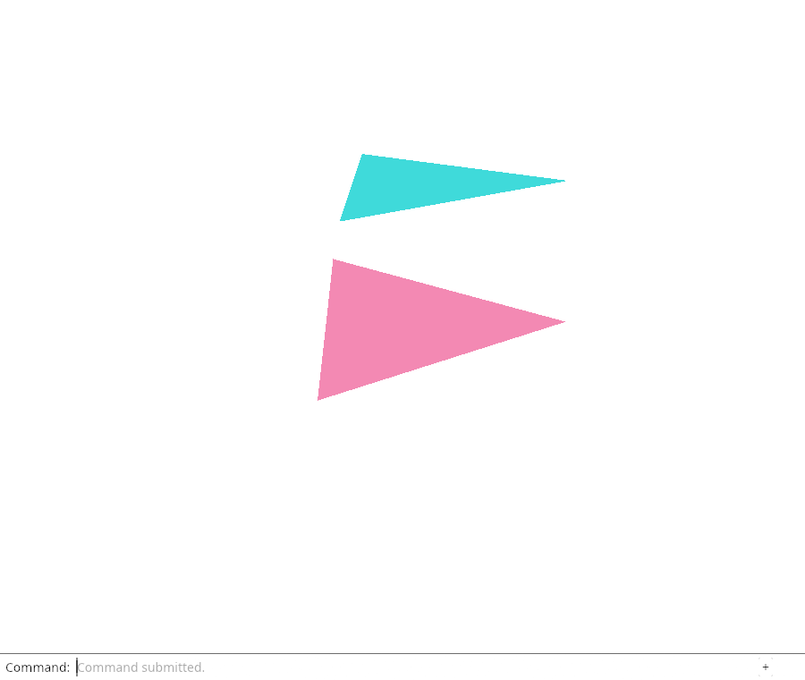
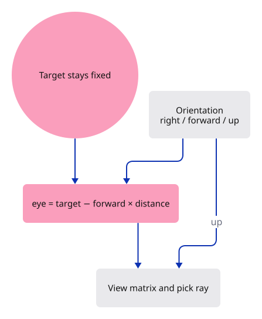

# 16 · Walk around the model

**Typing: 28–56 minutes.** [Estimate](typing-load.md).

Orbit around a fixed target. Camera orientation determines its right, up and forward directions; viewing distance places the eye behind the target.

Use the kernel's quaternion to represent orientation. Rotate sideways around world z and tilt around the camera's current right axis. In `yaw × (pitch × orientation)`, the existing orientation is followed by tilt, then yaw. Order matters.

## Type

Continue from [Pick the nearest surface through the view](15-perspective.md). [Save or recover your work](recovery.md).

### 1. `src/camera.rs`

Use the kernel’s rotation representation alongside its points, vectors and matrices.

<details>
<summary>Locate the existing block</summary>

```rust
use session_rust::{Point, Vector, Xform};
```

</details>

Replace that block with:

```rust
--8<-- "journey/code/16-orbit-01.rs"
```

### 2. `src/camera.rs`

Store a 3D target and orientation instead of a flat centre and one angle.

<details>
<summary>Locate the existing block</summary>

```rust
    pub center: [f64; 2],
    pub distance: f64,
    pub angle: f64,
    pub aspect: f64,
```

</details>

Replace that block with:

```rust
--8<-- "journey/code/16-orbit-02.rs"
```

### 3. `src/camera.rs`

Keep the same initial eye and up directions as the perspective lesson.

<details>
<summary>Locate the existing block</summary>

```rust
        Self { center: [0.0, 0.0], distance: 3.0, angle: 0.0, aspect: 640.0 / 480.0 }
```

</details>

Replace that block with:

```rust
--8<-- "journey/code/16-orbit-03.rs"
```

### 4. `src/camera.rs`

Move the target in the camera’s current right/up plane, including its world-z component.

<details>
<summary>Locate the existing block</summary>

```rust
    pub fn pan(&mut self, dx: f32, dy: f32) {
        let (sin, cos) = self.angle.sin_cos();
        self.center[0] += dx as f64 * cos - dy as f64 * sin;
        self.center[1] += dx as f64 * sin + dy as f64 * cos;
    }
```

</details>

Replace that block with:

```rust
--8<-- "journey/code/16-orbit-04.rs"
```

### 5. `src/camera.rs`

Add world-up orbit and a named pose. Keep rotate as the existing Turn view action.

<details>
<summary>Locate the existing block</summary>

```rust
    pub fn rotate(&mut self, radians: f32) {
        self.angle += radians as f64;
    }
```

</details>

Replace that block with:

```rust
--8<-- "journey/code/16-orbit-05.rs"
```

### 6. `src/camera.rs`

Calculate eye and up from the orientation, then reuse the existing view and projection construction.

<details>
<summary>Locate the existing block</summary>

```rust
        let eye = Point::new(self.center[0], self.center[1], self.distance);
        let target = Point::new(self.center[0], self.center[1], 0.0);
        let (sin, cos) = self.angle.sin_cos();
        let up = Vector::new(-sin, cos, 0.0);
```

</details>

Replace that block with:

```rust
--8<-- "journey/code/16-orbit-06.rs"
```

### 7. `src/camera.rs`

Extend the target-centering test to include a 3D orbit.

<details>
<summary>Locate the existing block</summary>

```rust
        let target = Point::new(camera.center[0], camera.center[1], 0.0);
```

</details>

Replace that block with:

```rust
--8<-- "journey/code/16-orbit-07.rs"
```

### 8. `src/camera.rs`

Check the rotation invariant after many small updates, not just one convenient angle.

<details>
<summary>Locate the existing block</summary>

```rust
    #[test]
    fn a_projected_point_lies_on_its_unprojected_ray() {
```

</details>

Replace that block with:

```rust
--8<-- "journey/code/16-orbit-08.rs"
```

### 9. `src/browser.rs`

Add vertical orbit and isometric commands.

<details>
<summary>Locate the existing block</summary>

```rust
            "Pan Left",
            "Pan Right",
            "Orbit Right",
            "View Reset",
        ],
    );
```

</details>

Replace that block with:

```rust
--8<-- "journey/code/16-orbit-window-1.rs"
```

### 10. `src/browser.rs`

Apply vertical orbit or the isometric orientation.

<details>
<summary>Locate the existing block</summary>

```rust
                "pan left" => camera.pan(-0.25, 0.0),
                "pan right" => camera.pan(0.25, 0.0),
                "orbit right" => camera.rotate(std::f32::consts::FRAC_PI_4),
                "view reset" => camera = Camera { aspect: camera.aspect, ..Camera::default() },
                _ => return,
            }
```

</details>

Replace that block with:

```rust
--8<-- "journey/code/16-orbit-window-2.rs"
```

### 11. `src/browser.rs`

Report that orbit preserves the target.

<details>
<summary>Locate the existing block</summary>

```rust
    )?;
    // The page has one listener for its lifetime; JavaScript must retain the Rust callback.
    click.forget();
    report("Perspective and picking use the same camera.");
    Ok(())
}
```

</details>

Replace that block with:

```rust
--8<-- "journey/code/16-orbit-window-3.rs"
```

## Run and check

In your project:

```sh
cd workspace/journey
REGEN_PROTO=0 cargo build --lib --locked --target wasm32-unknown-unknown -j4
REGEN_PROTO=0 CARGO_BUILD_JOBS=4 trunk serve --port 8780
```

Open `http://127.0.0.1:8780/`. Keep an existing Trunk server running; saving rebuilds it.

Type `View Isometric`, then `Orbit Right`. The eye moves around the same target. Click a visible face to confirm picking still agrees with the new view.

**Verified checkpoint in Chrome.**



[Verification scope](release.md).

Run the state checks on your computer from your project folder:

```sh
REGEN_PROTO=0 cargo test --lib --locked --target host-tuple -j4
```

<details>
<summary>Code explanation and diagram</summary>

Normalise after updates to keep a pure rotation. The repeated-turn test checks that the resulting axes remain unit length and perpendicular.

Isometric changes orientation while retaining target and distance. Drawing and picking consume the same updated camera matrix. The scene, history and selection keep their existing owners.

View action → orientation quaternion → eye and up vectors → view-projection matrix → drawing and pick ray.



Which camera value should stay fixed while you orbit around the model?

The target stays fixed. Orientation changes the direction from the eye toward that target, and distance controls how far the eye is from it. Recomputing eye = target − forward × distance moves the eye around the target without editing any mesh positions.

Study estimate, including typing and experiments: 2–4 hours.

</details>

<details>
<summary>Optional experiment</summary>

Type `View Isometric` and press Enter, pan, then tilt. Predict whether the point at the screen centre will stay centred during the tilt. It should: pan chose a new target, and orbit keeps that target fixed. Delete a selected surface and undo; the camera should keep its current orientation.

</details>

<details>
<summary>Check and save your work</summary>

Restore experimental edits, then run from `session_viewer`:

```sh
npm --prefix ../session_tests run course -- check 16-orbit
npm --prefix ../session_tests run course -- save 16-orbit
```

Source comparison leaves your project untouched. [Save and recovery instructions](recovery.md).

</details>

<details>
<summary>Viewer coverage and verification</summary>

The maintained camera uses target, distance, orientation and world-up in the same way. Later gesture lessons turn pointer deltas into these operations; unit conversion, fit-to-scene and large-coordinate precision extend the camera without moving source geometry.

Look at the two triangles from Isometric: the changed overlap comes from the camera, not edited vertex positions.

[Full validation scope](release.md).

</details>
