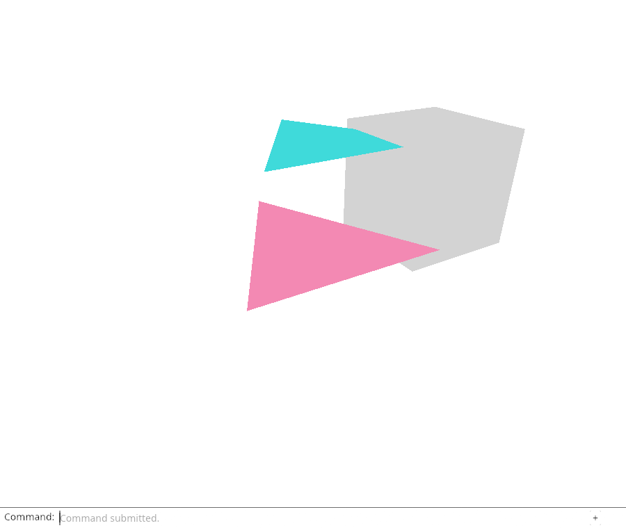
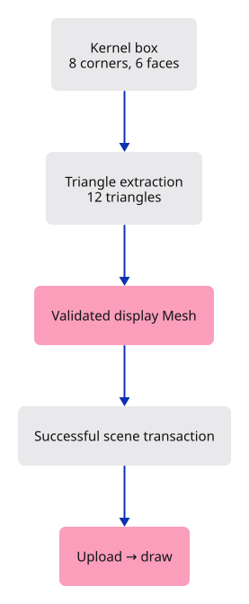

# 17 · Bring a solid into the scene

**Typing: 27–54 minutes.** [Estimate](typing-load.md).

Create a grey box with the geometry kernel and adapt it to our validated display mesh. `to_render` supplies float vertices and triangle indices; the adapter selects position and colour for our six-float vertex layout.

The box has eight geometric corners, six quad faces and twelve triangles. This example handles its convex faces; imported concave faces need later topology work.

## Type

Continue from [Walk around the model](16-orbit.md). [Save or recover your work](recovery.md).

### 1. `src/mesh.rs`

Adapt kernel triangle data to the current vertex and index layout with a checked narrowing conversion.

<details>
<summary>Locate the existing block</summary>

```rust
    pub fn vertices(&self) -> &[[f32; 6]] {
```

</details>

Replace that block with:

```rust
--8<-- "journey/code/17-solid-01.rs"
```

### 2. `src/mesh.rs`

Check the adapter using a solid with known topology.

<details>
<summary>Locate the existing block</summary>

```rust
    #[test]
    fn invalid_connections_and_nonfinite_vertices_are_rejected() {
```

</details>

Replace that block with:

```rust
--8<-- "journey/code/17-solid-02.rs"
```

### 3. `src/scene.rs`

Construct and place a box, then insert it only after its display mesh is valid.

<details>
<summary>Locate the existing block</summary>

```rust
    pub fn toggle_extra(&mut self) {
```

</details>

Replace that block with:

```rust
--8<-- "journey/code/17-solid-03.rs"
```

### 4. `src/history.rs`

Make transaction recording depend on success. The existing edit wrapper remains convenient for actions that cannot return an error.

<details>
<summary>Locate the existing block</summary>

```rust
    pub fn edit(&mut self, scene: &mut Scene, action: impl FnOnce(&mut Scene)) {
        let before = scene.clone();
        action(scene);
        if self.undo.len() == LIMIT {
            self.undo.remove(0);
        }
        self.undo.push(before);
        self.redo.clear();
    }
```

</details>

Replace that block with:

```rust
--8<-- "journey/code/17-solid-04.rs"
```

### 5. `src/history.rs`

Prove that a partial failed change cannot destroy either document contents or the redo branch.

<details>
<summary>Locate the existing block</summary>

```rust
    #[test]
    fn retained_history_has_a_fixed_count_limit() {
```

</details>

Replace that block with:

```rust
--8<-- "journey/code/17-solid-05.rs"
```

### 6. `src/browser.rs`

Add Example Box to the vocabulary.

<details>
<summary>Locate the existing block</summary>

```rust
        config.format.add_srgb_suffix(),
        &[
            "Help",
            "Example Triangle",
            "Select Next",
            "Delete",
```

</details>

Replace that block with:

```rust
--8<-- "journey/code/17-solid-window-1.rs"
```

### 7. `src/browser.rs`

Insert the box as one fallible history edit and report construction errors.

<details>
<summary>Locate the existing block</summary>

```rust
                        .and_then(|ray| crate::picking::pick(&scene, &ray));
                    renderer.set_scene(&scene, selected);
                }
                "example triangle" => {
                    history.edit(&mut scene, Scene::toggle_extra);
                    selected = selected.filter(|id| scene.contains(*id));
```

</details>

Replace that block with:

```rust
--8<-- "journey/code/17-solid-window-2.rs"
```

### 8. `src/browser.rs`

Report the undoable kernel object.

<details>
<summary>Locate the existing block</summary>

```rust
    )?;
    // The page has one listener for its lifetime; JavaScript must retain the Rust callback.
    click.forget();
    report("Orbit moves the eye around a fixed target.");
    Ok(())
}
```

</details>

Replace that block with:

```rust
--8<-- "journey/code/17-solid-window-3.rs"
```

## Run and check

In your project:

```sh
cd workspace/journey
REGEN_PROTO=0 cargo build --lib --locked --target wasm32-unknown-unknown -j4
REGEN_PROTO=0 CARGO_BUILD_JOBS=4 trunk serve --port 8780
```

Open `http://127.0.0.1:8780/`. Keep an existing Trunk server running; saving rebuilds it.

Type `Example Box`, then `View Isometric`. A solid box appears. `Undo` removes that one object; `Redo` restores it.

**Verified checkpoint in Chrome.**



[Verification scope](release.md).

Run the state checks from your project folder:

```sh
REGEN_PROTO=0 cargo test --lib --locked -j4
```

<details>
<summary>Code explanation and diagram</summary>

Convert kernel `u32` indices with `u16::try_from`. Return an error for an index that cannot fit rather than connecting the wrong corners.

Add `History::try_edit`: commit and clear redo only on success; restore the previous scene on error. A test deliberately mutates then fails. The box is unlit here; the next shader change reveals its face directions.

Kernel box → triangle extraction → validated display Mesh → document transaction → GPU upload → visible solid.



Why does a failed mesh conversion belong outside the GPU draw loop?

Conversion establishes the display data contract before an object enters the scene. A failure should leave the document and history unchanged. The draw loop should read already valid GPU resources; it cannot repair an invalid index or decide whether a failed document edit should be kept.

Study estimate, including typing and experiments: 3–5 hours.

</details>

<details>
<summary>Optional experiment</summary>

Add a box and undo. In the rollback test, predict whether a failed new edit should erase the available redo. Run the test: it should not. Then redo the successful box addition. Separate three questions in your notes: did creation succeed, did the document change, and was the change uploaded?

</details>

<details>
<summary>Check and save your work</summary>

Restore experimental edits, then run from `session_viewer`:

```sh
npm --prefix ../session_tests run course -- check 17-solid
npm --prefix ../session_tests run course -- save 17-solid
```

Source comparison leaves your project untouched. [Save and recovery instructions](recovery.md).

</details>

<details>
<summary>Viewer coverage and verification</summary>

The final viewer converts kernel geometry into renderable lanes while preserving document identity and transactional edits. This adapter is the first real kernel-to-display connection; later lessons retain face and edge provenance and share allocations across many objects.

Example Box inserts the grey solid behind the triangles. Its faces have one flat colour at this checkpoint.

[Full validation scope](release.md).

</details>
