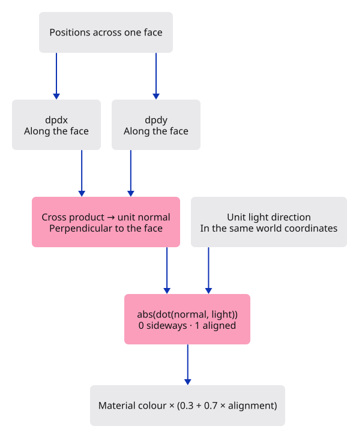

# 18 · Read the shape through light

**Plan about 1–2 hours.** 33 lines to type, including comments and blank lines. Allow time to read, predict and experiment; this is an estimate, not a deadline.

**Today:** Shade the box faces according to their direction, using the same mesh and renderer.

**In the whole viewer:** Connect the browser, drawing and input, then extend the same project. [See the destination](../journey.md#the-destination).

**Follow:** World position → neighbouring surface directions → normal → light alignment → fragment colour.

**Before you finish, explain:** Why should orbiting the camera leave the brightness of a particular box face unchanged?

Place a plain cardboard box near a lamp. Its faces have the same material, yet some look brighter. That difference tells your eye where the surface turns. We will give our grey box the same simple clue.

A **normal** is a direction perpendicular to a surface. Imagine a pencil standing straight out of a face. A face aimed towards the light gets more light; a face turned sideways gets less.



The vertex shader already receives world positions. Pass them to the fragment shader too. The GPU interpolates these positions across each triangle. `dpdx` and `dpdy` estimate how that position changes between neighbouring fragments horizontally and vertically. Their cross product points perpendicular to the triangle. `normalize` gives that direction a length of one.

The **dot product** measures alignment. For two unit directions, it is 1 when they agree, 0 at a right angle and −1 when they oppose each other. We use `abs` to give both sides of an open triangle the same lighting. This is a deliberate two-sided display rule; it is not a physically accurate material.

Our light direction, `(0.4, −0.6, 1.0)`, points mostly upwards. Both vectors must use world coordinates. Brightness ranges from 0.3 to 1: the constant part keeps side-facing surfaces readable. Multiplying RGB by brightness happens before the sRGB output conversion already configured in our renderer.

Only the shader needs new drawing logic. Mesh still owns positions and colours; Camera still positions the view; Renderer still submits triangles. This small change works because those responsibilities are separate.

## Type the change

Continue [Bring a solid into the scene](17-solid.md). From `session_viewer`, save your files with `npm --prefix ../session_tests run course -- save before-18-light`. A save keeps your own work; it does not fill in the next lesson.

### 1. `src/triangle.wgsl`

Pass world positions through the pipeline and turn face direction into brightness.

Find this exact block:

```wgsl
@group(0) @binding(0) var<uniform> transform: mat4x4<f32>;

struct VertexOutput {
    @builtin(position) position: vec4<f32>,
    @location(0) colour: vec3<f32>,
}

@vertex
fn vertex(@location(0) position: vec3<f32>, @location(1) colour: vec3<f32>) -> VertexOutput {
    var output: VertexOutput;
    output.position = transform * vec4<f32>(position, 1.0);
    output.colour = colour;
    return output;
}

@fragment
fn fragment(input: VertexOutput) -> @location(0) vec4<f32> {
    return vec4<f32>(input.colour, 1.0);
}
```

Replace that block with:

```wgsl
--8<-- "journey/code/18-light-01.wgsl"
```

### 2. `src/browser.rs`

Connect read the shape through light to the typed command path. Keep the scene state in its existing owner and redraw the dock after applying an action.

Find this exact block:

```rust
    )?;
    // The page has one listener for its lifetime; JavaScript must retain the Rust callback.
    click.forget();
    report("Kernel geometry becomes an undoable scene object.");
    Ok(())
}
```

Replace that block with:

```rust
--8<-- "journey/code/18-light-dock-01.rs"
```

## Run and look

From `session_viewer`, enter your project folder:

```sh
cd workspace/journey
cargo build --lib --locked --target wasm32-unknown-unknown -j4
CARGO_BUILD_JOBS=4 trunk serve --port 8780
```

Open `http://127.0.0.1:8780/`. If Trunk is already running in this project, leave it running; it rebuilds when you save.

Run `Example Box`, then `View Isometric`. Compare the three visible face colours. Run `Orbit Right`: the light stays fixed in the world. Click a face to see shaded yellow selection.

**Actual Chrome screenshot.**

Compare the box with lesson 17: the same geometry now has three face brightnesses.


*Captured from this checkpoint’s browser bundle after its browser checks passed. [Check scope and environment](release.md).*

Run the state checks from your project folder:

```sh
cargo test --lib --locked -j4
```

## Try one small experiment

Change the light to vec3<f32>(0.0, 0.0, 1.0). Predict the box first: the top should be bright and both vertical sides equally dark. Try it, then restore the original light. Explain why this changes colour without moving a single vertex.

## Explain it in your own words

Trace the values through the files without reading the answer first. If you lose the connection, stop at the last value you can follow.

<details>
<summary>Compare your explanation</summary>

Both the normal and the light direction are expressed in world coordinates. Orbit changes where we look from, not the face direction or the light. A different face may become visible, but the same face keeps the same brightness. Mixing a camera-space normal with a world-space light would break that relationship.

</details>

## Keep your working result

Return to `session_viewer` in a second terminal. Restore experimental edits before comparing:

```sh
npm --prefix ../session_tests run course -- check 18-light
npm --prefix ../session_tests run course -- save 18-light
```

The comparison spots typing differences; it does not prove behaviour. Keep three notes: what I changed; the values I followed; the question I still have. [Recover a checkpoint](recovery.md) if an experiment gets tangled.

## Where this grows

This is flat lighting: each triangle has one surface direction. The final viewer also needs smooth normals, materials, two-sided surface rules and contact shadows. Those features will extend the same distinction between geometry, view and shading.

[Validation status and course release](release.md).
