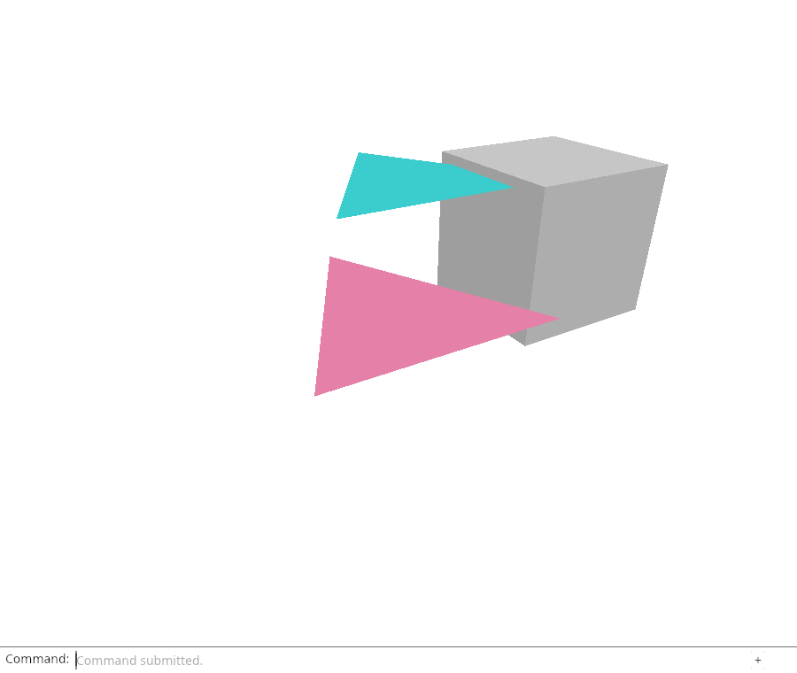
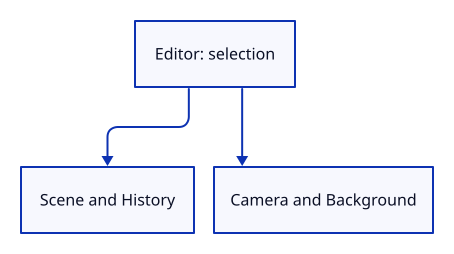

# 18a · Give application state one owner

**Typing: 14–27 minutes.** [Estimate](typing-load.md).

Editor owns application state. Action names an input; Change tells drawing whether scene data or only the view changed.

Keep History private so document edits follow one path. Default constructs an editor with the existing demonstration scene.

## Type

Continue from [Read the shape through light](18-light.md). [Save or recover your work](recovery.md).

### 1. `src/editor.rs`

Declare the action names, change kinds and application owner. Check a camera change keeps document identity.

Create the file and type:

```rust
--8<-- "journey/code/18a-editor-owner.rs"
```

### 2. `src/lib.rs`

Make the editor available to both the browser and native checks.

<details>
<summary>Locate the existing block</summary>

```rust
pub mod scene;
pub mod picking;
pub mod history;
pub mod gpu_mesh;
pub mod renderer;
#[cfg(target_arch = "wasm32")]
```

</details>

Replace that block with:

```rust
--8<-- "journey/code/19-actions-fullscreen-1.rs"
```

## Run and check

In your project:

```sh
cd workspace/journey
REGEN_PROTO=0 cargo build --lib --locked --target wasm32-unknown-unknown -j4
REGEN_PROTO=0 CARGO_BUILD_JOBS=4 trunk serve --port 8780
```

Open `http://127.0.0.1:8780/`. Keep an existing Trunk server running; saving rebuilds it.

Run the state checks. Zooming the owned camera preserves the document IDs and empty selection.

**Verified checkpoint in Chrome.**



[Verification scope](release.md).

Run the state checks from your project folder:

```sh
REGEN_PROTO=0 cargo test --lib --locked -j4
```

<details>
<summary>Code explanation and diagram</summary>


Editor owns scene and history beside camera, background and selection.



Why put these values in one struct?

An input handler can borrow one editor rather than manage separate captured scene, camera, selection and history values.

Study estimate, including typing and experiments: 0.5–0.75 hours.

</details>

<details>
<summary>Optional experiment</summary>

Change the ownership test to pan the camera. Its scene IDs should still match; restore the original zoom check.

</details>

<details>
<summary>Check and save your work</summary>

Restore experimental edits, then run from `session_viewer`:

```sh
npm --prefix ../session_tests run course -- check 18a-editor
npm --prefix ../session_tests run course -- save 18a-editor
```

Source comparison leaves your project untouched. [Save and recovery instructions](recovery.md).

</details>

<details>
<summary>Viewer coverage and verification</summary>

The application owner keeps document and view lifetimes together while history stores document changes only.

Native checks establish the new state owner. Chrome independently retains the preceding lighting and typed-command path; browser routing moves into Editor in the final step.

[Full validation scope](release.md).

</details>
