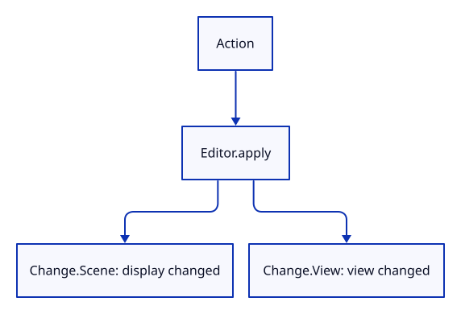

# 18b · Apply document and view actions in Rust

**Typing: 27–53 minutes.** [Estimate](typing-load.md).

Editor::apply handles an Action and returns the kind of drawing change. Document edits use History; camera and background changes stay outside it.

Result propagates a failed add operation. After deletion or history travel, retain selection only if its ID still exists. View Reset keeps the current window aspect.

## Type

Continue from [Give application state one owner](18a-editor.md). [Save or recover your work](recovery.md).

### 1. `src/editor.rs`

Implement the action route and check history preserves the view. Keep the current aspect when resetting the camera.

<details>
<summary>Locate the existing block</summary>

```rust
#[cfg(test)]
mod tests {
    use super::*;

    #[test]
    fn changing_the_owned_camera_keeps_document_identity() {
        let mut editor = Editor::default();
        let ids: Vec<_> = editor.scene.objects().iter().map(|object| object.id).collect();
        editor.camera.zoom(2.0);
        assert_eq!(editor.camera.distance, 1.5);
        assert_eq!(editor.scene.objects().iter().map(|object| object.id).collect::<Vec<_>>(), ids);
        assert!(editor.selected.is_none());
    }
}
```

</details>

Replace that block with:

```rust
--8<-- "journey/code/18b-actions-apply.rs"
```

## Run and check

In your project:

```sh
cd workspace/journey
REGEN_PROTO=0 cargo build --lib --locked --target wasm32-unknown-unknown -j4
REGEN_PROTO=0 CARGO_BUILD_JOBS=4 trunk serve --port 8780
```

Open `http://127.0.0.1:8780/`. Keep an existing Trunk server running; saving rebuilds it.

Run the state checks. Undo removes the added box while keeping zoom and background; View Reset preserves the current aspect.

**Verified checkpoint in Chrome.**


[Verification scope](release.md).

Run the state checks from your project folder:

```sh
REGEN_PROTO=0 cargo test --lib --locked -j4
```

<details>
<summary>Code explanation and diagram</summary>


Action → Editor::apply → History for document edits → Change::Scene or Change::View.



Why return Change rather than redraw here?

The editor owns application values, not GPU objects. Its caller decides when to upload scene data and draw.

Study estimate, including typing and experiments: 1–1.5 hours.

</details>

<details>
<summary>Optional experiment</summary>

Set camera aspect to 2.0 in the reset test. Reset distance and orientation should change while that aspect stays 2.0.

</details>

<details>
<summary>Check and save your work</summary>

Restore experimental edits, then run from `session_viewer`:

```sh
npm --prefix ../session_tests run course -- check 18b-actions
npm --prefix ../session_tests run course -- save 18b-actions
```

Source comparison leaves your project untouched. [Save and recovery instructions](recovery.md).

</details>

<details>
<summary>Viewer coverage and verification</summary>

Actions preserve the document/view boundary and describe the synchronization required. This checkpoint also retains aspect during reset before browser routing is introduced.

Native checks exercise the new action route and render its selected box. Chrome retains the earlier event handler and lighting result; the following step connects browser input to Editor.

[Full validation scope](release.md).

</details>
