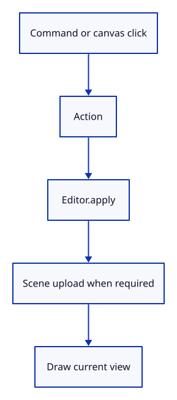

# 19 · Route browser input through the editor

**Typing: 29–57 minutes.** [Estimate](typing-load.md).

Convert submitted commands and canvas clicks to Action values. Apply them through Editor, upload only when Change is Scene, then redraw from the editor camera and background.

## Type

Continue from [Apply document and view actions in Rust](18b-actions.md). [Save or recover your work](recovery.md).

### 1. `src/editor.rs`

Check selection repair, redo preservation and picking through the editor’s current camera.

<details>
<summary>Locate the existing block</summary>

```rust
        assert_eq!(editor.background.rgb(), [0.9, 0.9, 0.9]);
    }
}
```

</details>

Replace that block with:

```rust
--8<-- "journey/code/19-actions-tests.rs"
```

### 2. `src/browser.rs`

Import the editor action types.

<details>
<summary>Locate the existing block</summary>

```rust
use crate::background::Background;
use crate::camera::Camera;
use crate::history::History;
use crate::renderer::Renderer;
use crate::scene::Scene;
use wasm_bindgen::{JsCast, JsValue, closure::Closure};

pub fn report(message: &str) {
```

</details>

Replace that block with:

```rust
--8<-- "journey/code/19-actions-window-1.rs"
```

### 3. `src/browser.rs`

Create one editor and initialize drawing from its scene.

<details>
<summary>Locate the existing block</summary>

```rust
        .ok_or("No compatible surface format")?;
    config.view_formats = vec![config.format.add_srgb_suffix()];
    surface.configure(&device, &config);
    let mut scene = Scene::demo();
    let mut renderer = Renderer::new(device, queue, config.format.add_srgb_suffix(), &scene);
    renderer.resize(width, height);
    let mut panel = crate::panel::Panel::new(
        &renderer,
```

</details>

Replace that block with:

```rust
--8<-- "journey/code/19-actions-window-2.rs"
```

### 4. `src/browser.rs`

Present the editor background and camera.

<details>
<summary>Locate the existing block</summary>

```rust
        ],
    );
    panel.update(None, &canvas)?;
    let mut history = History::default();
    let mut selected = None;
    let mut background = Background::default();
    let mut camera = Camera { aspect: width as f64 / height as f64, ..Camera::default() };
    present(
        &surface,
        &renderer,
        &background,
        &camera.uniform(),
        &mut panel,
    )?;
    let input_canvas = canvas.clone();
```

</details>

Replace that block with:

```rust
--8<-- "journey/code/19-actions-window-3.rs"
```

### 5. `src/browser.rs`

Start converting submitted lines into actions.

<details>
<summary>Locate the existing block</summary>

```rust
            .then(|| "canvas".into())
        });
        if let Some(line) = line {
            match line.as_str() {
                "canvas" => {
                    let Some(event) = event.dyn_ref::<web_sys::MouseEvent>() else {
                        return;
```

</details>

Replace that block with:

```rust
--8<-- "journey/code/19-actions-window-4.rs"
```

### 6. `src/browser.rs`

Map commands to Action, apply through Editor, and synchronize according to Change.

<details>
<summary>Locate the existing block</summary>

```rust
                    if rect.width() <= 0.0 || rect.height() <= 0.0 {
                        return;
                    }
                    let screen = [
                        (2.0 * (event.client_x() as f64 - rect.left()) / rect.width() - 1.0) as f32,
                        (1.0 - 2.0 * (event.client_y() as f64 - rect.top()) / rect.height()) as f32,
                    ];
                    selected = camera
                        .ray(screen)
                        .and_then(|ray| crate::picking::pick(&scene, &ray));
                    renderer.set_scene(&scene, selected);
                }
                "example box" => {
                    if let Err(error) =
                        history.try_edit(&mut scene, |scene| scene.add_box().map(|_| ()))
                    {
                        report(error);
                        return;
                    }
                    renderer.set_scene(&scene, selected);
                }
                "example triangle" => {
                    history.edit(&mut scene, Scene::toggle_extra);
                    selected = selected.filter(|id| scene.contains(*id));
                    renderer.set_scene(&scene, selected);
                }
                "select next" => {
                    selected = scene.next(selected);
                    renderer.set_scene(&scene, selected);
                }
                "delete" => {
                    if let Some(id) = selected.take() {
                        history.edit(&mut scene, |scene| {
                            scene.remove(id);
                        });
                        renderer.set_scene(&scene, selected);
                    }
                }
                "undo" | "redo" => {
                    if line == "undo" {
                        history.undo(&mut scene);
                    } else {
                        history.redo(&mut scene);
                    }
                    selected = selected.filter(|id| scene.contains(*id));
                    renderer.set_scene(&scene, selected);
                }
                "background" => background.toggle(),
                "zoom in" => camera.zoom(2.0),
                "zoom out" => camera.zoom(0.5),
                "pan left" => camera.pan(-0.25, 0.0),
                "pan right" => camera.pan(0.25, 0.0),
                "orbit right" => camera.rotate(std::f32::consts::FRAC_PI_4),
                "orbit up" => camera.orbit(0.0, std::f64::consts::FRAC_PI_6),
                "view isometric" => camera.isometric(),
                "view reset" => camera = Camera { aspect: camera.aspect, ..Camera::default() },
                _ => return,
            }
        }
        if let Err(error) = panel.update(None, &input_canvas) {
```

</details>

Replace that block with:

```rust
--8<-- "journey/code/19-actions-window-5.rs"
```

### 7. `src/browser.rs`

Redraw from the editor state.

<details>
<summary>Locate the existing block</summary>

```rust
        if let Err(error) = present(
            &surface,
            &renderer,
            &background,
            &camera.uniform(),
            &mut panel,
        ) {
            report(&format!("Cannot redraw: {error:?}"));
```

</details>

Replace that block with:

```rust
--8<-- "journey/code/19-actions-window-6.rs"
```

### 8. `src/browser.rs`

Report the shared action route.

<details>
<summary>Locate the existing block</summary>

```rust
    )?;
    // The page has one listener for its lifetime; JavaScript must retain the Rust callback.
    click.forget();
    report("Surface direction changes brightness, not geometry.");
    Ok(())
}
```

</details>

Replace that block with:

```rust
--8<-- "journey/code/19-actions-window-7.rs"
```

## Run and check

In your project:

```sh
cd workspace/journey
REGEN_PROTO=0 cargo build --lib --locked --target wasm32-unknown-unknown -j4
REGEN_PROTO=0 CARGO_BUILD_JOBS=4 trunk serve --port 8780
```

Open `http://127.0.0.1:8780/`. Keep an existing Trunk server running; saving rebuilds it.

Type Example Box, then Undo and Redo. The box disappears and returns through the editor route.

**Verified checkpoint in Chrome.**


[Verification scope](release.md).

Run the state checks on your computer from your project folder:

```sh
REGEN_PROTO=0 cargo test --lib --locked --target host-tuple -j4
```

<details>
<summary>Code explanation and diagram</summary>

The closure captures one mutable editor. The GPU renderer keeps its derived representation separate from the document owner.

Typed command or canvas click → Action → Editor::apply → Change → scene upload when required → draw.



Why does Change::View skip set_scene?

The scene data did not change. Redrawing with the editor camera or background is sufficient.

Study estimate, including typing and experiments: 1–1.5 hours.

</details>

<details>
<summary>Optional experiment</summary>

Pan Right, delete a selected object and Undo. The document returns while the camera stays where you put it.

</details>

<details>
<summary>Check and save your work</summary>

Restore experimental edits, then run from `session_viewer`:

```sh
npm --prefix ../session_tests run course -- check 19-actions
npm --prefix ../session_tests run course -- save 19-actions
```

Source comparison leaves your project untouched. [Save and recovery instructions](recovery.md).

</details>

<details>
<summary>Viewer coverage and verification</summary>

The full command system will build on this boundary. commands, keyboard input and tools request document operations through the same owner, while rendering consumes the result. More commands should add behavior here or in focused command modules, not duplicate transactions in UI handlers.

The box is yellow after Select Next reaches it. commands feed the shared Editor action path.

[Full validation scope](release.md).

To reproduce the scripted acceptance of the reference checkpoint, run from `session_viewer` with the [course bundle server](release.md#reproduce) running on port 8781:

```sh
npm --prefix ../session_tests run course -- capture 19-actions
```

This uses the verified reference bundle; it does not check or change your typed project.

</details>
