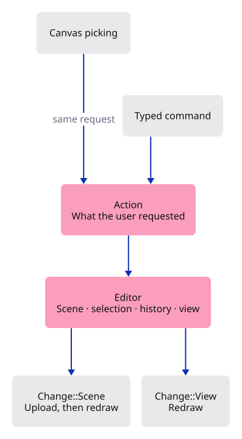
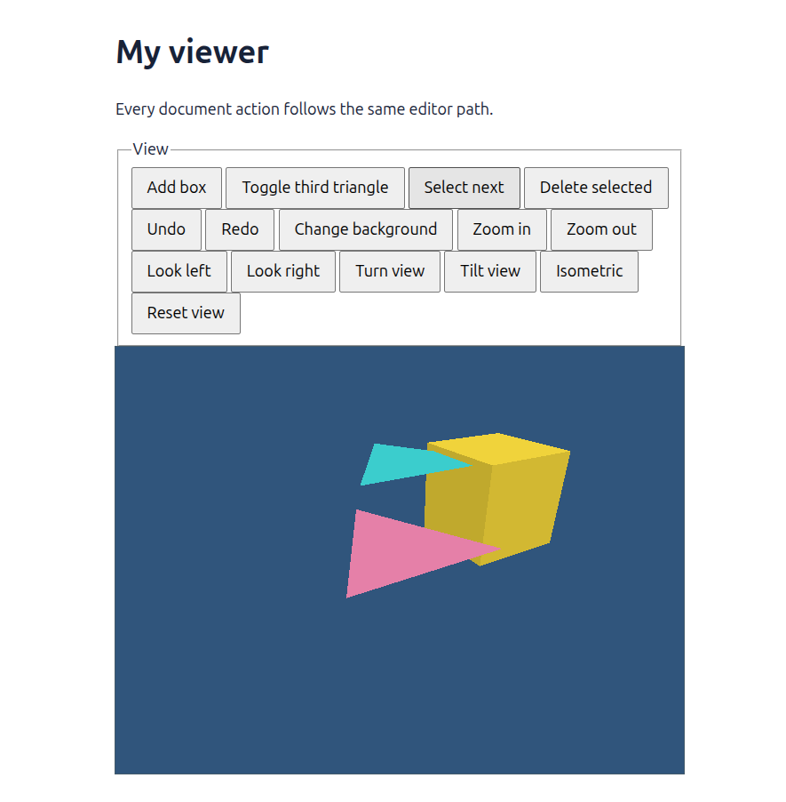

# 19 · Give every action the same route

**Plan about 3–5 hours.** 167 lines to type, including comments and blank lines. Allow time to read, predict and experiment; this is an estimate, not a deadline.

**Today:** Move document actions into a browser-independent editor while keeping picking, undo and drawing working.

**In the whole viewer:** Connect the browser, drawing and input, then extend the same project. [See the destination](../journey.md#the-destination).

**Follow:** HTML event → Action → Editor → Change → GPU upload when needed → draw.

**Before you finish, explain:** Where should a future Delete keyboard shortcut go so it behaves exactly like the Delete button?

Our browser callback now knows too much. It translates HTML events, edits geometry, maintains history and repairs selection. Adding keyboard shortcuts there would tempt us to copy the same editing rules a second time.

Give those rules one home: `Editor`. It owns the current scene, selection, camera, background and history. It has no browser handles and no GPU buffers. We can use it in Rust tests now and in a native window later.



An **enum** lists the alternatives a value may hold. `Action::Delete` carries no extra information; `Action::Pan(dx, dy)` carries two numbers. The browser chooses an action, then `apply` matches that action to its behavior.

The editor returns another enum, `Change`. A view change needs a redraw. A scene change also needs an upload because geometry or its selection colour may have changed. We can improve upload efficiency later without changing how a button requests deletion.

After any scene action, one line checks whether the selected ID still exists. That covers deletion and both directions of history travel. View actions return earlier because moving a camera cannot delete an object.

We are moving responsibilities you already understand, not inventing new editing behavior. Keep this map beside the code: **browser translates; editor decides; history remembers; renderer draws**.

## Type the change

Continue [Read the shape through light](18-light.md). From `session_viewer`, save your files with `npm --prefix ../session_tests run course -- save before-19-actions`. A save keeps your own work; it does not fill in the next lesson.

### 1. `src/editor.rs`

Give document actions one owner, shared by every future input method.

Create the file and type:

```rust
--8<-- "journey/code/19-actions-01.rs"
```

### 2. `src/lib.rs`

Make the editor available to both the browser and native checks.

Find this exact block:

```rust
pub mod history;
```

Replace that block with:

```rust
--8<-- "journey/code/19-actions-02.rs"
```

### 3. `src/browser.rs`

The browser now talks to the editor instead of owning its document and history separately.

Find this exact block:

```rust
use crate::scene::Scene;
use crate::history::History;
```

Replace that block with:

```rust
--8<-- "journey/code/19-actions-03.rs"
```

### 4. `src/browser.rs`

Create one editor, then let the renderer read its initial scene.

Find this exact block:

```rust
    let mut scene = Scene::demo();
    let mut renderer = Renderer::new(device, queue, config.format.add_srgb_suffix(), &scene);
    let mut history = History::default();
    let mut selected = None;
    let mut background = Background::default();
    let mut camera = Camera::default();
    present(&surface, &renderer, &background, &camera.uniform())?;
```

Replace that block with:

```rust
--8<-- "journey/code/19-actions-04.rs"
```

### 5. `src/browser.rs`

Translate each HTML event into an action. Upload scene data only when the editor reports a scene change.

Find this exact block:

```rust
        match target.id().as_str() {
            "canvas" => {
                let rect = canvas.get_bounding_client_rect();
                if rect.width() <= 0.0 || rect.height() <= 0.0 {
                    return;
                }
                let screen = [
                    (2.0 * (event.client_x() as f64 - rect.left()) / rect.width() - 1.0) as f32,
                    (1.0 - 2.0 * (event.client_y() as f64 - rect.top()) / rect.height()) as f32,
                ];
                selected = camera.ray(screen).and_then(|ray| crate::picking::pick(&scene, &ray));
                renderer.set_scene(&scene, selected);
            }
            "box" => {
                if let Err(error) = history.try_edit(&mut scene, |scene| scene.add_box().map(|_| ())) {
                    report(error);
                    return;
                }
                renderer.set_scene(&scene, selected);
            }
            "scene" => {
                history.edit(&mut scene, Scene::toggle_extra);
                selected = selected.filter(|id| scene.contains(*id));
                renderer.set_scene(&scene, selected);
            }
            "select" => {
                selected = scene.next(selected);
                renderer.set_scene(&scene, selected);
            }
            "delete" => {
                if let Some(id) = selected.take() {
                    history.edit(&mut scene, |scene| { scene.remove(id); });
                    renderer.set_scene(&scene, selected);
                }
            }
            "undo" | "redo" => {
                if target.id() == "undo" {
                    history.undo(&mut scene);
                } else {
                    history.redo(&mut scene);
                }
                selected = selected.filter(|id| scene.contains(*id));
                renderer.set_scene(&scene, selected);
            }
            "background" => background.toggle(),
            "zoom-in" => camera.zoom(2.0),
            "zoom-out" => camera.zoom(0.5),
            "left" => camera.pan(-0.25, 0.0),
            "right" => camera.pan(0.25, 0.0),
            "turn" => camera.rotate(std::f32::consts::FRAC_PI_4),
            "tilt" => camera.orbit(0.0, std::f64::consts::FRAC_PI_6),
            "iso" => camera.isometric(),
            "reset" => camera = Camera::default(),
            _ => return,
        }
        if let Err(error) = present(&surface, &renderer, &background, &camera.uniform()) {
            report(&format!("Cannot redraw: {error:?}"));
        }
```

Replace that block with:

```rust
--8<-- "journey/code/19-actions-05.rs"
```

### 6. `src/browser.rs`

Remove the import: camera ownership now belongs to Editor.

Find this exact block:

```rust
use crate::camera::Camera;
```

Delete this block.

### 7. `src/browser.rs`

Describe the new common action path.

Find this exact block:

```rust
    report("Surface direction changes brightness, not geometry.");
```

Replace that block with:

```rust
--8<-- "journey/code/19-actions-07.rs"
```

## Run and look

From `session_viewer`, enter your project folder:

```sh
cd workspace/journey
cargo build --lib --locked --target wasm32-unknown-unknown -j4
CARGO_BUILD_JOBS=4 trunk serve --port 8780
```

Open `http://127.0.0.1:8780/`. If Trunk is already running in this project, leave it running; it rebuilds when you save.

All controls should behave as before. Add a box, select it using Select next three times, delete it and undo. The box returns; your camera and background stay as you left them.

**Actual Chrome screenshot.**

The box is yellow after Select next reaches it. Buttons feed the shared Editor action path.



*Captured from this checkpoint’s browser bundle after its browser checks passed. [Check scope and environment](release.md).*

Run the state checks from your project folder:

```sh
cargo test --lib --locked -j4
```

## Try one small experiment

Add a box, then change the background and zoom. Undo once. Predict which of those three changes disappears. Only the box addition is a document edit; the other two belong to the view. Find the early return in apply that keeps those actions out of history.

## Explain it in your own words

Trace the values through the files without reading the answer first. If you lose the connection, stop at the last value you can follow.

<details>
<summary>Compare your explanation</summary>

The keyboard handler should produce Action::Delete and pass it to Editor::apply. The editor already owns selection, the document and history. Reusing that action gives the shortcut the same transaction and selection repair as the button; the keyboard handler should not remove scene objects itself.

</details>

## Keep your working result

Return to `session_viewer` in a second terminal. Restore experimental edits before comparing:

```sh
npm --prefix ../session_tests run course -- check 19-actions
npm --prefix ../session_tests run course -- save 19-actions
```

The comparison spots typing differences; it does not prove behaviour. Keep three notes: what I changed; the values I followed; the question I still have. [Recover a checkpoint](recovery.md) if an experiment gets tangled.

## Where this grows

The full command system will build on this boundary. Buttons, keyboard input and tools request document operations through the same owner, while rendering consumes the result. More commands should add behavior here or in focused command modules, not duplicate transactions in UI handlers.

[Validation status and course release](release.md).
