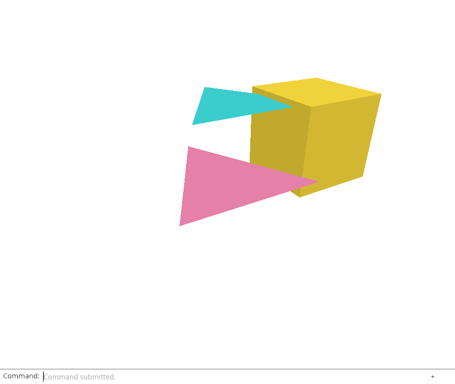
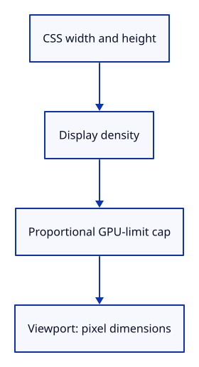

# 19a · Measure a safe drawing size

**Typing: 19–37 minutes.** [Estimate](typing-load.md).

Viewport converts CSS size and display density to GPU pixel dimensions. Reduce both dimensions together when they exceed the device limit. Reject hidden or invalid sizes.

## Type

Continue from [Route browser input through the editor](19-actions.md). [Save or recover your work](recovery.md).

### 1. `src/viewport.rs`

Convert layout dimensions to a safe drawing size, keeping the proportions when the GPU limit applies.

Create the file and type:

```rust
--8<-- "journey/code/20-resize-01.rs"
```

### 2. `src/lib.rs`

Make the size calculation usable by browser code and Rust tests.

<details>
<summary>Locate the existing block</summary>

```rust
pub mod picking;
pub mod history;
pub mod editor;
pub mod gpu_mesh;
pub mod renderer;
#[cfg(target_arch = "wasm32")]
```

</details>

Replace that block with:

```rust
--8<-- "journey/code/20-resize-fullscreen-1.rs"
```

## Run and check

In your project:

```sh
cd workspace/journey
REGEN_PROTO=0 cargo build --lib --locked --target wasm32-unknown-unknown -j4
REGEN_PROTO=0 CARGO_BUILD_JOBS=4 trunk serve --port 8780
```

Open `http://127.0.0.1:8780/`. Keep an existing Trunk server running; saving rebuilds it.

Run the state checks. Density two doubles pixel dimensions without stretching the view; the GPU cap preserves proportions; hidden sizes are rejected.

**Verified checkpoint in Chrome.**



[Verification scope](release.md).

Run the state checks on your computer from your project folder:

```sh
REGEN_PROTO=0 cargo test --lib --locked --target host-tuple -j4
```

<details>
<summary>Code explanation and diagram</summary>

Viewport is Copy, so drawing and camera setup can receive the same measured value. aspect uses the bounded pixel dimensions.

CSS width and height × display density → proportional GPU-limit cap → Viewport.



Why cap width and height by the same scale?

Independent caps would change their ratio and stretch the scene. A shared scale keeps proportions apart from integer rounding.

Study estimate, including typing and experiments: 0.75–1.25 hours.

</details>

<details>
<summary>Optional experiment</summary>

Change the dense-display test ratio to 4.0 and lower the device limit to 1024. Predict the bounded dimensions before running the check.

</details>

<details>
<summary>Check and save your work</summary>

Restore experimental edits, then run from `session_viewer`:

```sh
npm --prefix ../session_tests run course -- check 19a-viewport
npm --prefix ../session_tests run course -- save 19a-viewport
```

Source comparison leaves your project untouched. [Save and recovery instructions](recovery.md).

</details>

<details>
<summary>Viewer coverage and verification</summary>

A camera aspect and its GPU attachments must use one bounded pixel size. This step establishes that size calculation; the next connects it to the browser and GPU.

Native tests establish bounded density-aware sizing. Chrome independently retains the editor input route and drawing; actual canvas and attachment resizing are connected next.

[Full validation scope](release.md).

To reproduce the scripted acceptance of the reference checkpoint, run from `session_viewer` with the [course bundle server](release.md#reproduce) running on port 8781:

```sh
npm --prefix ../session_tests run course -- capture 19a-viewport
```

This uses the verified reference bundle; it does not check or change your typed project.

</details>
