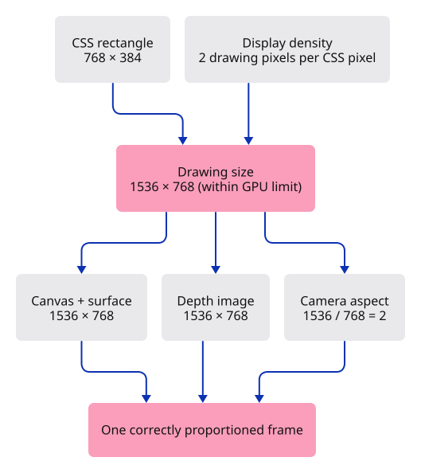
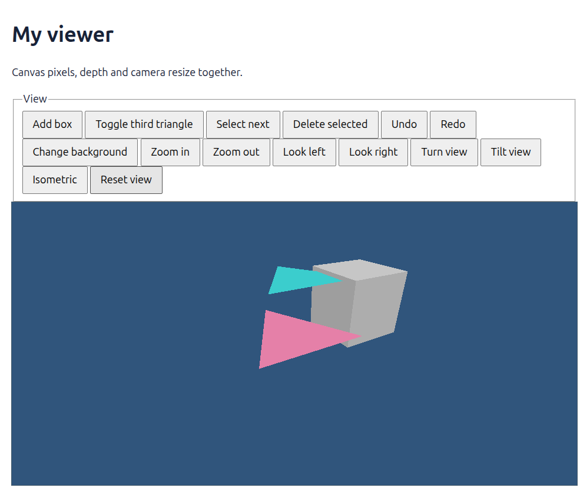

# 20 · Keep a changing window in proportion

**Plan about 3–5 hours.** 172 lines to type, including comments and blank lines. Allow time to read, predict and experiment; this is an estimate, not a deadline.

**Today:** Resize the drawing buffer, depth attachment and camera together, including on dense displays.

**In the whole viewer:** Connect the browser, drawing and input, then extend the same project. [See the destination](../journey.md#the-destination).

**Follow:** CSS rectangle × display density → bounded pixel size → canvas and surface + depth image + camera aspect → draw.

**Before you finish, explain:** Why is changing only the canvas width insufficient?

Make the browser narrow. Until now, CSS stretches a fixed 640 × 480 image to fit. The viewer needs to draw a new image at the right size instead.

There are two measurements. **CSS pixels** describe page layout. **Drawing pixels** describe the GPU image. A canvas 768 CSS pixels wide on a display with a density of 2 needs 1536 drawing pixels across. Geometry should look the same size on the page, just sharper.



The viewport helper multiplies layout size by display density, then caps both dimensions together if the image would exceed the GPU's limit. Its result is an `Option`: `Some(size)` means we can draw; `None` means the canvas is hidden or the measurements are invalid. A zero-sized GPU texture is not a useful placeholder.

The browser will update three things together: the canvas and surface, the depth image, and the camera's aspect ratio. Here **aspect** means width divided by height. A wide canvas needs a wide view, not a stretched box.

Clicks and window resize events can share one callback. Browser events arrive one at a time; the callback already owns our mutable editor and renderer. The window clone is another handle to the same browser window, not another window. We check size before every redraw, but recreate textures only when the dimensions change.

One small trap remains: Reset view used to replace the whole camera. Keep the aspect while resetting its pose. The new test catches this, so resizing cannot quietly stop working after a reset.

## Type the change

Continue [Give every action the same route](19-actions.md). From `session_viewer`, save your files with `npm --prefix ../session_tests run course -- save before-20-resize`. A save keeps your own work; it does not fill in the next lesson.

### 1. `src/viewport.rs`

Convert layout dimensions to a safe drawing size, keeping the proportions when the GPU limit applies.

Create the file and type:

```rust
--8<-- "journey/code/20-resize-01.rs"
```

### 2. `src/lib.rs`

Make the size calculation usable by browser code and Rust tests.

Find this exact block:

```rust
pub mod editor;
```

Replace that block with:

```rust
--8<-- "journey/code/20-resize-02.rs"
```

### 3. `src/renderer.rs`

Move depth-image construction into one helper that also serves resize.

Find this exact block:

```rust
        let depth_texture = device.create_texture(&wgpu::TextureDescriptor {
            label: Some("opaque depth"),
            size: wgpu::Extent3d { width: 640, height: 480, depth_or_array_layers: 1 },
            mip_level_count: 1,
            sample_count: 1,
            dimension: wgpu::TextureDimension::D2,
            format: wgpu::TextureFormat::Depth32Float,
            usage: wgpu::TextureUsages::RENDER_ATTACHMENT,
            view_formats: &[],
        });
        let depth = depth_texture.create_view(&Default::default());
```

Replace that block with:

```rust
--8<-- "journey/code/20-resize-03.rs"
```

### 4. `src/renderer.rs`

Recreate the depth attachment when the colour image changes size. The old view is dropped when replaced.

Find this exact block:

```rust
    pub fn set_scene(&mut self, scene: &Scene, selected: Option<ObjectId>) {
```

Replace that block with:

```rust
--8<-- "journey/code/20-resize-04.rs"
```

### 5. `src/editor.rs`

Reset the camera pose while retaining the current viewport proportions.

Find this exact block:

```rust
                    Action::ResetView => self.camera = Camera::default(),
```

Replace that block with:

```rust
--8<-- "journey/code/20-resize-05.rs"
```

### 6. `src/editor.rs`

Catch a resize bug that would otherwise return whenever the learner presses Reset view.

Find this exact block:

```rust
    #[test]
    fn undo_changes_the_document_without_rewinding_the_view() {
```

Replace that block with:

```rust
--8<-- "journey/code/20-resize-06.rs"
```

### 7. `index.html`

Let the page become wider than the original fixed canvas.

Find this exact block:

```html
max-width: 640px;
```

Replace that block with:

```html
--8<-- "journey/code/20-resize-07.html"
```

### 8. `index.html`

Give the canvas a CSS height independent of its drawing-buffer dimensions, avoiding a resize feedback loop.

Find this exact block:

```html
width: 100%; background:
```

Replace that block with:

```html
--8<-- "journey/code/20-resize-08.html"
```

### 9. `src/browser.rs`

Use the same size conversion that the native tests check.

Find this exact block:

```rust
use crate::editor::{Action, Change, Editor};
```

Replace that block with:

```rust
--8<-- "journey/code/20-resize-09.rs"
```

### 10. `src/browser.rs`

Configure the actual visible size before presenting the first frame.

Find this exact block:

```rust
    present(&surface, &renderer, &editor.background, &editor.camera.uniform())?;
```

Replace that block with:

```rust
--8<-- "journey/code/20-resize-10.rs"
```

### 11. `src/browser.rs`

Use one callback for clicks and window resizing. Only click events need a mouse position and an editor action.

Find this exact block:

```rust
    let click = Closure::<dyn FnMut(web_sys::MouseEvent)>::new(move |event: web_sys::MouseEvent| {
        let Some(target) = event.target()
            .and_then(|target| target.dyn_into::<web_sys::Element>().ok()) else { return; };
        let action = match target.id().as_str() {
            "canvas" => {
                let rect = canvas.get_bounding_client_rect();
                if rect.width() <= 0.0 || rect.height() <= 0.0 {
                    return;
                }
                Action::Pick([
                    (2.0 * (event.client_x() as f64 - rect.left()) / rect.width() - 1.0) as f32,
                    (1.0 - 2.0 * (event.client_y() as f64 - rect.top()) / rect.height()) as f32,
                ])
            }
            "box" => Action::AddBox,
            "scene" => Action::ToggleExtra,
            "select" => Action::SelectNext,
            "delete" => Action::Delete,
            "undo" => Action::Undo,
            "redo" => Action::Redo,
            "background" => Action::Background,
            "zoom-in" => Action::Zoom(2.0),
            "zoom-out" => Action::Zoom(0.5),
            "left" => Action::Pan(-0.25, 0.0),
            "right" => Action::Pan(0.25, 0.0),
            "turn" => Action::Orbit(std::f64::consts::FRAC_PI_4, 0.0),
            "tilt" => Action::Orbit(0.0, std::f64::consts::FRAC_PI_6),
            "iso" => Action::Isometric,
            "reset" => Action::ResetView,
            _ => return,
        };
        match editor.apply(action) {
            Ok(Change::Scene) => renderer.set_scene(&editor.scene, editor.selected),
            Ok(Change::View) => {}
            Err(error) => { report(error); return; }
        }
```

Replace that block with:

```rust
--8<-- "journey/code/20-resize-11.rs"
```

### 12. `src/browser.rs`

Both event sources finish by checking size and drawing. A hidden canvas waits until it has a positive size.

Find this exact block:

```rust
        if let Err(error) = present(&surface, &renderer, &editor.background, &editor.camera.uniform()) {
            report(&format!("Cannot redraw: {error:?}"));
        }
    });
    document.add_event_listener_with_callback("click", click.as_ref().unchecked_ref())?;
    controls.remove_attribute("disabled")?;
    // The page has one listener for its lifetime; JavaScript must retain the Rust callback.
    click.forget();
    report("Every document action follows the same editor path.");
```

Replace that block with:

```rust
--8<-- "journey/code/20-resize-12.rs"
```

### 13. `src/browser.rs`

Keep drawing-buffer size, surface size, depth size and projection aspect synchronized before acquiring a frame.

Find this exact block:

```rust
fn present(
```

Replace that block with:

```rust
--8<-- "journey/code/20-resize-13.rs"
```

## Run and look

From `session_viewer`, enter your project folder:

```sh
cd workspace/journey
cargo build --lib --locked --target wasm32-unknown-unknown -j4
CARGO_BUILD_JOBS=4 trunk serve --port 8780
```

Open `http://127.0.0.1:8780/`. If Trunk is already running in this project, leave it running; it rebuilds when you save.

Add a box and choose Isometric. Widen and narrow the browser: the box should retain its proportions while more or less horizontal space becomes visible. Try Reset view after resizing. The canvas drawing dimensions should reflect display density rather than always reading 640 × 480.

**Actual Chrome screenshot.**

The browser window has been resized. The drawing buffer, depth texture and camera aspect now follow the canvas dimensions.



*Captured from this checkpoint’s browser bundle after its browser checks passed. [Check scope and environment](release.md).*

Run the state checks from your project folder:

```sh
cargo test --lib --locked -j4
```

## Try one small experiment

At density 2, predict the drawing size for a 768 × 384 CSS canvas: 1536 × 768. Now set the GPU limit in the viewport test to 1024. Both dimensions must shrink together to 1024 × 512. Run the test and explain why clamping each dimension independently would stretch the scene.

## Explain it in your own words

Trace the values through the files without reading the answer first. If you lose the connection, stop at the last value you can follow.

<details>
<summary>Compare your explanation</summary>

The canvas drawing buffer, surface configuration and depth attachment must agree on their pixel dimensions. The camera also needs width divided by height so geometry keeps its proportions. Changing only one can cause a GPU validation error, a stretched view or an old blurry image scaled by CSS.

</details>

## Keep your working result

Return to `session_viewer` in a second terminal. Restore experimental edits before comparing:

```sh
npm --prefix ../session_tests run course -- check 20-resize
npm --prefix ../session_tests run course -- save 20-resize
```

The comparison spots typing differences; it does not prove behaviour. Keep three notes: what I changed; the values I followed; the question I still have. [Recover a checkpoint](recovery.md) if an experiment gets tangled.

## Where this grows

The final viewer uses the same size agreement for every attachment, including multisampling, picking and post-processing. Later panels need element resize observation as well as window events; this lesson handles window resizing and rechecks layout on each action.

[Validation status and course release](release.md).
