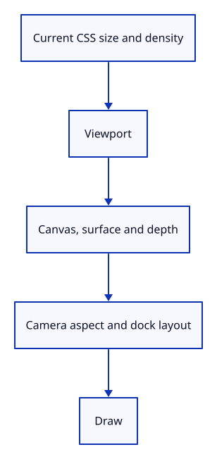

# 20 · Resize canvas, depth and camera together

**Typing: 29–57 minutes.** [Estimate](typing-load.md).

Use Viewport to resize canvas pixels, the surface, depth attachment and camera aspect together. Read the current CSS rectangle and display density before drawing.

The callback borrows the renderer and editor mutably. A hidden canvas returns without drawing; a changed size recreates attachments before the next frame.

## Type

Continue from [Measure a safe drawing size](19a-viewport.md). [Save or recover your work](recovery.md).

### 1. `src/renderer.rs`

Keep depth texture allocation in the existing depth helper.

<details>
<summary>Locate the existing block</summary>

```rust
        Self { device, queue, pipeline, meshes, uniform, view_group, depth }
    }

    pub fn set_scene(&mut self, scene: &Scene, selected: Option<ObjectId>) {
        self.meshes = scene.objects().iter().map(|object| {
            GpuMesh::upload(&self.device, &object.mesh, selected == Some(object.id))
        }).collect();
    }

    fn depth(device: &wgpu::Device, width: u32, height: u32) -> wgpu::TextureView {
        let depth_texture = device.create_texture(&wgpu::TextureDescriptor {
            label: Some("opaque depth"),
```

</details>

Replace that block with:

```rust
--8<-- "journey/code/20-resize-fullscreen-8.rs"
```

### 2. `src/renderer.rs`

Recreate the depth view for the measured viewport dimensions.

<details>
<summary>Locate the existing block</summary>

```rust
        depth_texture.create_view(&Default::default())
    }

    pub fn resize(&mut self, width: u32, height: u32) {
        self.depth = Self::depth(&self.device, width, height);
    }

    pub fn draw(
```

</details>

Replace that block with:

```rust
--8<-- "journey/code/20-resize-fullscreen-9.rs"
```

### 3. `src/browser.rs`

Import the viewport size type.

<details>
<summary>Locate the existing block</summary>

```rust
use crate::background::Background;
use crate::editor::{Action, Change, Editor};
use crate::renderer::Renderer;
use wasm_bindgen::{JsCast, JsValue, closure::Closure};

pub fn report(message: &str) {
```

</details>

Replace that block with:

```rust
--8<-- "journey/code/20-resize-window-1.rs"
```

### 4. `src/browser.rs`

Size renderer attachments from the viewport.

<details>
<summary>Locate the existing block</summary>

```rust
    config.view_formats = vec![config.format.add_srgb_suffix()];
    surface.configure(&device, &config);
    let mut editor = Editor::default();
    editor.camera.aspect = width as f64 / height as f64;
    let mut renderer = Renderer::new(
        device,
        queue,
        config.format.add_srgb_suffix(),
        &editor.scene,
    );
    renderer.resize(width, height);
    let mut panel = crate::panel::Panel::new(
        &renderer,
        config.format.add_srgb_suffix(),
```

</details>

Replace that block with:

```rust
--8<-- "journey/code/20-resize-window-2.rs"
```

### 5. `src/browser.rs`

Handle initial resizing and retain the window for later resize events.

<details>
<summary>Locate the existing block</summary>

```rust
        ],
    );
    panel.update(None, &canvas)?;
    present(
        &surface,
        &renderer,
        &editor.background,
        &editor.camera.uniform(),
        &mut panel,
    )?;
    let input_canvas = canvas.clone();
    let click = Closure::<dyn FnMut(web_sys::Event)>::new(move |event: web_sys::Event| {
        let line = match panel.update(Some(&event), &input_canvas) {
            Ok(line) => line,
            Err(error) => {
```

</details>

Replace that block with:

```rust
--8<-- "journey/code/20-resize-window-3.rs"
```

### 6. `src/browser.rs`

Keep the event callback open for the resize path.

<details>
<summary>Locate the existing block</summary>

```rust
                return;
            }
        };

        let line = line.or_else(|| {
            let mouse = event.dyn_ref::<web_sys::MouseEvent>()?;
            (event.type_() == "click"
```

</details>

Replace that block with:

```rust
--8<-- "journey/code/20-resize-window-4.rs"
```

### 7. `src/browser.rs`

Resize before handling input; refresh dock layout and drawing when dimensions change.

<details>
<summary>Locate the existing block</summary>

```rust
                }
            }
        }
        if let Err(error) = panel.update(None, &input_canvas) {
            report(&format!("Cannot lay out commands: {error:?}"));
            return;
        }
        if let Err(error) = present(
            &surface,
            &renderer,
            &editor.background,
            &editor.camera.uniform(),
            &mut panel,
        ) {
            report(&format!("Cannot redraw: {error:?}"));
        }
    });
    for name in [
```

</details>

Replace that block with:

```rust
--8<-- "journey/code/20-resize-window-5.rs"
```

### 8. `src/browser.rs`

Register resize events and update canvas pixels, surface configuration, attachments and camera aspect together.

<details>
<summary>Locate the existing block</summary>

```rust
        "blur",
        "click",
    ] {
        canvas.add_event_listener_with_callback(name, click.as_ref().unchecked_ref())?;
    }
    let options = web_sys::AddEventListenerOptions::new();
    options.set_passive(false);
    canvas.add_event_listener_with_callback_and_add_event_listener_options(
        "wheel",
        click.as_ref().unchecked_ref(),
        &options,
    )?;
    // The page has one listener for its lifetime; JavaScript must retain the Rust callback.
    click.forget();
    report("Every document action follows the same editor path.");
    Ok(())
}

fn present(
    surface: &wgpu::Surface<'_>,
    renderer: &Renderer,
```

</details>

Replace that block with:

```rust
--8<-- "journey/code/20-resize-window-6.rs"
```

## Run and check

In your project:

```sh
cd workspace/journey
REGEN_PROTO=0 cargo build --lib --locked --target wasm32-unknown-unknown -j4
REGEN_PROTO=0 CARGO_BUILD_JOBS=4 trunk serve --port 8780
```

Open `http://127.0.0.1:8780/`. Keep an existing Trunk server running; saving rebuilds it.

Resize the browser window. Geometry keeps its proportions and continues drawing across wide and tall sizes.

**Verified checkpoint in Chrome.**


[Verification scope](release.md).

Run the state checks on your computer from your project folder:

```sh
REGEN_PROTO=0 cargo test --lib --locked --target host-tuple -j4
```

<details>
<summary>Code explanation and diagram</summary>


Resize event → Viewport → canvas pixels, surface, depth and aspect → command layout → draw.



Why resize the depth attachment with the canvas?

The colour and depth attachments in one render pass must have matching dimensions.

Study estimate, including typing and experiments: 1–1.5 hours.

</details>

<details>
<summary>Optional experiment</summary>

Change the window from wide to tall, then type View Reset. The view should retain the current aspect.

</details>

<details>
<summary>Check and save your work</summary>

Restore experimental edits, then run from `session_viewer`:

```sh
npm --prefix ../session_tests run course -- check 20-resize
npm --prefix ../session_tests run course -- save 20-resize
```

Source comparison leaves your project untouched. [Save and recovery instructions](recovery.md).

</details>

<details>
<summary>Viewer coverage and verification</summary>

The final viewer uses the same size agreement for every attachment, including multisampling, picking and post-processing. Later panels need element resize observation as well as window events; this lesson handles window resizing and rechecks layout on each action.

Chrome verifies wide and tall resize events, then density two with stable CSS geometry bounds. The capture restores the default viewport and initial scene after those checks.

[Full validation scope](release.md).

To reproduce the scripted acceptance of the reference checkpoint, run from `session_viewer` with the [course bundle server](release.md#reproduce) running on port 8781:

```sh
npm --prefix ../session_tests run course -- capture 20-resize
```

This uses the verified reference bundle; it does not check or change your typed project.

</details>
