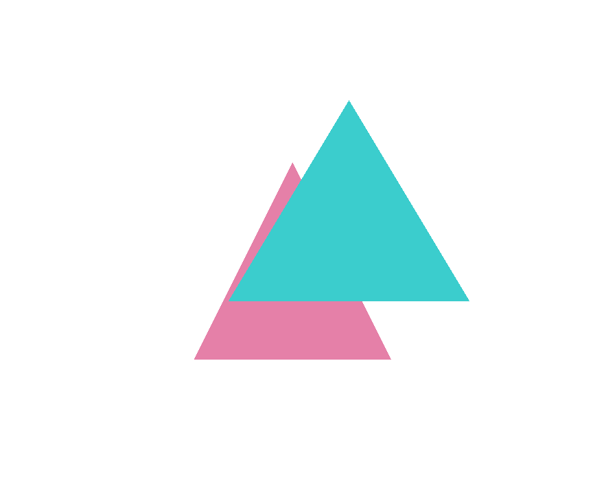
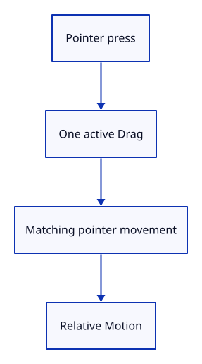

# 20a · Remember the pointer that starts a drag

**Typing: 20–39 minutes.** [Estimate](typing-load.md).

Gesture remembers one pointer ID, its button and its positions. Reject a second press while that pointer is active. Each move reports the change from the previous position.

Option holds one Drag or none. as_mut borrows the stored drag; filter accepts only its pointer ID. The click threshold remembers whether any movement exceeded four CSS pixels.

## Type

Continue from [Resize canvas, depth and camera together](20-resize.md). [Save or recover your work](recovery.md).

### 1. `src/gesture.rs`

Retain one pointer, track its starting position and return relative right-drag movement.

Create the file and type:

```rust
--8<-- "journey/code/20a-press-state.rs"
```

### 2. `src/gesture_tests.rs`

Check rejected presses, pointer ownership and movement from the previous position.

Create the file and type:

```rust
--8<-- "journey/code/20a-press-tests.rs"
```

### 3. `src/lib.rs`

Expose the gesture module to the browser and compile its tests only in the test build.

<details>
<summary>Locate the existing block</summary>

```rust
pub mod history;
pub mod editor;
pub mod viewport;
pub mod gpu_mesh;
pub mod renderer;
#[cfg(target_arch = "wasm32")]
```

</details>

Replace that block with:

```rust
--8<-- "journey/code/21-gestures-fullscreen-1.rs"
```

## Run and check

In your project:

```sh
cd workspace/journey
REGEN_PROTO=0 cargo build --lib --locked --target wasm32-unknown-unknown -j4
REGEN_PROTO=0 CARGO_BUILD_JOBS=4 trunk serve --port 8780
```

Open `http://127.0.0.1:8780/`. Keep an existing Trunk server running; saving rebuilds it.

Run the state checks. Another pointer cannot replace the press or move it; matching moves report relative deltas.

**Verified checkpoint in Chrome.**



[Verification scope](release.md).

Run the state checks from your project folder:

```sh
REGEN_PROTO=0 cargo test --lib --locked -j4
```

<details>
<summary>Code explanation and diagram</summary>


Press → Option<Drag> → matching move → Motion::Orbit.



Why retain both the starting and previous positions?

The start distinguishes a click from a drag. The previous position gives the next orbit delta.

Study estimate, including typing and experiments: 0.75–1.25 hours.

</details>

<details>
<summary>Optional experiment</summary>

In the native check, move the matching pointer to [30.0, 28.0]. Predict the delta from [20.0, 25.0] before running it.

</details>

<details>
<summary>Check and save your work</summary>

Restore experimental edits, then run from `session_viewer`:

```sh
npm --prefix ../session_tests run course -- check 20a-press
npm --prefix ../session_tests run course -- save 20a-press
```

Source comparison leaves your project untouched. [Save and recovery instructions](recovery.md).

</details>

<details>
<summary>Viewer coverage and verification</summary>

The browser will later deliver captured pointer events. This step establishes application ownership independently of DOM capture.

Native checks establish one-pointer ownership and relative movement. Chrome retains the previous resize and command route; browser gestures are connected after release and action conversion.

[Full validation scope](release.md).

To reproduce the scripted acceptance of the reference checkpoint, run from `session_viewer` with the [course bundle server](release.md#reproduce) running on port 8781:

```sh
npm --prefix ../session_tests run course -- capture 20a-press
```

This uses the verified reference bundle; it does not check or change your typed project.

</details>
