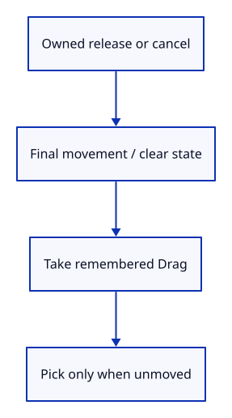

# 20b · Finish or cancel a drag

**Typing: 23–46 minutes.** [Estimate](typing-load.md).

Release processes the final position, then takes the remembered drag out of Gesture. A left release picks only if the press never crossed the movement threshold. Right release may supply one final orbit delta.

Cancellation clears the state without selecting. cancel_pointer checks ownership first; another pointer cannot end the active drag.

## Type

Continue from [Remember the pointer that starts a drag](20a-press.md). [Save or recover your work](recovery.md).

### 1. `src/gesture.rs`

Finish the owned pointer, preserve drag classification and clear cancelled input.

<details>
<summary>Locate the existing block</summary>

```rust
        (drag.button == 2 && delta != [0.0, 0.0]).then_some(Motion::Orbit(delta))
    }

}
```

</details>

Replace that block with:

```rust
--8<-- "journey/code/20b-release-methods.rs"
```

### 2. `src/gesture_tests.rs`

Check left-click classification, final motion, pointer ownership and cancellation.

<details>
<summary>Locate the existing block</summary>

```rust
use crate::gesture::{Gesture, Motion};

#[test]
fn a_press_retains_one_pointer_and_reports_relative_motion() {
    let mut gesture = Gesture::default();
    assert!(!gesture.press(1, 1, [0.0, 0.0]));
    assert!(!gesture.press(1, 0, [f64::NAN, 0.0]));
    assert!(gesture.press(1, 2, [10.0, 20.0]));
    assert!(!gesture.press(2, 0, [10.0, 20.0]));
    assert_eq!(gesture.move_to(2, [30.0, 25.0]), None);
    assert_eq!(gesture.move_to(1, [20.0, 25.0]), Some(Motion::Orbit([10.0, 5.0])));
    assert_eq!(gesture.move_to(1, [24.0, 28.0]), Some(Motion::Orbit([4.0, 3.0])));
}
```

</details>

Replace that block with:

```rust
--8<-- "journey/code/20b-release-tests.rs"
```

## Run and check

In your project:

```sh
cd workspace/journey
REGEN_PROTO=0 cargo build --lib --locked --target wasm32-unknown-unknown -j4
REGEN_PROTO=0 CARGO_BUILD_JOBS=4 trunk serve --port 8780
```

Open `http://127.0.0.1:8780/`. Keep an existing Trunk server running; saving rebuilds it.

Run the state checks. A left drag returning to its start does not click; cancellation produces no selection and permits a fresh press.

**Verified checkpoint in Chrome.**


[Verification scope](release.md).

Run the state checks on your computer from your project folder:

```sh
REGEN_PROTO=0 cargo test --lib --locked --target host-tuple -j4
```

<details>
<summary>Code explanation and diagram</summary>


Release → final move → take stored Drag → click or orbit; cancel → no active drag.



What does Option::take do on release?

It returns the stored Drag and leaves None, so later movement cannot continue the finished gesture.

Study estimate, including typing and experiments: 0.75–1.25 hours.

</details>

<details>
<summary>Optional experiment</summary>

Read the return-to-start test. Predict the result if release checked only its final distance instead of the remembered moved flag.

</details>

<details>
<summary>Check and save your work</summary>

Restore experimental edits, then run from `session_viewer`:

```sh
npm --prefix ../session_tests run course -- check 20b-release
npm --prefix ../session_tests run course -- save 20b-release
```

Source comparison leaves your project untouched. [Save and recovery instructions](recovery.md).

</details>

<details>
<summary>Viewer coverage and verification</summary>

Lost capture, browser blur and interrupted tools must clear application gesture ownership. Their browser adapters follow after Motion reaches Editor.

Native checks establish click classification, owned release and cancellation. Chrome still retains the earlier drawing and input route.

[Full validation scope](release.md).

To reproduce the scripted acceptance of the reference checkpoint, run from `session_viewer` with the [course bundle server](release.md#reproduce) running on port 8781:

```sh
npm --prefix ../session_tests run course -- capture 20b-release
```

This uses the verified reference bundle; it does not check or change your typed project.

</details>
