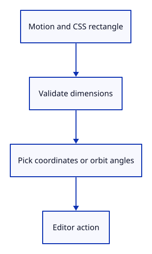

# 20c · Convert pointer motion to editor actions

**Typing: 18–35 minutes.** [Estimate](typing-load.md).

Motion::action uses the canvas CSS rectangle to convert a pick to normalized screen coordinates or a drag delta to orbit angles. Reject an invalid rectangle before dividing.

The method consumes Motion. Option<Action> permits invalid input to produce no editor request. Orbit changes the view while leaving document history unchanged.

## Type

Continue from [Finish or cancel a drag](20b-release.md). [Save or recover your work](recovery.md).

### 1. `src/gesture.rs`

Import the editor action used by motion conversion.

<details>
<summary>Locate the existing block</summary>

```rust
#[derive(Debug, PartialEq)]
```

</details>

Replace that block with:

```rust
--8<-- "journey/code/20c-motion-import.rs"
```

### 2. `src/gesture.rs`

Convert CSS position or motion to an existing editor action after validating the canvas rectangle.

<details>
<summary>Locate the existing block</summary>

```rust
struct Drag {
```

</details>

Replace that block with:

```rust
--8<-- "journey/code/20c-motion-action.rs"
```

### 3. `src/gesture_tests.rs`

Import editor actions for motion and history checks.

<details>
<summary>Locate the existing block</summary>

```rust
use crate::gesture::{Gesture, Motion};
```

</details>

Replace that block with:

```rust
--8<-- "journey/code/20c-motion-test-imports.rs"
```

### 4. `src/gesture_tests.rs`

Check CSS coordinate conversion and camera movement outside document history.

<details>
<summary>Locate the existing block</summary>

```rust
    assert!(!input.press(1, 0, [f64::NAN, 0.0]));
}
```

</details>

Replace that block with:

```rust
--8<-- "journey/code/20c-motion-tests.rs"
```

## Run and check

In your project:

```sh
cd workspace/journey
REGEN_PROTO=0 cargo build --lib --locked --target wasm32-unknown-unknown -j4
REGEN_PROTO=0 CARGO_BUILD_JOBS=4 trunk serve --port 8780
```

Open `http://127.0.0.1:8780/`. Keep an existing Trunk server running; saving rebuilds it.

Run the state checks. A CSS centre maps to [0, 0]; orbit changes the camera, and Undo restores the document without rewinding it.

**Verified checkpoint in Chrome.**


[Verification scope](release.md).

Run the state checks from your project folder:

```sh
REGEN_PROTO=0 cargo test --lib --locked -j4
```

<details>
<summary>Code explanation and diagram</summary>


Motion + CSS rectangle → Action → Editor → selection or view change.



Why use CSS dimensions instead of the GPU drawing size?

Pointer positions use CSS pixels. Mixing them with denser GPU pixels would change picking and sensitivity when display density changes.

Study estimate, including typing and experiments: 0.75–1.25 hours.

</details>

<details>
<summary>Optional experiment</summary>

Double the rectangle dimensions and the pointer offsets in the centre test. Predict the same [0, 0] pick before running it.

</details>

<details>
<summary>Check and save your work</summary>

Restore experimental edits, then run from `session_viewer`:

```sh
npm --prefix ../session_tests run course -- check 20c-motion
npm --prefix ../session_tests run course -- save 20c-motion
```

Source comparison leaves your project untouched. [Save and recovery instructions](recovery.md).

</details>

<details>
<summary>Viewer coverage and verification</summary>

Pointer and command input share Editor actions. Camera navigation stays outside document history and browser callbacks do not edit geometry directly.

Native checks route pointer motion through Editor and render its orbited view. Chrome independently retains the earlier input route until browser pointer delivery is connected next.

[Full validation scope](release.md).

To reproduce the scripted acceptance of the reference checkpoint, run from `session_viewer` with the [course bundle server](release.md#reproduce) running on port 8781:

```sh
npm --prefix ../session_tests run course -- capture 20c-motion
```

This uses the verified reference bundle; it does not check or change your typed project.

</details>
