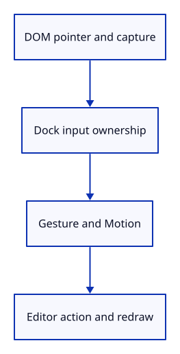

# 21 · Connect captured pointers to the editor

**Typing: 23–46 minutes.** [Estimate](typing-load.md).

Deliver canvas pointer events to Gesture when the command dock has not consumed them. Capture the accepted pointer so events keep arriving outside the canvas. Apply any returned action through Editor.

Release capture on pointer-up. Clear gesture state on cancellation, lost capture, blur or resize; suppress the browser context menu for right-drag navigation.

## Type

Continue from [Convert pointer motion to editor actions](20c-motion.md). [Save or recover your work](recovery.md).

### 1. `Cargo.toml`

Enable the browser event bindings used by the command dock.

<details>
<summary>Locate the existing block</summary>

```toml

[dependencies]
wasm-bindgen = "=0.2.128"
web-sys = { version = "=0.3.105", features = ["Window", "Document", "Element", "HtmlCanvasElement", "EventTarget", "AddEventListenerOptions", "Event", "PointerEvent", "MouseEvent", "KeyboardEvent", "WheelEvent", "FocusOptions", "DomRect", "HtmlElement"] }
console_error_panic_hook = "=0.1.7"
wasm-bindgen-futures = "=0.4.78"
wgpu = "=29.0.4"
```

</details>

Replace that block with:

```toml
--8<-- "journey/code/21-gestures-dock-01.toml"
```

### 2. `src/browser.rs`

Import the gesture state.

<details>
<summary>Locate the existing block</summary>

```rust
use crate::background::Background;
use crate::editor::{Action, Change, Editor};
use crate::renderer::Renderer;
use crate::viewport::Viewport;
use wasm_bindgen::{JsCast, JsValue, closure::Closure};
```

</details>

Replace that block with:

```rust
--8<-- "journey/code/21-gestures-window-1.rs"
```

### 3. `src/browser.rs`

Retain the canvas and one gesture across pointer events.

<details>
<summary>Locate the existing block</summary>

```rust
    }
    let input_canvas = canvas.clone();
    let browser_window = window.clone();
    let update = Closure::<dyn FnMut(web_sys::Event)>::new(move |event: web_sys::Event| {
        let line = match panel.update(Some(&event), &input_canvas) {
            Ok(line) => line,
```

</details>

Replace that block with:

```rust
--8<-- "journey/code/21-gestures-window-2.rs"
```

### 4. `src/browser.rs`

Begin choosing between submitted commands and pointer gestures.

<details>
<summary>Locate the existing block</summary>

```rust
                return;
            }
        };
        let line = line.or_else(|| {
            let mouse = event.dyn_ref::<web_sys::MouseEvent>()?;
            (event.type_() == "click"
                && !panel.consumed
                && mouse
                    .target()
                    .and_then(|target| target.dyn_into::<web_sys::Element>().ok())
                    .is_some_and(|target| target.id() == "canvas"))
            .then(|| "canvas".into())
        });
        if let Some(line) = line {
            let action = match line.as_str() {
                "canvas" => {
                    let Some(event) = event.dyn_ref::<web_sys::MouseEvent>() else {
                        return;
                    };
                    let rect = input_canvas.get_bounding_client_rect();
                    if rect.width() <= 0.0 || rect.height() <= 0.0 {
                        return;
                    }
                    Action::Pick([
                        (2.0 * (event.client_x() as f64 - rect.left()) / rect.width() - 1.0) as f32,
                        (1.0 - 2.0 * (event.client_y() as f64 - rect.top()) / rect.height()) as f32,
                    ])
                }
                "example box" => Action::AddBox,
                "example triangle" => Action::ToggleExtra,
                "select next" => Action::SelectNext,
```

</details>

Replace that block with:

```rust
--8<-- "journey/code/21-gestures-window-3.rs"
```

### 5. `src/browser.rs`

Use pointer gestures only when the dock has not consumed input; apply any resulting action.

<details>
<summary>Locate the existing block</summary>

```rust
                "view reset" => Action::ResetView,
                _ => return,
            };
            match editor.apply(action) {
                Ok(Change::Scene) => renderer.set_scene(&editor.scene, editor.selected),
                Ok(Change::View) => {}
```

</details>

Replace that block with:

```rust
--8<-- "journey/code/21-gestures-window-4.rs"
```

### 6. `src/browser.rs`

Use the retained pointer canvas for resizing.

<details>
<summary>Locate the existing block</summary>

```rust
        }
        if resize(
            &browser_window,
            &input_canvas,
            &surface,
            &mut config,
            &mut renderer,
```

</details>

Replace that block with:

```rust
--8<-- "journey/code/21-gestures-window-5.rs"
```

### 7. `src/browser.rs`

Keep the callback open for pointer event registration.

<details>
<summary>Locate the existing block</summary>

```rust
        "keydown",
        "keyup",
        "blur",
        "click",
    ] {
        canvas.add_event_listener_with_callback(name, update.as_ref().unchecked_ref())?;
    }
```

</details>

Replace that block with:

```rust
--8<-- "journey/code/21-gestures-window-6.rs"
```

### 8. `src/browser.rs`

Track pointer presses, capture and release; cancel on blur or resize and suppress the browser context menu.

<details>
<summary>Locate the existing block</summary>

```rust
        &options,
    )?;
    window.add_event_listener_with_callback("resize", update.as_ref().unchecked_ref())?;
    // Both event sources retain this one callback for the lifetime of the page.
    update.forget();
    report("Canvas pixels, depth and camera resize together.");
    Ok(())
}

fn resize(
    window: &web_sys::Window,
    canvas: &web_sys::HtmlCanvasElement,
```

</details>

Replace that block with:

```rust
--8<-- "journey/code/21-gestures-window-7.rs"
```

## Run and check

In your project:

```sh
cd workspace/journey
REGEN_PROTO=0 cargo build --lib --locked --target wasm32-unknown-unknown -j4
REGEN_PROTO=0 CARGO_BUILD_JOBS=4 trunk serve --port 8780
```

Open `http://127.0.0.1:8780/`. Keep an existing Trunk server running; saving rebuilds it.

Right-drag the scene, then release. Further movement must stop orbiting; a left click still selects a face.

**Verified checkpoint in Chrome.**


[Verification scope](release.md).

Run the state checks on your computer from your project folder:

```sh
REGEN_PROTO=0 cargo test --lib --locked --target host-tuple -j4
```

<details>
<summary>Code explanation and diagram</summary>


DOM pointer → Gesture → Motion::action → Editor → redraw.



Why do we need both browser pointer capture and our own active pointer ID?

Capture keeps delivering events outside the canvas. The ID tells our application which pointer owns the gesture. Neither replaces the other: a second pointer must not finish the first gesture, and lost capture must clear our state.

Study estimate, including typing and experiments: 1–1.5 hours.

</details>

<details>
<summary>Optional experiment</summary>

Change the four-pixel click threshold to twenty. Try a short left drag, then restore four. Explain why this distance is measured in CSS pixels: doubling display density should not make the same hand movement harder to classify. Finally undo adding the box after orbiting. The box should disappear while the camera stays where you put it.

</details>

<details>
<summary>Check and save your work</summary>

Restore experimental edits, then run from `session_viewer`:

```sh
npm --prefix ../session_tests run course -- check 21-gestures
npm --prefix ../session_tests run course -- save 21-gestures
```

Source comparison leaves your project untouched. [Save and recovery instructions](recovery.md).

</details>

<details>
<summary>Viewer coverage and verification</summary>

The maintained viewer keeps richer gesture state and cancellation listeners in `src/app/input.rs`. This checkpoint establishes one active pointer and cancellation; touch orbit, wheel zoom and drawing tools will extend the same route rather than editing geometry inside DOM callbacks.

Chrome verifies actual right-drag orbit and release, movement outside the canvas, lost capture, pointer cancellation, blur, resize and left-click classification. The final view restores the initial accepted orbit.

[Full validation scope](release.md).

To reproduce the scripted acceptance of the reference checkpoint, run from `session_viewer` with the [course bundle server](release.md#reproduce) running on port 8781:

```sh
npm --prefix ../session_tests run course -- capture 21-gestures
```

This uses the verified reference bundle; it does not check or change your typed project.

</details>
