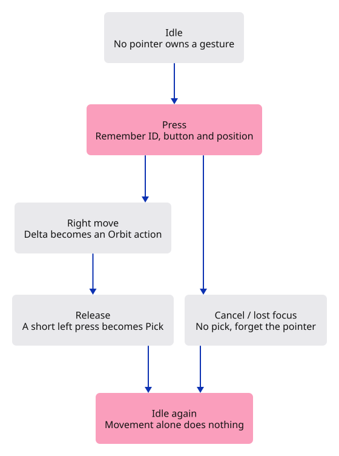
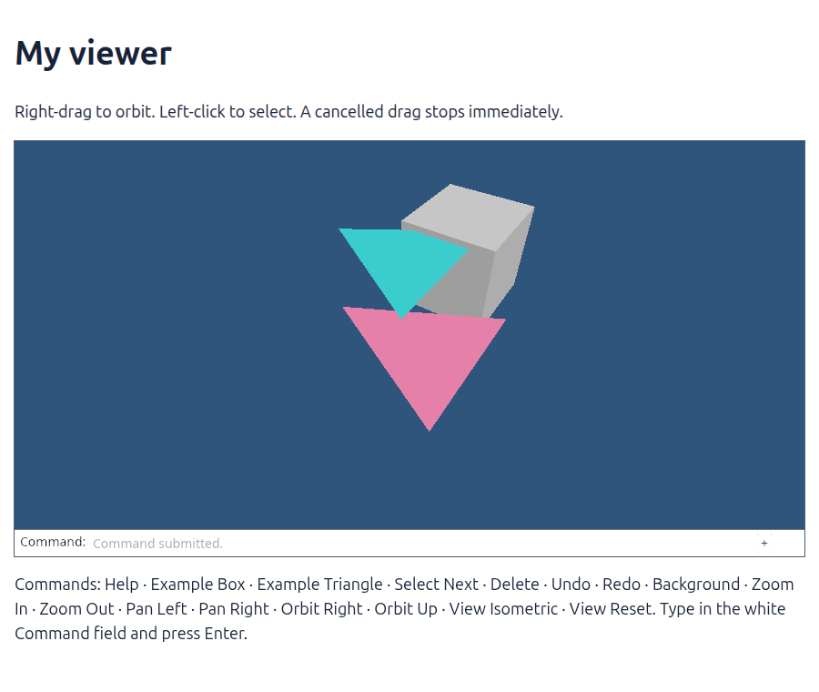

# 21 · Remember a press until it ends

**Combined study estimate: 3–5 hours.** Includes reading, typing, reasoning and experiments.

**Typing estimate: 77–153 minutes.** 216 added or changed lines; unchanged context is excluded. [How this is estimated](typing-load.md).

**Splitting required:** this verified checkpoint exceeds the one-hour typing target. Smaller runnable lessons are still being prepared.

**Today:** Orbit with a right drag, pick with a left click, and stop safely when the pointer or window loses focus.

**Follow:** Pointer event → Gesture memory → Motion → Editor action → camera or selection → frame.

Put your finger on the table. Move it, then lift it. Those are three events, but you understand them as one gesture because you remember the press. Our viewer needs that little piece of memory too.

A click waits until release. If a left press travels more than four CSS pixels, it is no longer a click—even if it comes back. A right press turns each movement into an orbit delta. We already know how to orbit; this lesson only supplies the changing angles.

Rust’s `Option<Drag>` means “either one active drag, or none.” `as_mut()` lets us update the remembered position without taking the drag out. `take()` removes it on release. Keeping this small state machine outside the browser lets us test interrupted gestures as ordinary Rust calls.



## Type the change

Continue from [Keep a changing window in proportion](20-resize.md). Save your own work first: `npm --prefix ../session_tests run course -- save before-21-gestures` (from `session_viewer`).

### 1. `src/gesture.rs`

Keep pointer state separate from the document. Motion carries intent; converting it to an Action uses CSS dimensions, never the GPU pixel count.

Create the file and type:

```rust
--8<-- "journey/code/21-gestures-01.rs"
```

### 2. `src/gesture.rs`

A drag remembers its pointer ID and previous position. Option lets an event produce no action without pretending it was a click.

<details>
<summary>Locate the existing block</summary>

```rust
pub struct Gesture {
    active: Option<Drag>,
}
```

</details>

Replace that block with:

```rust
--8<-- "journey/code/21-gestures-02.rs"
```

### 3. `src/gesture_tests.rs`

Test the event sequences that usually hide bugs: another finger, a cancelled press, and a drag returning to its start. These tests need no browser.

Create the file and type:

```rust
--8<-- "journey/code/21-gestures-03.rs"
```

### 4. `Cargo.toml`

Enable the browser event bindings used by the command dock. serde records the drawn field for browser verification; the same code still receives real keyboard events.

<details>
<summary>Locate the existing block</summary>

```toml

[dependencies]
wasm-bindgen = "=0.2.128"
web-sys = { version = "=0.3.105", features = ["Window", "Document", "Element", "HtmlCanvasElement", "EventTarget", "AddEventListenerOptions", "Event", "MouseEvent", "DomRect", "PointerEvent", "KeyboardEvent", "WheelEvent", "FocusOptions", "HtmlElement"] }
console_error_panic_hook = "=0.1.7"
wasm-bindgen-futures = "=0.4.78"
wgpu = "=29.0.4"
```

</details>

Replace that block with:

```toml
--8<-- "journey/code/21-gestures-dock-01.toml"
```

### 5. `src/lib.rs`

Expose the gesture module to the browser and compile its tests only in the test build.

<details>
<summary>Locate the existing block</summary>

```rust
pub mod history;
pub mod editor;
pub mod viewport;
pub mod gpu_mesh;
pub mod renderer;
#[cfg(target_arch = "wasm32")]
```

</details>

Replace that block with:

```rust
--8<-- "journey/code/21-gestures-fullscreen-1.rs"
```

### 6. `src/browser.rs`

Connect remember a press until it ends to the typed command path. Keep the scene state in its existing owner and redraw the dock after applying an action.

<details>
<summary>Locate the existing block</summary>

```rust
use crate::background::Background;
use crate::editor::{Action, Change, Editor};
use crate::renderer::Renderer;
use crate::viewport::Viewport;
use wasm_bindgen::{JsCast, JsValue, closure::Closure};
```

</details>

Replace that block with:

```rust
--8<-- "journey/code/21-gestures-window-1.rs"
```

### 7. `src/browser.rs`

Connect remember a press until it ends to the typed command path. Keep the scene state in its existing owner and redraw the dock after applying an action.

<details>
<summary>Locate the existing block</summary>

```rust
    }
    let input_canvas = canvas.clone();
    let browser_window = window.clone();
    let update = Closure::<dyn FnMut(web_sys::Event)>::new(move |event: web_sys::Event| {
        let line = match panel.update(Some(&event), &input_canvas) {
            Ok(line) => line,
```

</details>

Replace that block with:

```rust
--8<-- "journey/code/21-gestures-window-2.rs"
```

### 8. `src/browser.rs`

Connect remember a press until it ends to the typed command path. Keep the scene state in its existing owner and redraw the dock after applying an action.

<details>
<summary>Locate the existing block</summary>

```rust
                return;
            }
        };
        let line = line.or_else(|| {
            let mouse = event.dyn_ref::<web_sys::MouseEvent>()?;
            (event.type_() == "click"
                && !panel.consumed
                && mouse
                    .target()
                    .and_then(|target| target.dyn_into::<web_sys::Element>().ok())
                    .is_some_and(|target| target.id() == "canvas"))
            .then(|| "canvas".into())
        });
        if let Some(line) = line {
            let action = match line.as_str() {
                "canvas" => {
                    let Some(event) = event.dyn_ref::<web_sys::MouseEvent>() else {
                        return;
                    };
                    let rect = input_canvas.get_bounding_client_rect();
                    if rect.width() <= 0.0 || rect.height() <= 0.0 {
                        return;
                    }
                    Action::Pick([
                        (2.0 * (event.client_x() as f64 - rect.left()) / rect.width() - 1.0) as f32,
                        (1.0 - 2.0 * (event.client_y() as f64 - rect.top()) / rect.height()) as f32,
                    ])
                }
                "example box" => Action::AddBox,
                "example triangle" => Action::ToggleExtra,
                "select next" => Action::SelectNext,
```

</details>

Replace that block with:

```rust
--8<-- "journey/code/21-gestures-window-3.rs"
```

### 9. `src/browser.rs`

Connect remember a press until it ends to the typed command path. Keep the scene state in its existing owner and redraw the dock after applying an action.

<details>
<summary>Locate the existing block</summary>

```rust
                "view reset" => Action::ResetView,
                _ => return,
            };
            match editor.apply(action) {
                Ok(Change::Scene) => renderer.set_scene(&editor.scene, editor.selected),
                Ok(Change::View) => {}
```

</details>

Replace that block with:

```rust
--8<-- "journey/code/21-gestures-window-4.rs"
```

### 10. `src/browser.rs`

Connect remember a press until it ends to the typed command path. Keep the scene state in its existing owner and redraw the dock after applying an action.

<details>
<summary>Locate the existing block</summary>

```rust
        }
        if resize(
            &browser_window,
            &input_canvas,
            &surface,
            &mut config,
            &mut renderer,
```

</details>

Replace that block with:

```rust
--8<-- "journey/code/21-gestures-window-5.rs"
```

### 11. `src/browser.rs`

Connect remember a press until it ends to the typed command path. Keep the scene state in its existing owner and redraw the dock after applying an action.

<details>
<summary>Locate the existing block</summary>

```rust
        "keydown",
        "keyup",
        "blur",
        "click",
    ] {
        canvas.add_event_listener_with_callback(name, update.as_ref().unchecked_ref())?;
    }
```

</details>

Replace that block with:

```rust
--8<-- "journey/code/21-gestures-window-6.rs"
```

### 12. `src/browser.rs`

Connect remember a press until it ends to the typed command path. Keep the scene state in its existing owner and redraw the dock after applying an action.

<details>
<summary>Locate the existing block</summary>

```rust
        &options,
    )?;
    window.add_event_listener_with_callback("resize", update.as_ref().unchecked_ref())?;
    // Both event sources retain this one callback for the lifetime of the page.
    update.forget();
    report("Canvas pixels, depth and camera resize together.");
    Ok(())
}

fn resize(
    window: &web_sys::Window,
    canvas: &web_sys::HtmlCanvasElement,
```

</details>

Replace that block with:

```rust
--8<-- "journey/code/21-gestures-window-7.rs"
```

## Run and look

From `session_viewer`, enter your project folder:

```sh
cd workspace/journey
REGEN_PROTO=0 cargo build --lib --locked --target wasm32-unknown-unknown -j4
REGEN_PROTO=0 CARGO_BUILD_JOBS=4 trunk serve --port 8780
```

Open `http://127.0.0.1:8780/`. If Trunk is already running in this project, leave it running; it rebuilds when you save.

Right-drag the drawing and release outside the canvas. Further pointer movement must stop orbiting. A left click still selects a face.

**Verified checkpoint in Chrome.**



[What this screenshot checks](release.md).

Run the state checks from your project folder:

```sh
REGEN_PROTO=0 cargo test --lib --locked -j4
```

<details>
<summary>Optional experiment</summary>

Change the four-pixel click threshold to twenty. Try a short left drag, then restore four. Explain why this distance is measured in CSS pixels: doubling display density should not make the same hand movement harder to classify. Finally undo adding the box after orbiting. The box should disappear while the camera stays where you put it.

</details>

## Explain the change

Why do we need both browser pointer capture and our own active pointer ID?

<details>
<summary>Compare your explanation</summary>

Capture keeps delivering events outside the canvas. The ID tells our application which pointer owns the gesture. Neither replaces the other: a second pointer must not finish the first gesture, and lost capture must clear our state.

</details>

## Keep your working result

Return to `session_viewer` in a second terminal. Restore experimental edits before comparing:

```sh
npm --prefix ../session_tests run course -- check 21-gestures
npm --prefix ../session_tests run course -- save 21-gestures
```

Check compares your typed source; run the focused check above for behavior. [Recover your work](recovery.md).

<details>
<summary>Where this fits in the finished viewer</summary>

The maintained viewer keeps richer gesture state and cancellation listeners in `src/app/input.rs`. This checkpoint establishes one active pointer and cancellation; touch orbit, wheel zoom and drawing tools will extend the same route rather than editing geometry inside DOM callbacks.

</details>

<details>
<summary>Verification notes and browser acceptance</summary>

A right drag turns the scene. The browser check then releases the command and confirms that further pointer movement leaves the camera still.

[Full validation scope](release.md).

</details>
