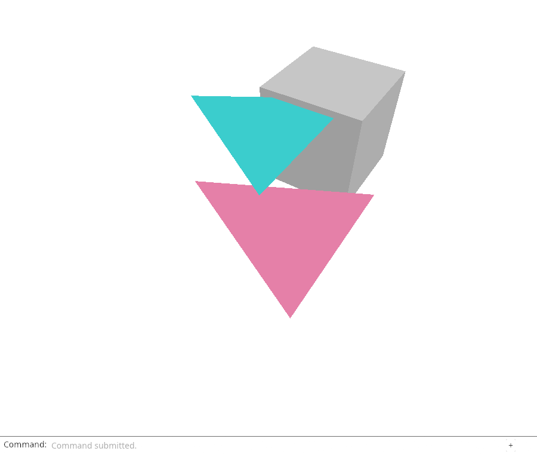
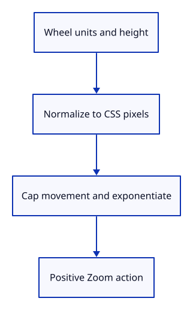

# 21a · Convert wheel units to camera zoom

**Typing: 25–50 minutes.** [Estimate](typing-load.md).

navigation::wheel converts pixels, lines or pages to CSS pixels, caps one event at 600 pixels, then returns a positive exponential zoom factor. Invalid input returns None.

The stateless function borrows no editor. Its checks apply the returned Zoom through Editor and verify that camera movement stays outside document history.

## Type

Continue from [Connect captured pointers to the editor](21-gestures.md). [Save or recover your work](recovery.md).

### 1. `src/navigation.rs`

Normalize wheel units into the existing Zoom action. Zero or invalid input returns None.

Create the file and type:

```rust
--8<-- "journey/code/22-shortcuts-01.rs"
```

### 2. `src/navigation_tests.rs`

Compare equivalent wheel inputs, bound large jumps, and show that navigation preserves document history.

Create the file and type:

```rust
--8<-- "journey/code/22-shortcuts-02.rs"
```

### 3. `src/lib.rs`

Register the small input translator and its tests.

<details>
<summary>Locate the existing block</summary>

```rust
pub mod editor;
pub mod viewport;
pub mod gesture;
#[cfg(test)]
mod gesture_tests;
pub mod gpu_mesh;
```

</details>

Replace that block with:

```rust
--8<-- "journey/code/22-shortcuts-fullscreen-1.rs"
```

## Run and check

In your project:

```sh
cd workspace/journey
REGEN_PROTO=0 cargo build --lib --locked --target wasm32-unknown-unknown -j4
REGEN_PROTO=0 CARGO_BUILD_JOBS=4 trunk serve --port 8780
```

Open `http://127.0.0.1:8780/`. Keep an existing Trunk server running; saving rebuilds it.

Run the state checks. Equivalent pixel, line and page deltas give the same zoom; Undo restores geometry while retaining the camera.

**Verified checkpoint in Chrome.**



[Verification scope](release.md).

Run the state checks on your computer from your project folder:

```sh
REGEN_PROTO=0 cargo test --lib --locked --target host-tuple -j4
```

<details>
<summary>Code explanation and diagram</summary>


Wheel delta and units → CSS pixels → bounded exponential → Action::Zoom.



Why use an exponential for the zoom factor?

It stays positive and lets equal opposite movements restore the earlier distance, subject to the camera limits.

Study estimate, including typing and experiments: 0.75–1.5 hours.

</details>

<details>
<summary>Optional experiment</summary>

Compare 48 pixels, three lines and 0.1 pages at height 480. Predict the same result before running the unit check.

</details>

<details>
<summary>Check and save your work</summary>

Restore experimental edits, then run from `session_viewer`:

```sh
npm --prefix ../session_tests run course -- check 21a-wheel
npm --prefix ../session_tests run course -- save 21a-wheel
```

Source comparison leaves your project untouched. [Save and recovery instructions](recovery.md).

</details>

<details>
<summary>Viewer coverage and verification</summary>

Mouse and phone navigation produce view actions outside document history. This step establishes wheel normalization before browser delivery.

Native checks normalize wheel units and render the resulting view. Chrome retains the previous pointer route; actual wheel delivery is connected next.

[Full validation scope](release.md).

To reproduce the scripted acceptance of the reference checkpoint, run from `session_viewer` with the [course bundle server](release.md#reproduce) running on port 8781:

```sh
npm --prefix ../session_tests run course -- capture 21a-wheel
```

This uses the verified reference bundle; it does not check or change your typed project.

</details>
