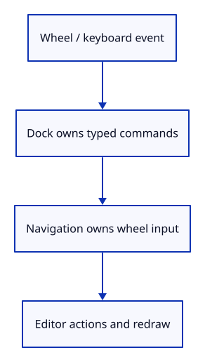

# 22 · Deliver wheel input without keyboard feature shortcuts

**Typing: 17–34 minutes.** [Estimate](typing-load.md).

Route wheel events through navigation::wheel, prevent page scrolling when zoom is handled, and keep printable keyboard input in the command dock. Focus the canvas when a pointer press starts navigation.

There is no keyboard feature map. Text-editing keys stay with the dock; Escape can cancel gesture state through the navigation route when the dock has not consumed it.

## Type

Continue from [Convert wheel units to camera zoom](21a-wheel.md). [Save or recover your work](recovery.md).

### 1. `Cargo.toml`

Enable the browser event bindings used by the command dock.

<details>
<summary>Locate the existing block</summary>

```toml

[dependencies]
wasm-bindgen = "=0.2.128"
web-sys = { version = "=0.3.105", features = ["Window", "Document", "Element", "HtmlCanvasElement", "EventTarget", "AddEventListenerOptions", "Event", "MouseEvent", "PointerEvent", "DomRect", "KeyboardEvent", "WheelEvent", "FocusOptions", "HtmlElement"] }
console_error_panic_hook = "=0.1.7"
wasm-bindgen-futures = "=0.4.78"
wgpu = "=29.0.4"
```

</details>

Replace that block with:

```toml
--8<-- "journey/code/22-shortcuts-dock-01.toml"
```

### 2. `src/browser.rs`

Route unconsumed canvas input through navigation_action.

<details>
<summary>Locate the existing block</summary>

```rust
            };
            Some(action)
        } else if !panel.consumed {
            pointer_action(&event, &pointer_canvas, &mut gesture)
        } else {
            None
        };
```

</details>

Replace that block with:

```rust
--8<-- "journey/code/22-shortcuts-window-1.rs"
```

### 3. `src/browser.rs`

Retain the shared callback and dispatch wheel or pointer navigation.

<details>
<summary>Locate the existing block</summary>

```rust
    window.add_event_listener_with_callback("blur", update.as_ref().unchecked_ref())?;
    // Both event sources retain this one callback for the lifetime of the page.
    update.forget();
    report("Right-drag to orbit. Left-click to select. A cancelled drag stops immediately.");
    Ok(())
}

fn pointer_action(
    event: &web_sys::Event,
    canvas: &web_sys::HtmlCanvasElement,
```

</details>

Replace that block with:

```rust
--8<-- "journey/code/22-shortcuts-window-2.rs"
```

### 4. `src/browser.rs`

Focus the canvas and capture accepted pointer presses; cancel if either operation fails.

<details>
<summary>Locate the existing block</summary>

```rust
        "pointerdown" => {
            if pointer.is_primary() && gesture.press(id, pointer.button(), position) {
                event.prevent_default();
                if canvas.set_pointer_capture(id).is_err() {
                    gesture.cancel();
                }
            }
```

</details>

Replace that block with:

```rust
--8<-- "journey/code/22-shortcuts-window-3.rs"
```

## Run and check

In your project:

```sh
cd workspace/journey
REGEN_PROTO=0 cargo build --lib --locked --target wasm32-unknown-unknown -j4
REGEN_PROTO=0 CARGO_BUILD_JOBS=4 trunk serve --port 8780
```

Open `http://127.0.0.1:8780/`. Keep an existing Trunk server running; saving rebuilds it.

Wheel over the scene to zoom. Click the canvas and type Pan Right; the first character reaches the dock and Enter pans the view.

**Verified checkpoint in Chrome.**


[Verification scope](release.md).

Run the state checks from your project folder:

```sh
REGEN_PROTO=0 cargo test --lib --locked -j4
```

<details>
<summary>Code explanation and diagram</summary>


Wheel → navigation_action → Editor; printable key → command dock → typed Action.



Why request a non-passive wheel listener?

Handled wheel navigation must call prevent_default so the browser does not scroll the page.

Study estimate, including typing and experiments: 0.5–1 hours.

</details>

<details>
<summary>Optional experiment</summary>

Change wheel sensitivity from 0.002 to 0.001, predict the difference, and try it before restoring the value. Run `Undo` after several wheel movements: it removes the box while preserving the camera. Run `Redo` to restore it. Explain why navigation does not enter document history. Finally Tab away during a drag; the canvas blur listener should cancel it.

</details>

<details>
<summary>Check and save your work</summary>

Restore experimental edits, then run from `session_viewer`:

```sh
npm --prefix ../session_tests run course -- check 22-shortcuts
npm --prefix ../session_tests run course -- save 22-shortcuts
```

Source comparison leaves your project untouched. [Save and recovery instructions](recovery.md).

</details>

<details>
<summary>Viewer coverage and verification</summary>

The maintained viewer routes mouse and phone navigation through src/app/input.rs. Printable input activates the command dock immediately; named commands share the existing state and history. This checkpoint keeps wheel zoom centred on the camera target. Pointer-centred zoom and phone gestures will extend navigation without introducing keyboard feature shortcuts.

Chrome checks actual wheel zoom without page scrolling, equivalent line/page wheel events, and immediate typing after canvas focus without keyboard feature shortcuts.

[Full validation scope](release.md).

To reproduce the scripted acceptance of the reference checkpoint, run from `session_viewer` with the [course bundle server](release.md#reproduce) running on port 8781:

```sh
npm --prefix ../session_tests run course -- capture 22-shortcuts
```

This uses the verified reference bundle; it does not check or change your typed project.

</details>
