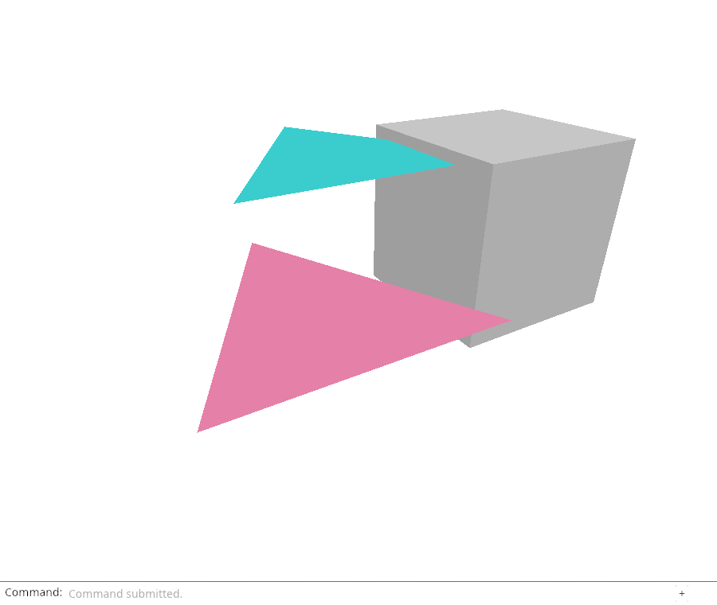
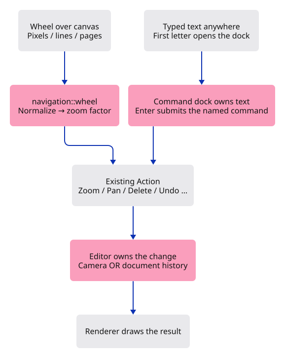

# 22 · Keep navigation on the mouse and commands in the dock

**Typing: 42–84 minutes.** [Estimate](typing-load.md).

**Splitting required:** this verified checkpoint exceeds the one-hour typing target. Smaller runnable lessons are still being prepared.

Keep keyboard features in the command dock and navigation on the mouse. Clicking the drawing then typing `Pan Right` preserves the first letter; Enter runs the command. Text-editing keys never become camera or document shortcuts.

Add a stateless wheel translator beside gesture state. It turns delta, delta mode and canvas height into `Option<Action>`. Invalid or zero movement returns no action.

## Type

Continue from [Remember a press until it ends](21-gestures.md). [Save or recover your work](recovery.md).

### 1. `src/navigation.rs`

Normalize wheel units into the existing Zoom action. Zero or invalid input returns None.

Create the file and type:

```rust
--8<-- "journey/code/22-shortcuts-01.rs"
```

### 2. `src/navigation_tests.rs`

Compare equivalent wheel inputs, bound large jumps, and show that navigation preserves document history.

Create the file and type:

```rust
--8<-- "journey/code/22-shortcuts-02.rs"
```

### 3. `Cargo.toml`

Enable the browser event bindings used by the command dock.

<details>
<summary>Locate the existing block</summary>

```toml

[dependencies]
wasm-bindgen = "=0.2.128"
web-sys = { version = "=0.3.105", features = ["Window", "Document", "Element", "HtmlCanvasElement", "EventTarget", "AddEventListenerOptions", "Event", "MouseEvent", "PointerEvent", "DomRect", "KeyboardEvent", "WheelEvent", "FocusOptions", "HtmlElement"] }
console_error_panic_hook = "=0.1.7"
wasm-bindgen-futures = "=0.4.78"
wgpu = "=29.0.4"
```

</details>

Replace that block with:

```toml
--8<-- "journey/code/22-shortcuts-dock-01.toml"
```

### 4. `src/lib.rs`

Register the small input translator and its tests.

<details>
<summary>Locate the existing block</summary>

```rust
pub mod editor;
pub mod viewport;
pub mod gesture;
#[cfg(test)]
mod gesture_tests;
pub mod gpu_mesh;
```

</details>

Replace that block with:

```rust
--8<-- "journey/code/22-shortcuts-fullscreen-1.rs"
```

### 5. `src/browser.rs`

Route unconsumed canvas input through navigation_action.

<details>
<summary>Locate the existing block</summary>

```rust
            };
            Some(action)
        } else if !panel.consumed {
            pointer_action(&event, &pointer_canvas, &mut gesture)
        } else {
            None
        };
```

</details>

Replace that block with:

```rust
--8<-- "journey/code/22-shortcuts-window-1.rs"
```

### 6. `src/browser.rs`

Retain the shared callback and dispatch wheel or pointer navigation.

<details>
<summary>Locate the existing block</summary>

```rust
    window.add_event_listener_with_callback("blur", update.as_ref().unchecked_ref())?;
    // Both event sources retain this one callback for the lifetime of the page.
    update.forget();
    report("Right-drag to orbit. Left-click to select. A cancelled drag stops immediately.");
    Ok(())
}

fn pointer_action(
    event: &web_sys::Event,
    canvas: &web_sys::HtmlCanvasElement,
```

</details>

Replace that block with:

```rust
--8<-- "journey/code/22-shortcuts-window-2.rs"
```

### 7. `src/browser.rs`

Focus the canvas and capture accepted pointer presses; cancel if either operation fails.

<details>
<summary>Locate the existing block</summary>

```rust
        "pointerdown" => {
            if pointer.is_primary() && gesture.press(id, pointer.button(), position) {
                event.prevent_default();
                if canvas.set_pointer_capture(id).is_err() {
                    gesture.cancel();
                }
            }
```

</details>

Replace that block with:

```rust
--8<-- "journey/code/22-shortcuts-window-3.rs"
```

## Run and check

In your project:

```sh
cd workspace/journey
REGEN_PROTO=0 cargo build --lib --locked --target wasm32-unknown-unknown -j4
REGEN_PROTO=0 CARGO_BUILD_JOBS=4 trunk serve --port 8780
```

Open `http://127.0.0.1:8780/`. Keep an existing Trunk server running; saving rebuilds it.

Click the canvas and type a single letter. It must appear in the command field without changing the scene. Type `Pan Right` and press Enter to move the view. Wheel input still zooms.

**Verified checkpoint in Chrome.**



[Verification scope](release.md).

Run the state checks from your project folder:

```sh
REGEN_PROTO=0 cargo test --lib --locked -j4
```

<details>
<summary>Code explanation and diagram</summary>

Convert lines to sixteen CSS pixels and pages to one canvas height. An exponential produces a positive zoom factor; cap an event at 600 pixels. Camera retains its distance limits.

A non-passive wheel listener can prevent scrolling for handled zoom. Escape cancels gesture state. See the browser [delta modes](https://developer.mozilla.org/en-US/docs/Web/API/WheelEvent/deltaMode) and [listener options](https://developer.mozilla.org/en-US/docs/Web/API/EventTarget/addEventListener).

Wheel units → navigation::wheel → Editor action → camera → frame; typed text → command dock → Editor action.



Why does a wheel need units, while typed text needs one owner?

A wheel delta may represent pixels, lines or pages. Normalize those units before zooming. Typed text belongs to the command dock, even after clicking the drawing. There is no second keyboard feature map to accidentally move the camera or delete geometry.

Study estimate, including typing and experiments: 2–4 hours.

</details>

<details>
<summary>Optional experiment</summary>

Change wheel sensitivity from 0.002 to 0.001, predict the difference, and try it before restoring the value. Run `Undo` after several wheel movements: it removes the box while preserving the camera. Run `Redo` to restore it. Explain why navigation does not enter document history. Finally Tab away during a drag; the canvas blur listener should cancel it.

</details>

<details>
<summary>Check and save your work</summary>

Restore experimental edits, then run from `session_viewer`:

```sh
npm --prefix ../session_tests run course -- check 22-shortcuts
npm --prefix ../session_tests run course -- save 22-shortcuts
```

Source comparison leaves your project untouched. [Save and recovery instructions](recovery.md).

</details>

<details>
<summary>Viewer coverage and verification</summary>

The maintained viewer routes mouse and phone navigation through src/app/input.rs. Printable input activates the command dock immediately; named commands share the existing state and history. This checkpoint keeps wheel zoom centred on the camera target. Pointer-centred zoom and phone gestures will extend navigation without introducing keyboard feature shortcuts.

Wheel input zooms and the Pan Right command pans. Typing after clicking the drawing activates the dock without invoking keyboard feature shortcuts.

[Full validation scope](release.md).

</details>
