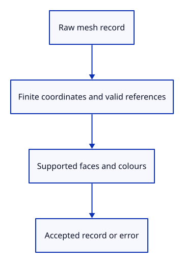

# 22a · Validate a raw mesh record

**Typing: 26–51 minutes.** [Estimate](typing-load.md).

Define the source owners and check protobuf mesh records before building kernel objects. Accept finite coordinates, valid vertex references, triangles or quads, and object colours within the stated size limits.

## Type

Continue from [Deliver wheel input without keyboard feature shortcuts](22-shortcuts.md). [Save or recover your work](recovery.md).

### 1. `Cargo.toml`

Add fixed protobuf and browser byte-reading dependencies for the import sequence.

<details>
<summary>Locate the existing block</summary>

```toml

[dependencies]
wasm-bindgen = "=0.2.128"
web-sys = { version = "=0.3.105", features = ["Window", "Document", "Element", "HtmlCanvasElement", "EventTarget", "AddEventListenerOptions", "Event", "MouseEvent", "PointerEvent", "DomRect", "KeyboardEvent", "WheelEvent", "AddEventListenerOptions", "HtmlElement", "FocusOptions"] }
console_error_panic_hook = "=0.1.7"
wasm-bindgen-futures = "=0.4.78"
wgpu = "=29.0.4"
session_rust = { path = "../../../session_rust", default-features = false }
```

</details>

Replace that block with:

```toml
--8<-- "journey/code/23-import-dock-01.toml"
```

### 2. `src/document.rs`

Reject unsupported mesh records before kernel construction; check finite coordinates and referenced vertex keys.

Create the file and type:

```rust
--8<-- "journey/code/22a-records-document.rs"
```

### 3. `src/lib.rs`

Register the raw-record validator.

<details>
<summary>Locate the existing block</summary>

```rust
pub mod navigation;
```

</details>

Replace that block with:

```rust
--8<-- "journey/code/22a-records-register.rs"
```

## Run and check

After typing the manifest, run this from `session_viewer` to select the fixed dependency versions. It updates Cargo.lock, preserves the previous lock, and installs any supplied binary font assets. It does not write implementation code:

```sh
npm --prefix ../session_tests run course -- dependencies 22a-records
```

In your project:

```sh
cd workspace/journey
REGEN_PROTO=0 cargo build --lib --locked --target wasm32-unknown-unknown -j4
REGEN_PROTO=0 CARGO_BUILD_JOBS=4 trunk serve --port 8780
```

Open `http://127.0.0.1:8780/`. Keep an existing Trunk server running; saving rebuilds it.

Run the state checks. A valid box passes; non-finite coordinates and missing vertex references are rejected.

**Verified checkpoint in Chrome.**


[Verification scope](release.md).

Run the state checks on your computer from your project folder:

```sh
REGEN_PROTO=0 cargo test --lib --locked --target host-tuple -j4
```

<details>
<summary>Code explanation and diagram</summary>

The validator borrows a record and returns Result<(), &str>. It inspects stored triangulation without constructing a Session or changing the scene.

Raw proto::Mesh → validation → accepted record or error.



Why validate raw records before constructing a Session?

Invalid indices and unsupported forms should return a controlled error before kernel construction begins.

Study estimate, including typing and experiments: 0.75–1.25 hours.

</details>

<details>
<summary>Optional experiment</summary>

Change one face vertex key to a missing key in the native check. Predict rejection before running it.

</details>

<details>
<summary>Check and save your work</summary>

Restore experimental edits, then run from `session_viewer`:

```sh
npm --prefix ../session_tests run course -- check 22a-records
npm --prefix ../session_tests run course -- save 22a-records
```

Source comparison leaves your project untouched. [Save and recovery instructions](recovery.md).

</details>

<details>
<summary>Viewer coverage and verification</summary>

Keep the source document separate from its display meshes. Later checkpoints extend supported geometry and input while retaining identity and undo boundaries.

Native checks validate raw mesh records. Chrome retains the earlier wheel and command route; file delivery is connected after decoding and document ownership.

[Full validation scope](release.md).

To reproduce the scripted acceptance of the reference checkpoint, run from `session_viewer` with the [course bundle server](release.md#reproduce) running on port 8781:

```sh
npm --prefix ../session_tests run course -- capture 22a-records
```

This uses the verified reference bundle; it does not check or change your typed project.

</details>
