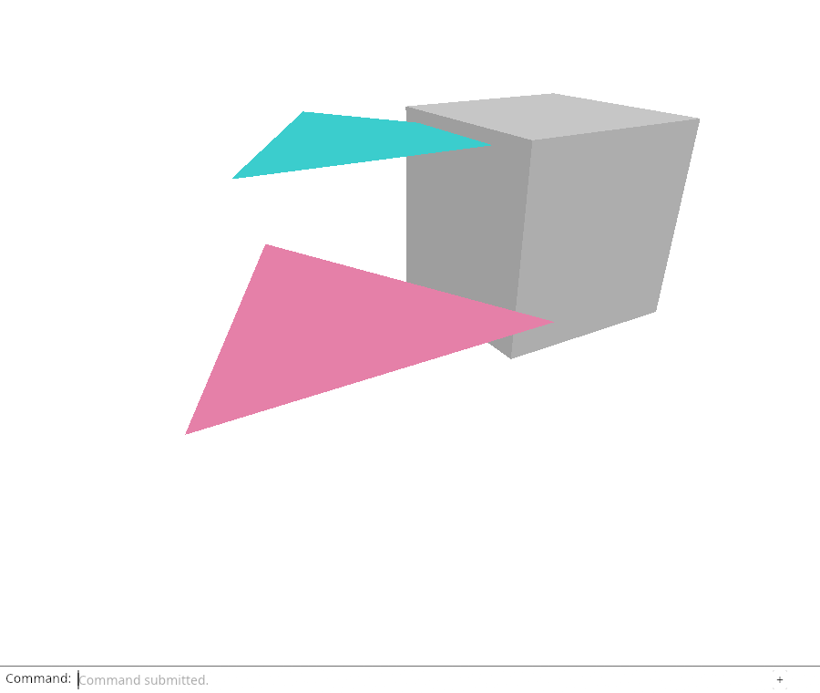
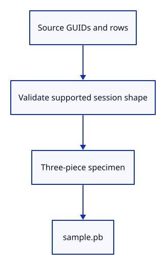

# 22b · Validate session identity and build a sample file

**Typing: 29–58 minutes.** [Estimate](typing-load.md).

Retain a shared Session with its display meshes and source GUIDs. Validate the supported session shape and flat tree before decoding it into kernel objects.

## Type

Continue from [Validate a raw mesh record](22a-records.md). [Save or recover your work](recovery.md).

### 1. `src/document.rs`

Import the GUID set used by session validation.

<details>
<summary>Locate the existing block</summary>

```rust
use std::rc::Rc;
```

</details>

Replace that block with:

```rust
--8<-- "journey/code/22b-session-import.rs"
```

### 2. `src/document.rs`

Check supported geometry, unique GUIDs and one flat tree row per mesh.

<details>
<summary>Locate the existing block</summary>

```rust
pub fn validate_mesh
```

</details>

Replace that block with:

```rust
--8<-- "journey/code/22b-session-validator.rs"
```

### 3. `src/specimen.rs`

Build a small three-piece frame with the real kernel. This is our file specimen, not a second renderer or a new file format.

Create the file and type:

```rust
--8<-- "journey/code/23-import-02.rs"
```

### 4. `examples/sample.rs`

Write the specimen as an actual session file. You will choose this file in the browser.

Create the file and type:

```rust
--8<-- "journey/code/23-import-03.rs"
```

### 5. `src/lib.rs`

Register the specimen builder.

<details>
<summary>Locate the existing block</summary>

```rust
pub mod document;
```

</details>

Replace that block with:

```rust
--8<-- "journey/code/22b-session-register.rs"
```

### 6. `src/document.rs`

Check that the specimen passes validation and duplicate source GUIDs are rejected.

<details>
<summary>Locate the existing block</summary>

```rust

#[cfg(test)]
mod record_checks {
    use super::validate_mesh;

    #[test]
    fn raw_mesh_records_are_checked_before_construction() {
        let mut record = session_rust::Mesh::create_box(1.0, 1.0, 1.0).to_proto();
        assert!(validate_mesh(&record).is_ok());
        record.vertices.values_mut().next().unwrap().x = f64::NAN;
        assert!(validate_mesh(&record).is_err());
        record.vertices.values_mut().for_each(|vertex| vertex.x = 0.0);
        record.faces.values_mut().next().unwrap().vertices[0] = u64::MAX;
        assert!(validate_mesh(&record).is_err());
    }
}
```

</details>

Replace that block with:

```rust
--8<-- "journey/code/22b-session-tests.rs"
```

## Run and check

In your project:

```sh
cd workspace/journey
REGEN_PROTO=0 cargo build --lib --locked --target wasm32-unknown-unknown -j4
REGEN_PROTO=0 CARGO_BUILD_JOBS=4 trunk serve --port 8780
```

Open `http://127.0.0.1:8780/`. Keep an existing Trunk server running; saving rebuilds it.

Run the state checks, then cargo run --example sample. The sample has three distinct source meshes; duplicate GUIDs are rejected.

**Verified checkpoint in Chrome.**



[Verification scope](release.md).

Run the state checks on your computer from your project folder:

```sh
REGEN_PROTO=0 cargo test --lib --locked --target host-tuple -j4
```

<details>
<summary>Code explanation and diagram</summary>

HashSet compares unique mesh GUIDs with tree row names. The specimen builder creates three named meshes and writes their protobuf bytes to sample.pb.

Source GUIDs and flat rows → validated Session shape; specimen → sample.pb.



Why keep GUID separate from ObjectId?

GUID names a source mesh. ObjectId will name a particular viewer import, so the same source can be imported more than once.

Study estimate, including typing and experiments: 0.75–1.25 hours.

</details>

<details>
<summary>Optional experiment</summary>

Change the top beam width in the specimen, write sample.pb again, then restore the original value.

</details>

<details>
<summary>Check and save your work</summary>

Restore experimental edits, then run from `session_viewer`:

```sh
npm --prefix ../session_tests run course -- check 22b-session
npm --prefix ../session_tests run course -- save 22b-session
```

Source comparison leaves your project untouched. [Save and recovery instructions](recovery.md).

</details>

<details>
<summary>Viewer coverage and verification</summary>

Keep the source document separate from its display meshes. Later checkpoints extend supported geometry and input while retaining identity and undo boundaries.

Native checks validate session GUIDs and flat rows. The example writes the real sample file; Chrome still retains the earlier input route.

[Full validation scope](release.md).

To reproduce the scripted acceptance of the reference checkpoint, run from `session_viewer` with the [course bundle server](release.md#reproduce) running on port 8781:

```sh
npm --prefix ../session_tests run course -- capture 22b-session
```

This uses the verified reference bundle; it does not check or change your typed project.

</details>
