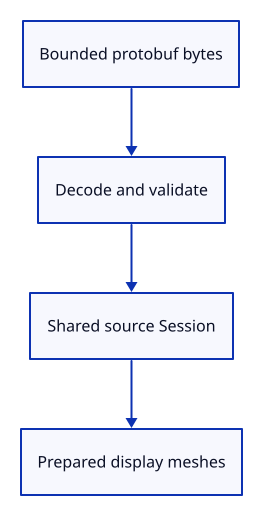

# 22c · Decode and prepare the whole import

**Typing: 18–35 minutes.** [Estimate](typing-load.md).

Bound byte length, decode the protobuf message, validate it, then construct one shared Session and every display mesh. Return Loaded only when the whole preparation succeeds.

## Type

Continue from [Validate session identity and build a sample file](22b-session.md). [Save or recover your work](recovery.md).

### 1. `src/document.rs`

Import the protobuf decoding trait.

<details>
<summary>Locate the existing block</summary>

```rust
use session_rust::{proto, Session};
```

</details>

Replace that block with:

```rust
--8<-- "journey/code/22c-decode-message.rs"
```

### 2. `src/document.rs`

Decode bounded bytes and prepare every display mesh before returning a Loaded document.

<details>
<summary>Locate the existing block</summary>

```rust
pub fn validate(message:
```

</details>

Replace that block with:

```rust
--8<-- "journey/code/22c-decode-load.rs"
```

### 3. `src/document.rs`

Keep mesh validation private to the completed loader.

<details>
<summary>Locate the existing block</summary>

```rust
pub fn validate_mesh
```

</details>

Replace that block with:

```rust
--8<-- "journey/code/22c-decode-private.rs"
```

### 4. `src/document.rs`

Replace the preparation-only record check with the complete loader checks.

Find this exact block:

```rust

#[cfg(test)]
mod record_checks {
    use super::validate_mesh;

    #[test]
    fn raw_mesh_records_are_checked_before_construction() {
        let mut record = session_rust::Mesh::create_box(1.0, 1.0, 1.0).to_proto();
        assert!(validate_mesh(&record).is_ok());
        record.vertices.values_mut().next().unwrap().x = f64::NAN;
        assert!(validate_mesh(&record).is_err());
        record.vertices.values_mut().for_each(|vertex| vertex.x = 0.0);
        record.faces.values_mut().next().unwrap().vertices[0] = u64::MAX;
        assert!(validate_mesh(&record).is_err());
    }
}
```

Delete this block.

### 5. `src/document.rs`

Replace the preparation-only session check with byte-level loader checks.

Find this exact block:

```rust

#[cfg(test)]
mod session_checks {
    use prost::Message;

    #[test]
    fn the_specimen_has_distinct_meshes_and_flat_rows() {
        let mut record = session_rust::proto::Session::decode(crate::specimen::bytes().as_slice()).unwrap();
        assert!(super::validate(&record).is_ok());
        let meshes = &mut record.objects.as_mut().unwrap().meshes;
        meshes[1].guid = meshes[0].guid.clone();
        assert!(super::validate(&record).is_err());
    }
}
```

Delete this block.

### 6. `src/document_tests.rs`

Reject malformed bytes, oversize files and unsupported records before construction.

Create the file and type:

```rust
--8<-- "journey/code/22c-decode-tests.rs"
```

### 7. `src/lib.rs`

Register the byte-level loader checks.

<details>
<summary>Locate the existing block</summary>

```rust
pub mod specimen;
```

</details>

Replace that block with:

```rust
--8<-- "journey/code/22c-decode-register.rs"
```

## Run and check

In your project:

```sh
cd workspace/journey
REGEN_PROTO=0 cargo build --lib --locked --target wasm32-unknown-unknown -j4
REGEN_PROTO=0 CARGO_BUILD_JOBS=4 trunk serve --port 8780
```

Open `http://127.0.0.1:8780/`. Keep an existing Trunk server running; saving rebuilds it.

Run the state checks. Invalid bytes, oversized data and unsupported records are refused before scene insertion.

**Verified checkpoint in Chrome.**


[Verification scope](release.md).

Run the state checks on your computer from your project folder:

```sh
REGEN_PROTO=0 cargo test --lib --locked --target host-tuple -j4
```

<details>
<summary>Code explanation and diagram</summary>

The ? operator stops at the first error. No scene or history is changed here, so a bad later mesh cannot leave a partial import.

Bytes → decoded record → validation → shared Session and prepared Mesh values.



Why prepare all meshes before editing the scene?

A preparation error then leaves the current scene, selection and redo branch untouched.

Study estimate, including typing and experiments: 0.75–1.25 hours.

</details>

<details>
<summary>Optional experiment</summary>

Read the six malformed-record cases and predict which validation rule rejects each one.

</details>

<details>
<summary>Check and save your work</summary>

Restore experimental edits, then run from `session_viewer`:

```sh
npm --prefix ../session_tests run course -- check 22c-decode
npm --prefix ../session_tests run course -- save 22c-decode
```

Source comparison leaves your project untouched. [Save and recovery instructions](recovery.md).

</details>

<details>
<summary>Viewer coverage and verification</summary>

Keep the source document separate from its display meshes. Later checkpoints extend supported geometry and input while retaining identity and undo boundaries.

Native checks exercise actual byte decoding and preparation failures. Chrome retains the earlier input route until the completed import is connected.

[Full validation scope](release.md).

To reproduce the scripted acceptance of the reference checkpoint, run from `session_viewer` with the [course bundle server](release.md#reproduce) running on port 8781:

```sh
npm --prefix ../session_tests run course -- capture 22c-decode
```

This uses the verified reference bundle; it does not check or change your typed project.

</details>
