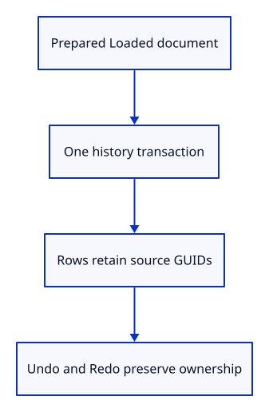

# 22d · Commit an import as one undoable action

**Typing: 28–55 minutes.** [Estimate](typing-load.md).

Attach the retained source Session and GUID to every imported object. Prepare bytes before starting History::try_edit, then insert the whole loaded file as one document action.

## Type

Continue from [Decode and prepare the whole import](22c-decode.md). [Save or recover your work](recovery.md).

### 1. `src/scene.rs`

An imported display object remembers the document and source GUID it came from. Demo objects have no source document.

<details>
<summary>Locate the existing block</summary>

```rust
    pub mesh: Rc<Mesh>,
```

</details>

Replace that block with:

```rust
--8<-- "journey/code/23-import-06.rs"
```

### 2. `src/scene.rs`

Keep the existing insertion path for demo objects.

<details>
<summary>Locate the existing block</summary>

```rust
self.objects.push(Object { id, mesh: Rc::new(mesh) });
```

</details>

Replace that block with:

```rust
--8<-- "journey/code/23-import-07.rs"
```

### 3. `src/scene.rs`

All imported rows share one retained source session. History will wrap this entire insertion in one transaction.

<details>
<summary>Locate the existing block</summary>

```rust
    pub fn remove(&mut self, id: ObjectId) -> bool {
```

</details>

Replace that block with:

```rust
--8<-- "journey/code/23-import-08.rs"
```

### 4. `src/editor.rs`

Make file import an ordinary document action.

<details>
<summary>Locate the existing block</summary>

```rust
    Pick([f32; 2]),
```

</details>

Replace that block with:

```rust
--8<-- "journey/code/23-import-09.rs"
```

### 5. `src/editor.rs`

Prepare first, commit second. A decode or mesh error cannot clear redo or leave half an import in the scene.

<details>
<summary>Locate the existing block</summary>

```rust
            Action::AddBox => {
```

</details>

Replace that block with:

```rust
--8<-- "journey/code/23-import-10.rs"
```

### 6. `src/document_tests.rs`

Import editor actions and shared-owner comparison for transaction checks.

<details>
<summary>Locate the existing block</summary>

```rust
use crate::{document, specimen};
use prost::Message;
use session_rust::proto;
```

</details>

Replace that block with:

```rust
--8<-- "journey/code/22d-import-test-imports.rs"
```

### 7. `src/document_tests.rs`

Check whole-file Undo/Redo, failed import and repeated source identities.

<details>
<summary>Locate the existing block</summary>

```rust
#[test]
fn malformed_and_unsupported_records_are_refused_before_construction()
```

</details>

Replace that block with:

```rust
--8<-- "journey/code/22d-import-tests.rs"
```

## Run and check

In your project:

```sh
cd workspace/journey
REGEN_PROTO=0 cargo build --lib --locked --target wasm32-unknown-unknown -j4
REGEN_PROTO=0 CARGO_BUILD_JOBS=4 trunk serve --port 8780
```

Open `http://127.0.0.1:8780/`. Keep an existing Trunk server running; saving rebuilds it.

Run the state checks. One Undo removes the whole file; Redo restores its IDs and shared source; a failed import preserves selection and redo.

**Verified checkpoint in Chrome.**


[Verification scope](release.md).

Run the state checks on your computer from your project folder:

```sh
REGEN_PROTO=0 cargo test --lib --locked --target host-tuple -j4
```

<details>
<summary>Code explanation and diagram</summary>

Rc::clone shares source ownership. Local ObjectId remains unique across imports; snapshots retain the same source allocation on Undo and Redo.

Loaded document → one history edit → rows with source identity → display.



Why retain Rc<Session> on imported rows?

Display arrays omit source metadata. Shared Session ownership keeps that information available without copying it into each row.

Study estimate, including typing and experiments: 0.75–1.25 hours.

</details>

<details>
<summary>Optional experiment</summary>

Import the same specimen twice in the native check. Compare local IDs, source GUIDs and source allocation identity.

</details>

<details>
<summary>Check and save your work</summary>

Restore experimental edits, then run from `session_viewer`:

```sh
npm --prefix ../session_tests run course -- check 22d-import
npm --prefix ../session_tests run course -- save 22d-import
```

Source comparison leaves your project untouched. [Save and recovery instructions](recovery.md).

</details>

<details>
<summary>Viewer coverage and verification</summary>

Keep the source document separate from its display meshes. Later checkpoints extend supported geometry and input while retaining identity and undo boundaries.

Native checks apply the import through Editor and render its three orange pieces. Chrome retains the previous input route until file reads are connected.

[Full validation scope](release.md).

To reproduce the scripted acceptance of the reference checkpoint, run from `session_viewer` with the [course bundle server](release.md#reproduce) running on port 8781:

```sh
npm --prefix ../session_tests run course -- capture 22d-import
```

This uses the verified reference bundle; it does not check or change your typed project.

</details>
