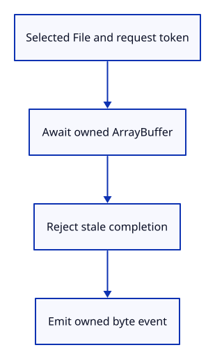

# 22e · Prepare asynchronous file delivery

**Typing: 18–36 minutes.** [Estimate](typing-load.md).

Add the hidden file input and its reader. A shared request number identifies the latest selection; await reads the selected Blob, then a custom event returns owned bytes.

## Type

Continue from [Commit an import as one undoable action](22d-import.md). [Save or recover your work](recovery.md).

### 1. `src/file_input.rs`

Read file bytes asynchronously; reject stale request numbers and return completion to the editor callback.

Create the file and type:

```rust
--8<-- "journey/code/23-import-13.rs"
```

### 2. `index.html`

Keep the HTML page small. Feature input belongs to the command dock drawn inside the canvas.

<details>
<summary>Locate the existing block</summary>

```html
<body>
  <p id="status" role="status" hidden>Waiting for Rust…</p>
  <canvas id="canvas" tabindex="0" width="640" height="480" aria-label="Viewer drawing"></canvas>
</body>
</html>
```

</details>

Replace that block with:

```html
--8<-- "journey/code/23-import-fullscreen-1.html"
```

### 3. `src/lib.rs`

Expose the complete file-reader component while preparing its browser integration.

<details>
<summary>Locate the existing block</summary>

```rust
pub mod renderer;
#[cfg(target_arch = "wasm32")]
mod browser;

use wasm_bindgen::prelude::*;
```

</details>

Replace that block with:

```rust
--8<-- "journey/code/22e-file-reader-register.rs"
```

## Run and check

In your project:

```sh
cd workspace/journey
REGEN_PROTO=0 cargo build --lib --locked --target wasm32-unknown-unknown -j4
REGEN_PROTO=0 CARGO_BUILD_JOBS=4 trunk serve --port 8780
```

Open `http://127.0.0.1:8780/`. Keep an existing Trunk server running; saving rebuilds it.

Build and run the checkpoint. The current scene and commands remain available; file selection is connected next.

**Verified checkpoint in Chrome.**


[Verification scope](release.md).

Run the state checks on your computer from your project folder:

```sh
REGEN_PROTO=0 cargo test --lib --locked --target host-tuple -j4
```

<details>
<summary>Code explanation and diagram</summary>

The reader owns no mutable Editor borrow while waiting. Its browser-event registration and Open command are connected in the next step.

Selected File → request token → await array_buffer → owned byte event.



Why compare the request number after await?

An older read may finish after a newer selection. Its result must not replace the current request.

Study estimate, including typing and experiments: 0.75–1.25 hours.

</details>

<details>
<summary>Optional experiment</summary>

Find the post-await request comparison. Predict which read is ignored if the second selection finishes first.

</details>

<details>
<summary>Check and save your work</summary>

Restore experimental edits, then run from `session_viewer`:

```sh
npm --prefix ../session_tests run course -- check 22e-file-reader
npm --prefix ../session_tests run course -- save 22e-file-reader
```

Source comparison leaves your project untouched. [Save and recovery instructions](recovery.md).

</details>

<details>
<summary>Viewer coverage and verification</summary>

Keep the source document separate from its display meshes. Later checkpoints extend supported geometry and input while retaining identity and undo boundaries.

WebAssembly compilation establishes the file-reader bindings. Chrome independently retains navigation and commands. Actual chooser, completion and latest-request acceptance follow in the connected browser step.

[Full validation scope](release.md).

To reproduce the scripted acceptance of the reference checkpoint, run from `session_viewer` with the [course bundle server](release.md#reproduce) running on port 8781:

```sh
npm --prefix ../session_tests run course -- capture 22e-file-reader
```

This uses the verified reference bundle; it does not check or change your typed project.

</details>
