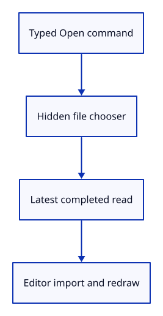

# 23 · Open a file through the command line

**Typing: 22–44 minutes.** [Estimate](typing-load.md).

Type Open to activate the hidden picker. Route selection through the reader and completed bytes through Action::Import in the callback that owns Editor.

## Type

Continue from [Prepare asynchronous file delivery](22e-file-reader.md). [Save or recover your work](recovery.md).

### 1. `src/lib.rs`

Keep the reader internal now that the browser callback owns file delivery.

<details>
<summary>Locate the existing block</summary>

```rust
pub mod file_input;
```

</details>

Replace that block with:

```rust
--8<-- "journey/code/23-import-reader-private.rs"
```

### 2. `src/browser.rs`

Add Open to the vocabulary.

<details>
<summary>Locate the existing block</summary>

```rust
        config.format.add_srgb_suffix(),
        &[
            "Help",
            "Example Box",
            "Example Triangle",
            "Select Next",
```

</details>

Replace that block with:

```rust
--8<-- "journey/code/23-import-window-1.rs"
```

### 3. `src/browser.rs`

Own a shared request number for asynchronous file reads.

<details>
<summary>Locate the existing block</summary>

```rust
    let browser_window = window.clone();
    let pointer_canvas = canvas.clone();
    let mut gesture = Gesture::default();
    let update = Closure::<dyn FnMut(web_sys::Event)>::new(move |event: web_sys::Event| {
        let line = match panel.update(Some(&event), &input_canvas) {
            Ok(line) => line,
```

</details>

Replace that block with:

```rust
--8<-- "journey/code/23-import-window-2.rs"
```

### 4. `src/browser.rs`

Route file selection and completion events through the editor; Open activates the hidden file picker.

<details>
<summary>Locate the existing block</summary>

```rust
                return;
            }
        };
        let action = if let Some(line) = line {
            let action = match line.as_str() {
                "example box" => Action::AddBox,
                "example triangle" => Action::ToggleExtra,
                "select next" => Action::SelectNext,
                "delete" => Action::Delete,
                "undo" => Action::Undo,
                "redo" => Action::Redo,
                "background" => Action::Background,
                "zoom in" => Action::Zoom(2.0),
                "zoom out" => Action::Zoom(0.5),
                "pan left" => Action::Pan(-0.25, 0.0),
                "pan right" => Action::Pan(0.25, 0.0),
                "orbit right" => Action::Orbit(std::f64::consts::FRAC_PI_4, 0.0),
                "orbit up" => Action::Orbit(0.0, std::f64::consts::FRAC_PI_6),
                "view isometric" => Action::Isometric,
                "view reset" => Action::ResetView,
                _ => return,
            };
            Some(action)
        } else if !panel.consumed {
            navigation_action(&event, &pointer_canvas, &mut gesture)
        } else {
```

</details>

Replace that block with:

```rust
--8<-- "journey/code/23-import-window-3.rs"
```

### 5. `src/browser.rs`

Report successful import as one undoable edit.

<details>
<summary>Locate the existing block</summary>

```rust
                }
            }
        }
        if resize(
            &browser_window,
            &pointer_canvas,
```

</details>

Replace that block with:

```rust
--8<-- "journey/code/23-import-window-4.rs"
```

### 6. `src/browser.rs`

Register file selection and byte-completion events.

<details>
<summary>Locate the existing block</summary>

```rust
    )?;
    window.add_event_listener_with_callback("resize", update.as_ref().unchecked_ref())?;
    window.add_event_listener_with_callback("blur", update.as_ref().unchecked_ref())?;
    // Both event sources retain this one callback for the lifetime of the page.
    update.forget();
    report("Wheel zooms; type commands anywhere in the drawing. Escape cancels a drag.");
```

</details>

Replace that block with:

```rust
--8<-- "journey/code/23-import-window-5.rs"
```

## Run and check

In your project:

```sh
cd workspace/journey
REGEN_PROTO=0 cargo build --lib --locked --target wasm32-unknown-unknown -j4
REGEN_PROTO=0 CARGO_BUILD_JOBS=4 trunk serve --port 8780
```

Open `http://127.0.0.1:8780/`. Keep an existing Trunk server running; saving rebuilds it.

Generate sample.pb with cargo run --example sample. Type Open and choose it; one Undo removes all three orange pieces and Redo restores them.

**Verified checkpoint in Chrome.**


[Verification scope](release.md).

Run the state checks on your computer from your project folder:

```sh
REGEN_PROTO=0 cargo test --lib --locked --target host-tuple -j4
```

<details>
<summary>Code explanation and diagram</summary>

The callback reports one completed import and updates the display through the existing Scene change path. The reader never holds the editor while awaiting bytes.

Open → hidden picker → latest read → viewer-file → Action::Import → upload and redraw.



Why do we retain the session after creating the arrays that the renderer needs?

The GPU arrays contain positions, colours and indices. They do not retain the session name, source mesh identities, tree or graph. Each imported object keeps a source reference: the complete session plus its original mesh GUID. Its local ObjectId remains separate, so opening the same file twice does not confuse selection or undo.

Study estimate, including typing and experiments: 0.75–1.25 hours.

</details>

<details>
<summary>Optional experiment</summary>

Change the specimen’s top beam width from 1.8 to 2.2, regenerate sample.pb, and import it. You have changed the source, not the renderer. Undo the import, restore 1.8, and regenerate. Then explain why the same source GUID may occur in two imports while their local ObjectIds must differ.

</details>

<details>
<summary>Check and save your work</summary>

Restore experimental edits, then run from `session_viewer`:

```sh
npm --prefix ../session_tests run course -- check 23-import
npm --prefix ../session_tests run course -- save 23-import
```

Source comparison leaves your project untouched. [Save and recovery instructions](recovery.md).

</details>

<details>
<summary>Viewer coverage and verification</summary>

The maintained viewer keeps source sessions in FileDoc and builds display data from them. Its reader also handles hierarchy, placement, CAD, points, curves and large files. This first reader intentionally refuses those cases. Future lessons extend the retained document boundary instead of trying to recover lost information from GPU buffers.

The actual Open command imports the sample through the picker. Chrome checks whole-import Undo/Redo, malformed and oversized selections, and an older held read completing after a newer failure; the capture restores the initial imported fixture.

[Full validation scope](release.md).

To reproduce the scripted acceptance of the reference checkpoint, run from `session_viewer` with the [course bundle server](release.md#reproduce) running on port 8781:

```sh
npm --prefix ../session_tests run course -- capture 23-import
```

This uses the verified reference bundle; it does not check or change your typed project.

</details>
