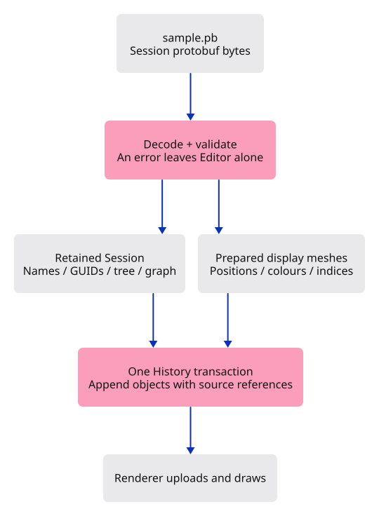

# 23 · Keep the document behind the picture

**Combined study estimate: 5–8 hours.** Includes reading, typing, reasoning and experiments.

**Typing estimate: 126–252 minutes.** 280 added or changed lines; unchanged context is excluded. [How this is estimated](typing-load.md).

**Splitting required:** this verified checkpoint exceeds the one-hour typing target. Smaller runnable lessons are still being prepared.

**Today:** Import a real mesh-session file, keep its source identity, and undo the whole import as one action.

**Follow:** File picker → bytes → validated session → prepared display meshes → one history transaction → GPU upload.

Import a real protobuf file while retaining its source document behind the display mesh. Type and run the small specimen builder to create the file.

Read bytes, prepare the whole import, then commit it as one history edit. A malformed later mesh must leave no earlier mesh inserted. This stage supports flat triangle/quad meshes with object colours; unsupported geometry and placements return errors.

`Rc<Session>` shares one decoded source among rows. `Source` pairs it with a source GUID. Local `ObjectId` identifies the viewer object; GUID identifies its source mesh.

Reading pauses at `await`. A completion event returns the result to the callback that owns Editor. Shared `Cell<u64>` request numbers reject stale reads without retaining a mutable editor borrow while waiting.



## Type the change

Continue from [Keep navigation on the mouse and commands in the dock](22-shortcuts.md). Save your own work first: `npm --prefix ../session_tests run course -- save before-23-import` (from `session_viewer`).

### 1. `src/document.rs`

Decode into a protobuf record before constructing kernel geometry. Validate the subset we can draw, then prepare every display mesh before changing the scene. Source keeps the complete session and its original mesh GUID.

Create the file and type:

```rust
--8<-- "journey/code/23-import-01.rs"
```

### 2. `src/specimen.rs`

Build a small three-piece frame with the real kernel. This is our file specimen, not a second renderer or a new file format.

Create the file and type:

```rust
--8<-- "journey/code/23-import-02.rs"
```

### 3. `examples/sample.rs`

Write the specimen as an actual session file. You will choose this file in the browser.

Create the file and type:

```rust
--8<-- "journey/code/23-import-03.rs"
```

### 4. `src/document_tests.rs`

Check data preservation, whole-file undo, repeated imports and error atomicity. Broken files must fail before kernel construction or document history changes.

Create the file and type:

```rust
--8<-- "journey/code/23-import-04.rs"
```

### 5. `src/scene.rs`

An imported display object remembers the document and source GUID it came from. Demo objects have no source document.

<details>
<summary>Locate the existing block</summary>

```rust
    pub mesh: Rc<Mesh>,
```

</details>

Replace that block with:

```rust
--8<-- "journey/code/23-import-06.rs"
```

### 6. `src/scene.rs`

Keep the existing insertion path for demo objects.

<details>
<summary>Locate the existing block</summary>

```rust
self.objects.push(Object { id, mesh: Rc::new(mesh) });
```

</details>

Replace that block with:

```rust
--8<-- "journey/code/23-import-07.rs"
```

### 7. `src/scene.rs`

All imported rows share one retained source session. History will wrap this entire insertion in one transaction.

<details>
<summary>Locate the existing block</summary>

```rust
    pub fn remove(&mut self, id: ObjectId) -> bool {
```

</details>

Replace that block with:

```rust
--8<-- "journey/code/23-import-08.rs"
```

### 8. `src/editor.rs`

Make file import an ordinary document action.

<details>
<summary>Locate the existing block</summary>

```rust
    Pick([f32; 2]),
```

</details>

Replace that block with:

```rust
--8<-- "journey/code/23-import-09.rs"
```

### 9. `src/editor.rs`

Prepare first, commit second. A decode or mesh error cannot clear redo or leave half an import in the scene.

<details>
<summary>Locate the existing block</summary>

```rust
            Action::AddBox => {
```

</details>

Replace that block with:

```rust
--8<-- "journey/code/23-import-10.rs"
```

### 10. `src/file_input.rs`

Read asynchronously without borrowing Editor across await. A numbered request prevents a slow earlier file from replacing a newer choice. Deliver bytes to the callback that already owns Editor.

Create the file and type:

```rust
--8<-- "journey/code/23-import-13.rs"
```

### 11. `Cargo.toml`

Enable the browser event bindings used by the command dock. serde records the drawn field for browser verification; the same code still receives real keyboard events.

<details>
<summary>Locate the existing block</summary>

```toml

[dependencies]
wasm-bindgen = "=0.2.128"
web-sys = { version = "=0.3.105", features = ["Window", "Document", "Element", "HtmlCanvasElement", "EventTarget", "AddEventListenerOptions", "Event", "MouseEvent", "PointerEvent", "DomRect", "KeyboardEvent", "WheelEvent", "AddEventListenerOptions", "HtmlElement", "FocusOptions"] }
console_error_panic_hook = "=0.1.7"
wasm-bindgen-futures = "=0.4.78"
wgpu = "=29.0.4"
session_rust = { path = "../../../session_rust", default-features = false }
```

</details>

Replace that block with:

```toml
--8<-- "journey/code/23-import-dock-01.toml"
```

### 12. `index.html`

Keep the HTML page small. Feature input belongs to the command dock drawn inside the canvas.

<details>
<summary>Locate the existing block</summary>

```html
<body>
  <p id="status" role="status" hidden>Waiting for Rust…</p>
  <canvas id="canvas" tabindex="0" width="640" height="480" aria-label="Viewer drawing"></canvas>
</body>
</html>
```

</details>

Replace that block with:

```html
--8<-- "journey/code/23-import-fullscreen-1.html"
```

### 13. `src/lib.rs`

Register the reader, specimen and native checks.

<details>
<summary>Locate the existing block</summary>

```rust
pub mod viewport;
pub mod gesture;
pub mod navigation;
#[cfg(test)]
mod navigation_tests;
#[cfg(test)]
```

</details>

Replace that block with:

```rust
--8<-- "journey/code/23-import-fullscreen-2.rs"
```

### 14. `src/lib.rs`

Register the reader, specimen and native checks.

<details>
<summary>Locate the existing block</summary>

```rust
pub mod renderer;
#[cfg(target_arch = "wasm32")]
mod browser;

use wasm_bindgen::prelude::*;
```

</details>

Replace that block with:

```rust
--8<-- "journey/code/23-import-fullscreen-3.rs"
```

### 15. `src/browser.rs`

Connect keep the document behind the picture to the typed command path. Keep the scene state in its existing owner and redraw the dock after applying an action.

<details>
<summary>Locate the existing block</summary>

```rust
        config.format.add_srgb_suffix(),
        &[
            "Help",
            "Example Box",
            "Example Triangle",
            "Select Next",
```

</details>

Replace that block with:

```rust
--8<-- "journey/code/23-import-window-1.rs"
```

### 16. `src/browser.rs`

Connect keep the document behind the picture to the typed command path. Keep the scene state in its existing owner and redraw the dock after applying an action.

<details>
<summary>Locate the existing block</summary>

```rust
    let browser_window = window.clone();
    let pointer_canvas = canvas.clone();
    let mut gesture = Gesture::default();
    let update = Closure::<dyn FnMut(web_sys::Event)>::new(move |event: web_sys::Event| {
        let line = match panel.update(Some(&event), &input_canvas) {
            Ok(line) => line,
```

</details>

Replace that block with:

```rust
--8<-- "journey/code/23-import-window-2.rs"
```

### 17. `src/browser.rs`

Connect keep the document behind the picture to the typed command path. Keep the scene state in its existing owner and redraw the dock after applying an action.

<details>
<summary>Locate the existing block</summary>

```rust
                return;
            }
        };
        let action = if let Some(line) = line {
            let action = match line.as_str() {
                "example box" => Action::AddBox,
                "example triangle" => Action::ToggleExtra,
                "select next" => Action::SelectNext,
                "delete" => Action::Delete,
                "undo" => Action::Undo,
                "redo" => Action::Redo,
                "background" => Action::Background,
                "zoom in" => Action::Zoom(2.0),
                "zoom out" => Action::Zoom(0.5),
                "pan left" => Action::Pan(-0.25, 0.0),
                "pan right" => Action::Pan(0.25, 0.0),
                "orbit right" => Action::Orbit(std::f64::consts::FRAC_PI_4, 0.0),
                "orbit up" => Action::Orbit(0.0, std::f64::consts::FRAC_PI_6),
                "view isometric" => Action::Isometric,
                "view reset" => Action::ResetView,
                _ => return,
            };
            Some(action)
        } else if !panel.consumed {
            navigation_action(&event, &pointer_canvas, &mut gesture)
        } else {
```

</details>

Replace that block with:

```rust
--8<-- "journey/code/23-import-window-3.rs"
```

### 18. `src/browser.rs`

Connect keep the document behind the picture to the typed command path. Keep the scene state in its existing owner and redraw the dock after applying an action.

<details>
<summary>Locate the existing block</summary>

```rust
                }
            }
        }
        if resize(
            &browser_window,
            &pointer_canvas,
```

</details>

Replace that block with:

```rust
--8<-- "journey/code/23-import-window-4.rs"
```

### 19. `src/browser.rs`

Connect keep the document behind the picture to the typed command path. Keep the scene state in its existing owner and redraw the dock after applying an action.

<details>
<summary>Locate the existing block</summary>

```rust
    )?;
    window.add_event_listener_with_callback("resize", update.as_ref().unchecked_ref())?;
    window.add_event_listener_with_callback("blur", update.as_ref().unchecked_ref())?;
    // Both event sources retain this one callback for the lifetime of the page.
    update.forget();
    report("Wheel zooms; type commands anywhere in the drawing. Escape cancels a drag.");
```

</details>

Replace that block with:

```rust
--8<-- "journey/code/23-import-window-5.rs"
```

## Run and look

After typing the manifest, run this from `session_viewer` to select the fixed dependency versions. It updates Cargo.lock, preserves the previous lock, and installs any supplied binary font assets. It does not write implementation code:

```sh
npm --prefix ../session_tests run course -- dependencies 23-import
```

From `session_viewer`, enter your project folder:

```sh
cd workspace/journey
REGEN_PROTO=0 cargo build --lib --locked --target wasm32-unknown-unknown -j4
REGEN_PROTO=0 CARGO_BUILD_JOBS=4 trunk serve --port 8780
```

Open `http://127.0.0.1:8780/`. If Trunk is already running in this project, leave it running; it rebuilds when you save.

In another terminal in `workspace/journey`, run `REGEN_PROTO=0 cargo run --example sample --locked --target x86_64-unknown-linux-gnu -j4`. Type `Open` and choose `sample.pb`. `Undo` must remove the whole import; `Redo` restores it.

**Verified checkpoint in Chrome.**


[What this screenshot checks](release.md).

Run the state checks from your project folder:

```sh
REGEN_PROTO=0 cargo test --lib --locked -j4
```

<details>
<summary>Optional experiment</summary>

Change the specimen’s top beam width from 1.8 to 2.2, regenerate sample.pb, and import it. You have changed the source, not the renderer. Undo the import, restore 1.8, and regenerate. Then explain why the same source GUID may occur in two imports while their local ObjectIds must differ.

</details>

## Explain the change

Why do we retain the session after creating the arrays that the renderer needs?

<details>
<summary>Compare your explanation</summary>

The GPU arrays contain positions, colours and indices. They do not retain the session name, source mesh identities, tree or graph. Each imported object keeps a source reference: the complete session plus its original mesh GUID. Its local ObjectId remains separate, so opening the same file twice does not confuse selection or undo.

</details>

## Keep your working result

Return to `session_viewer` in a second terminal. Restore experimental edits before comparing:

```sh
npm --prefix ../session_tests run course -- check 23-import
npm --prefix ../session_tests run course -- save 23-import
```

Check compares your typed source; run the focused check above for behavior. [Recover your work](recovery.md).

<details>
<summary>Where this fits in the finished viewer</summary>

The maintained viewer keeps source sessions in FileDoc and builds display data from them. Its reader also handles hierarchy, placement, CAD, points, curves and large files. This first reader intentionally refuses those cases. Future lessons extend the retained document boundary instead of trying to recover lost information from GPU buffers.

</details>

<details>
<summary>Verification notes and browser acceptance</summary>

The file picker imports all three orange pieces. The browser check removes the entire import with one Undo, restores it with Redo, and then chooses Isometric.

[Full validation scope](release.md).

</details>
