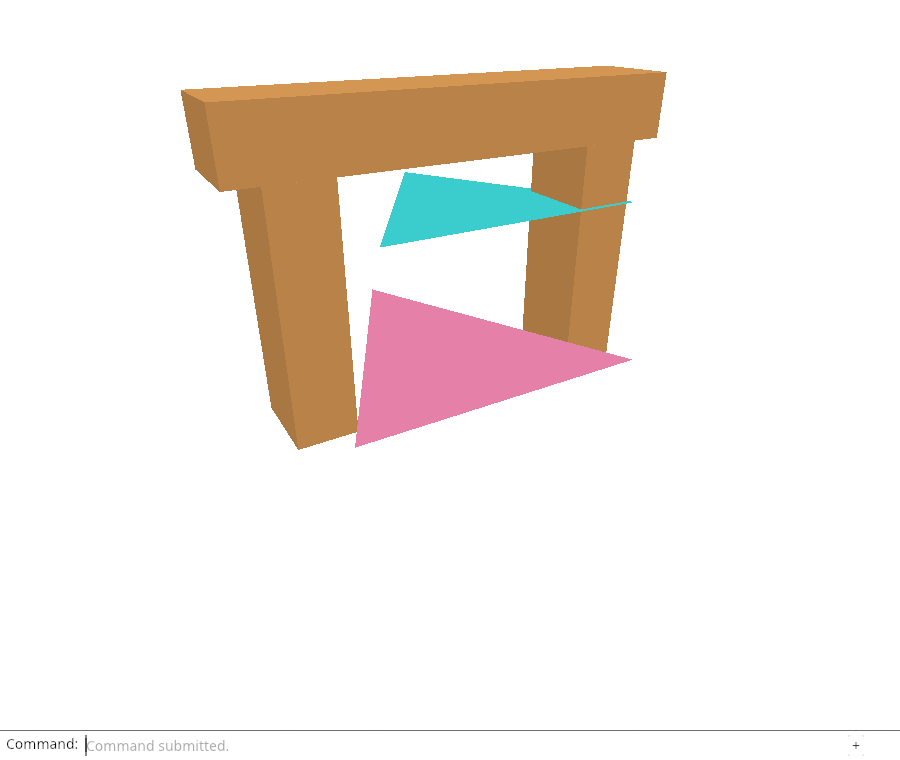
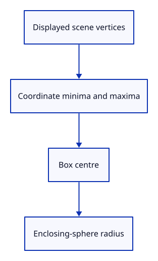

# 23a · Measure the displayed scene bounds

**Typing: 18–36 minutes.** [Estimate](typing-load.md).

Accumulate displayed vertex coordinates into Bounds. Its centre is the midpoint of the minimum and maximum; its radius encloses the box corners.

Scene::bounds returns Option<Bounds>. The first vertex starts the box; an empty scene returns None instead of invented dimensions.

## Type

Continue from [Open a file through the command line](23-import.md). [Save or recover your work](recovery.md).

### 1. `src/bounds.rs`

Store coordinate minima/maxima; compute the centre and enclosing-sphere radius from them.

Create the file and type:

```rust
--8<-- "journey/code/24-fit-01.rs"
```

### 2. `src/scene.rs`

Accumulate displayed vertices into f64 bounds; return None for an empty scene.

<details>
<summary>Locate the existing block</summary>

```rust
    pub fn objects(&self) -> &[Object] {
```

</details>

Replace that block with:

```rust
--8<-- "journey/code/24-fit-03.rs"
```

### 3. `src/lib.rs`

Register the bounds module beside Camera.

<details>
<summary>Locate the existing block</summary>

```rust
pub mod background;
pub mod camera;
pub mod mesh;
pub mod scene;
pub mod picking;
```

</details>

Replace that block with:

```rust
--8<-- "journey/code/24-fit-fullscreen-1.rs"
```

### 4. `src/fit_tests.rs`

Check measured bounds and the empty-scene result.

Create the file and type:

```rust
--8<-- "journey/code/23a-bounds-tests.rs"
```

### 5. `src/lib.rs`

Register the native Fit tests.

<details>
<summary>Locate the existing block</summary>

```rust
#[cfg(test)]
mod document_tests;
#[cfg(test)]
mod navigation_tests;
#[cfg(test)]
mod gesture_tests;
```

</details>

Replace that block with:

```rust
--8<-- "journey/code/24-fit-fullscreen-2.rs"
```

## Run and check

In your project:

```sh
cd workspace/journey
REGEN_PROTO=0 cargo build --lib --locked --target wasm32-unknown-unknown -j4
REGEN_PROTO=0 CARGO_BUILD_JOBS=4 trunk serve --port 8780
```

Open `http://127.0.0.1:8780/`. Keep an existing Trunk server running; saving rebuilds it.

Run the state checks. Known corners give the expected centre and radius; a scene with no objects has no bounds.

**Verified checkpoint in Chrome.**



[Verification scope](release.md).

Run the state checks from your project folder:

```sh
REGEN_PROTO=0 cargo test --lib --locked -j4
```

<details>
<summary>Code explanation and diagram</summary>


Displayed vertices → coordinate minima/maxima → centre and radius.



Why return None for an empty scene?

There is no geometry to frame. The caller can leave the current camera unchanged.

Study estimate, including typing and experiments: 0.75–1.25 hours.

</details>

<details>
<summary>Optional experiment</summary>

Change one corner in the bounds test and calculate the midpoint before running it.

</details>

<details>
<summary>Check and save your work</summary>

Restore experimental edits, then run from `session_viewer`:

```sh
npm --prefix ../session_tests run course -- check 23a-bounds
npm --prefix ../session_tests run course -- save 23a-bounds
```

Source comparison leaves your project untouched. [Save and recovery instructions](recovery.md).

</details>

<details>
<summary>Viewer coverage and verification</summary>

Fitting changes camera parameters, not document geometry. Later lessons add tighter corner fitting, selected bounds and camera-relative coordinates.

Native checks establish bounds and the empty case. Chrome retains actual file import and view commands until Fit is connected.

[Full validation scope](release.md).

To reproduce the scripted acceptance of the reference checkpoint, run from `session_viewer` with the [course bundle server](release.md#reproduce) running on port 8781:

```sh
npm --prefix ../session_tests run course -- capture 23a-bounds
```

This uses the verified reference bundle; it does not check or change your typed project.

</details>
