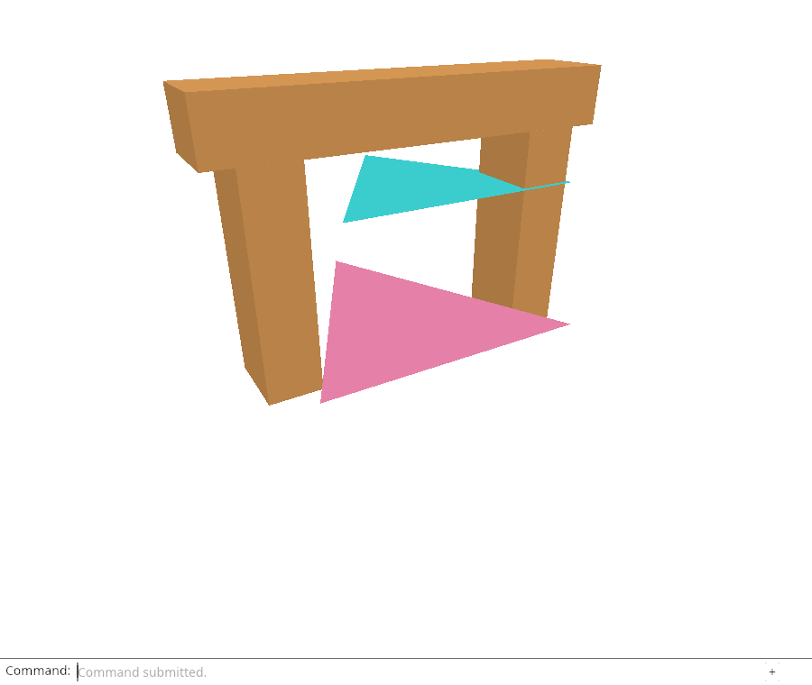
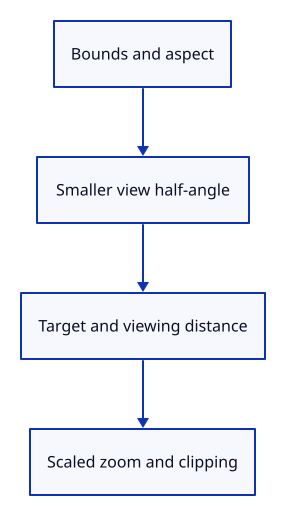

# 23b · Fit the camera around the bounds

**Typing: 23–46 minutes.** [Estimate](typing-load.md).

Aim the camera at the bounds centre and back away until its enclosing sphere fits the smaller horizontal or vertical half-angle. Preserve orientation and keep a small margin.

## Type

Continue from [Measure the displayed scene bounds](23a-bounds.md). [Save or recover your work](recovery.md).

### 1. `src/camera.rs`

Keep the fitted scene scale with the camera. Distance says where the eye is; radius says how large the scene is.

<details>
<summary>Locate the existing block</summary>

```rust
    pub distance: f64,
```

</details>

Replace that block with:

```rust
--8<-- "journey/code/24-fit-04.rs"
```

### 2. `src/camera.rs`

The original small demonstration scene starts with a one-unit radius. Fit will measure the real bounds.

<details>
<summary>Locate the existing block</summary>

```rust
            distance: 3.0,
```

</details>

Replace that block with:

```rust
--8<-- "journey/code/24-fit-05.rs"
```

### 3. `src/camera.rs`

Fit the enclosing sphere through the smaller half-angle: distance = radius × 1.1 / sin(angle).

<details>
<summary>Locate the existing block</summary>

```rust
    pub fn pan(&mut self, dx: f32, dy: f32) {
```

</details>

Replace that block with:

```rust
--8<-- "journey/code/24-fit-06.rs"
```

### 4. `src/camera.rs`

Scale zoom limits with scene radius to prevent a jump after fitting a large model.

<details>
<summary>Locate the existing block</summary>

```rust
            self.distance = (self.distance / factor as f64).clamp(0.2, 50.0);
```

</details>

Replace that block with:

```rust
--8<-- "journey/code/24-fit-07.rs"
```

### 5. `src/camera.rs`

Scale near and far clipping planes with camera distance and scene radius.

<details>
<summary>Locate the existing block</summary>

```rust
        let projection = Xform::perspective(60.0_f64.to_radians(), self.aspect, 0.01, 100.0);
```

</details>

Replace that block with:

```rust
--8<-- "journey/code/24-fit-08.rs"
```

### 6. `src/fit_tests.rs`

Check projected corners, preserved orientation and zoom after fitting.

<details>
<summary>Locate the existing block</summary>

```rust
use crate::bounds::Bounds;

#[test]
fn bounds_measure_vertices_and_define_the_empty_case() {
    let mut bounds = Bounds::point([-2.0, 1.0, 0.0]);
    bounds.include([2.0, 3.0, 2.0]);
    assert_eq!(bounds.centre(), [0.0, 2.0, 1.0]);
    assert!((bounds.radius() - 6.0_f64.sqrt()).abs() < 1.0e-12);
    let mut scene = crate::scene::Scene::demo();
    assert!(scene.bounds().is_some());
    while let Some(id) = scene.next(None) { scene.remove(id); }
    assert!(scene.bounds().is_none());
}
```

</details>

Replace that block with:

```rust
--8<-- "journey/code/23b-fit-camera-tests.rs"
```

## Run and check

In your project:

```sh
cd workspace/journey
REGEN_PROTO=0 cargo build --lib --locked --target wasm32-unknown-unknown -j4
REGEN_PROTO=0 CARGO_BUILD_JOBS=4 trunk serve --port 8780
```

Open `http://127.0.0.1:8780/`. Keep an existing Trunk server running; saving rebuilds it.

Run the state checks. Every corner remains inside the view across scales and aspect ratios, and fitting preserves orientation.

**Verified checkpoint in Chrome.**



[Verification scope](release.md).

Run the state checks on your computer from your project folder:

```sh
REGEN_PROTO=0 cargo test --lib --locked --target host-tuple -j4
```

<details>
<summary>Code explanation and diagram</summary>

Store the measured radius on Camera. Use it for zoom limits and clipping, so small and large scenes remain navigable after fitting.

Bounds centre/radius and aspect → camera target, distance and clipping.



Why use the smaller half-angle?

That direction limits the visible space. Using only the vertical angle would crop a scene in a tall window.

Study estimate, including typing and experiments: 0.75–1.25 hours.

</details>

<details>
<summary>Optional experiment</summary>

Change the 1.1 margin to 1.4, predict a smaller drawing, then restore it.

</details>

<details>
<summary>Check and save your work</summary>

Restore experimental edits, then run from `session_viewer`:

```sh
npm --prefix ../session_tests run course -- check 23b-fit-camera
npm --prefix ../session_tests run course -- save 23b-fit-camera
```

Source comparison leaves your project untouched. [Save and recovery instructions](recovery.md).

</details>

<details>
<summary>Viewer coverage and verification</summary>

Fitting changes camera parameters, not document geometry. Later lessons add tighter corner fitting, selected bounds and camera-relative coordinates.

Native checks fit across scale and aspect, and GPU readback renders the fitted frame. Chrome retains the earlier file and command route until Fit reaches Editor.

[Full validation scope](release.md).

To reproduce the scripted acceptance of the reference checkpoint, run from `session_viewer` with the [course bundle server](release.md#reproduce) running on port 8781:

```sh
npm --prefix ../session_tests run course -- capture 23b-fit-camera
```

This uses the verified reference bundle; it does not check or change your typed project.

</details>
