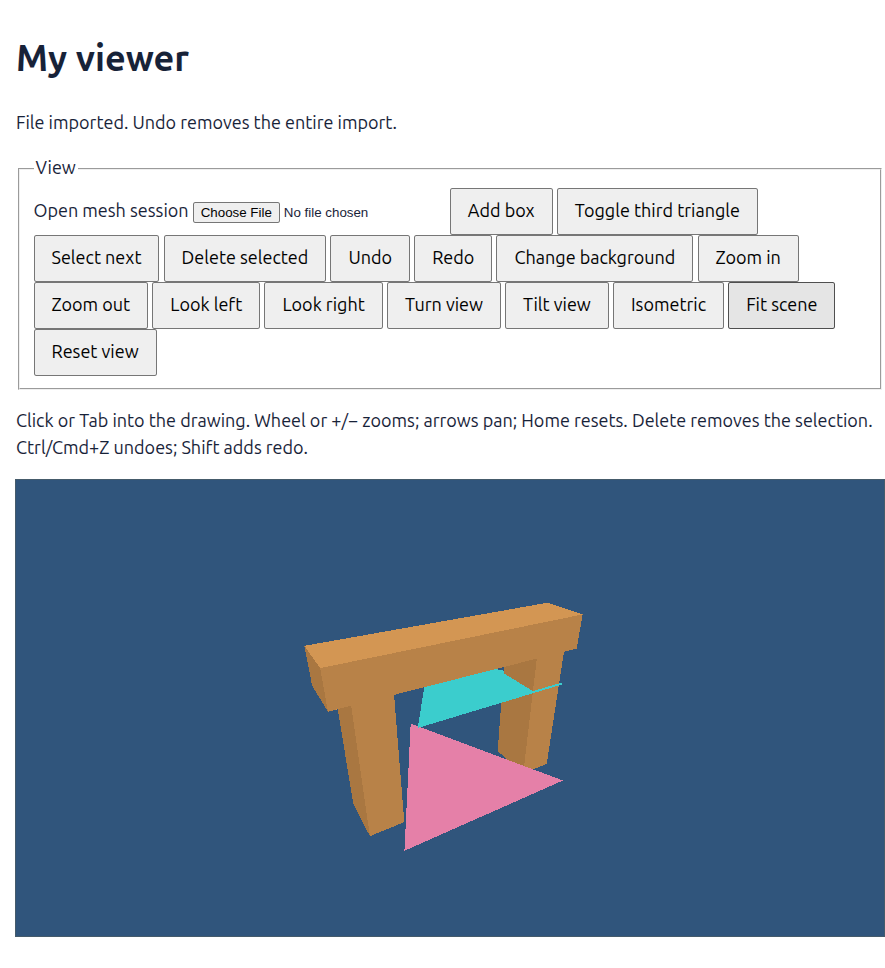
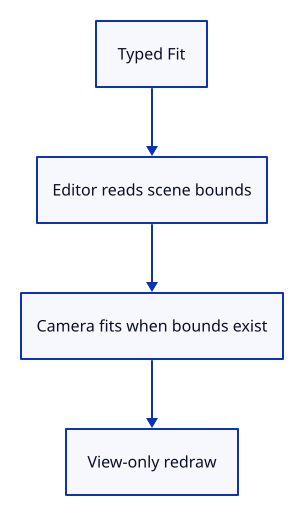

# 24 · Run Fit through the command line

**Typing: 18–35 minutes.** [Estimate](typing-load.md).

Add Fit to Action and the command vocabulary. Editor measures scene bounds and asks Camera to fit them when geometry exists.

Fit returns a view change. It retains selection and document history, and reuses the current geometry buffers. An empty scene leaves the camera unchanged.

## Type

Continue from [Fit the camera around the bounds](23b-fit-camera.md). [Save or recover your work](recovery.md).

### 1. `src/editor.rs`

Fit is an explicit action, like Isometric. Import still changes the document; Fit only changes how you look at it.

<details>
<summary>Locate the existing block</summary>

```rust
    ResetView,
```

</details>

Replace that block with:

```rust
--8<-- "journey/code/24-fit-09.rs"
```

### 2. `src/editor.rs`

Fit only when scene bounds exist; preserve document history and mesh uploads.

<details>
<summary>Locate the existing block</summary>

```rust
                    Action::Isometric => self.camera.isometric(),
```

</details>

Replace that block with:

```rust
--8<-- "journey/code/24-fit-10.rs"
```

### 3. `src/browser.rs`

Add Fit to the vocabulary.

<details>
<summary>Locate the existing block</summary>

```rust
            "Orbit Right",
            "Orbit Up",
            "View Isometric",
            "View Reset",
        ],
    );
```

</details>

Replace that block with:

```rust
--8<-- "journey/code/24-fit-window-1.rs"
```

### 4. `src/browser.rs`

Route Fit through the editor action.

<details>
<summary>Locate the existing block</summary>

```rust
                    "orbit right" => Action::Orbit(std::f64::consts::FRAC_PI_4, 0.0),
                    "orbit up" => Action::Orbit(0.0, std::f64::consts::FRAC_PI_6),
                    "view isometric" => Action::Isometric,
                    "view reset" => Action::ResetView,
                    _ => return,
                };
```

</details>

Replace that block with:

```rust
--8<-- "journey/code/24-fit-window-2.rs"
```

### 5. `src/fit_tests.rs`

Import editor actions for fitting and document-history checks.

<details>
<summary>Locate the existing block</summary>

```rust
use crate::{bounds::Bounds, camera::Camera};
use session_rust::Point;
```

</details>

Replace that block with:

```rust
--8<-- "journey/code/24-fit-test-imports.rs"
```

### 6. `src/fit_tests.rs`

Check imported bounds, selection, history and empty or single-point scenes.

<details>
<summary>Locate the existing block</summary>

```rust
            assert!((camera.distance - distance / 1.01_f32 as f64).abs() < distance * 1.0e-10);
        }
    }
}
```

</details>

Replace that block with:

```rust
--8<-- "journey/code/24-fit-editor-tests.rs"
```

## Run and check

In your project:

```sh
cd workspace/journey
REGEN_PROTO=0 cargo build --lib --locked --target wasm32-unknown-unknown -j4
REGEN_PROTO=0 CARGO_BUILD_JOBS=4 trunk serve --port 8780
```

Open `http://127.0.0.1:8780/`. Keep an existing Trunk server running; saving rebuilds it.

Open sample.pb, type Pan Right, then Fit. The whole scene returns with a margin while keeping its viewing direction.

**Verified checkpoint in Chrome.**



[Verification scope](release.md).

Run the state checks from your project folder:

```sh
REGEN_PROTO=0 cargo test --lib --locked -j4
```

<details>
<summary>Code explanation and diagram</summary>


Typed Fit → Editor → Scene::bounds → Camera::fit → redraw.



Why does Fit need both the scene bounds and the window shape, but no new GPU mesh?

Scene walks the displayed vertices to find a box. Camera aims at its centre and backs away until the enclosing sphere fits the smaller view angle. The window aspect decides which angle is smaller. Radius also scales zoom limits and clipping. Only the camera uniform changes; object IDs, mesh buffers and history stay as they were.

Study estimate, including typing and experiments: 0.75–1.25 hours.

</details>

<details>
<summary>Optional experiment</summary>

Before running Fit, predict whether a tall window needs the eye farther away. Resize, fit and compare. Then temporarily change the 1.1 margin to 1.4: the scene should become smaller, not larger. Restore 1.1 when you finish.

</details>

<details>
<summary>Check and save your work</summary>

Restore experimental edits, then run from `session_viewer`:

```sh
npm --prefix ../session_tests run course -- check 24-fit
npm --prefix ../session_tests run course -- save 24-fit
```

Source comparison leaves your project untouched. [Save and recovery instructions](recovery.md).

</details>

<details>
<summary>Viewer coverage and verification</summary>

Production also measures scene bounds and keeps fitting out of document history. Its corner-based fit is tighter and adds units, selection-only bounds and orthographic views. This checkpoint fits all displayed meshes and assumes ordinary coordinates that f32 can represent accurately. Very large offsets with tiny details need a later coordinate-origin strategy; fitting alone cannot restore precision lost in mesh storage. Pan commands still move by a fixed world-unit amount.

The orange frame and both triangles are centred together after three pans and Fit scene. Chrome also checks that a second Fit leaves the drawing unchanged, that Fit recovers after another pan, and that the imported file remains one undoable action.

[Full validation scope](release.md).

</details>
