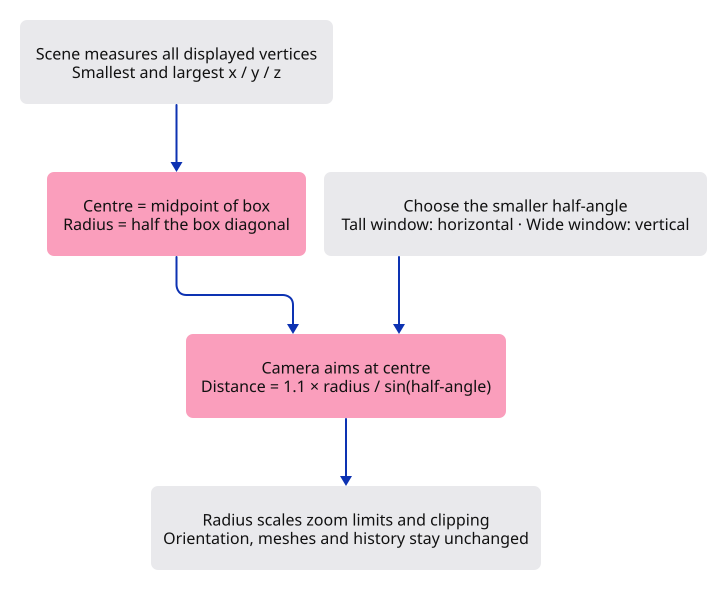
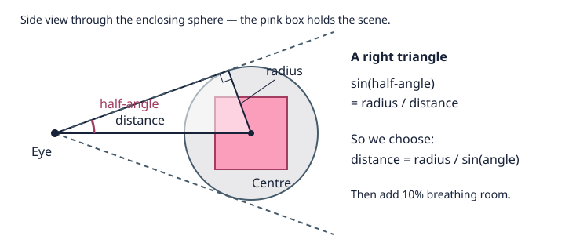

# 24 · Find the whole scene

**Typing: 53–105 minutes.** [Estimate](typing-load.md).

**Splitting required:** this verified checkpoint exceeds the one-hour typing target. Smaller runnable lessons are still being prepared.

Make `Fit` show a scene even when its geometry is far from the origin. Scene measures vertex bounds; Camera fits them; Editor connects the two. Renderer uses the resulting matrix unchanged.

Enclose the bounds box in a sphere. Fit that sphere through the smaller horizontal or vertical half-angle, so portrait windows work too. The radius and half-angle determine viewing distance.

## Type

Continue from [Keep the document behind the picture](23-import.md). [Save or recover your work](recovery.md).

### 1. `src/bounds.rs`

Store coordinate minima/maxima; compute the centre and enclosing-sphere radius from them.

Create the file and type:

```rust
--8<-- "journey/code/24-fit-01.rs"
```

### 2. `src/scene.rs`

Accumulate displayed vertices into f64 bounds; return None for an empty scene.

<details>
<summary>Locate the existing block</summary>

```rust
    pub fn objects(&self) -> &[Object] {
```

</details>

Replace that block with:

```rust
--8<-- "journey/code/24-fit-03.rs"
```

### 3. `src/camera.rs`

Keep the fitted scene scale with the camera. Distance says where the eye is; radius says how large the scene is.

<details>
<summary>Locate the existing block</summary>

```rust
    pub distance: f64,
```

</details>

Replace that block with:

```rust
--8<-- "journey/code/24-fit-04.rs"
```

### 4. `src/camera.rs`

The original small demonstration scene starts with a one-unit radius. Fit will measure the real bounds.

<details>
<summary>Locate the existing block</summary>

```rust
            distance: 3.0,
```

</details>

Replace that block with:

```rust
--8<-- "journey/code/24-fit-05.rs"
```

### 5. `src/camera.rs`

Fit the enclosing sphere through the smaller half-angle: distance = radius × 1.1 / sin(angle).

<details>
<summary>Locate the existing block</summary>

```rust
    pub fn pan(&mut self, dx: f32, dy: f32) {
```

</details>

Replace that block with:

```rust
--8<-- "journey/code/24-fit-06.rs"
```

### 6. `src/camera.rs`

Scale zoom limits with scene radius to prevent a jump after fitting a large model.

<details>
<summary>Locate the existing block</summary>

```rust
            self.distance = (self.distance / factor as f64).clamp(0.2, 50.0);
```

</details>

Replace that block with:

```rust
--8<-- "journey/code/24-fit-07.rs"
```

### 7. `src/camera.rs`

Scale near and far clipping planes with camera distance and scene radius.

<details>
<summary>Locate the existing block</summary>

```rust
        let projection = Xform::perspective(60.0_f64.to_radians(), self.aspect, 0.01, 100.0);
```

</details>

Replace that block with:

```rust
--8<-- "journey/code/24-fit-08.rs"
```

### 8. `src/editor.rs`

Fit is an explicit action, like Isometric. Import still changes the document; Fit only changes how you look at it.

<details>
<summary>Locate the existing block</summary>

```rust
    ResetView,
```

</details>

Replace that block with:

```rust
--8<-- "journey/code/24-fit-09.rs"
```

### 9. `src/editor.rs`

Fit only when scene bounds exist; preserve document history and mesh uploads.

<details>
<summary>Locate the existing block</summary>

```rust
                    Action::Isometric => self.camera.isometric(),
```

</details>

Replace that block with:

```rust
--8<-- "journey/code/24-fit-10.rs"
```

### 10. `src/fit_tests.rs`

Check projected corners, preserved selection, undoable import, and empty or single-point scenes.

Create the file and type:

```rust
--8<-- "journey/code/24-fit-13.rs"
```

### 11. `src/lib.rs`

Register the bounds module beside Camera.

<details>
<summary>Locate the existing block</summary>

```rust
pub mod background;
pub mod camera;
pub mod mesh;
pub mod scene;
pub mod picking;
```

</details>

Replace that block with:

```rust
--8<-- "journey/code/24-fit-fullscreen-1.rs"
```

### 12. `src/lib.rs`

Register the native Fit tests.

<details>
<summary>Locate the existing block</summary>

```rust
#[cfg(test)]
mod document_tests;
#[cfg(test)]
mod navigation_tests;
#[cfg(test)]
mod gesture_tests;
```

</details>

Replace that block with:

```rust
--8<-- "journey/code/24-fit-fullscreen-2.rs"
```

### 13. `src/browser.rs`

Add Fit to the vocabulary.

<details>
<summary>Locate the existing block</summary>

```rust
            "Orbit Right",
            "Orbit Up",
            "View Isometric",
            "View Reset",
        ],
    );
```

</details>

Replace that block with:

```rust
--8<-- "journey/code/24-fit-window-1.rs"
```

### 14. `src/browser.rs`

Route Fit through the editor action.

<details>
<summary>Locate the existing block</summary>

```rust
                    "orbit right" => Action::Orbit(std::f64::consts::FRAC_PI_4, 0.0),
                    "orbit up" => Action::Orbit(0.0, std::f64::consts::FRAC_PI_6),
                    "view isometric" => Action::Isometric,
                    "view reset" => Action::ResetView,
                    _ => return,
                };
```

</details>

Replace that block with:

```rust
--8<-- "journey/code/24-fit-window-2.rs"
```

## Run and check

In your project:

```sh
cd workspace/journey
REGEN_PROTO=0 cargo build --lib --locked --target wasm32-unknown-unknown -j4
REGEN_PROTO=0 CARGO_BUILD_JOBS=4 trunk serve --port 8780
```

Open `http://127.0.0.1:8780/`. Keep an existing Trunk server running; saving rebuilds it.

Open `sample.pb` from lesson 23. Type `View Isometric`, `Pan Right`, then `Fit`. The whole scene returns with a margin and keeps its viewing direction.

**Verified checkpoint in Chrome.**


[Verification scope](release.md).

Run the state checks from your project folder:

```sh
REGEN_PROTO=0 cargo test --lib --locked -j4
```

<details>
<summary>Code explanation and diagram</summary>

This first sphere fit is predictable and testable. It leaves extra space around thin geometry. Later a tighter fit can project box corners without changing the command boundary.

Fit command → Editor → Scene bounds → Camera target, distance and clipping → existing Renderer.





Why does Fit need both the scene bounds and the window shape, but no new GPU mesh?

Scene walks the displayed vertices to find a box. Camera aims at its centre and backs away until the enclosing sphere fits the smaller view angle. The window aspect decides which angle is smaller. Radius also scales zoom limits and clipping. Only the camera uniform changes; object IDs, mesh buffers and history stay as they were.

Study estimate, including typing and experiments: 3–5 hours.

</details>

<details>
<summary>Optional experiment</summary>

Before running Fit, predict whether a tall window needs the eye farther away. Resize, fit and compare. Then temporarily change the 1.1 margin to 1.4: the scene should become smaller, not larger. Restore 1.1 when you finish.

</details>

<details>
<summary>Check and save your work</summary>

Restore experimental edits, then run from `session_viewer`:

```sh
npm --prefix ../session_tests run course -- check 24-fit
npm --prefix ../session_tests run course -- save 24-fit
```

Source comparison leaves your project untouched. [Save and recovery instructions](recovery.md).

</details>

<details>
<summary>Viewer coverage and verification</summary>

Production also measures scene bounds and keeps fitting out of document history. Its corner-based fit is tighter and adds units, selection-only bounds and orthographic views. This checkpoint fits all displayed meshes and assumes ordinary coordinates that f32 can represent accurately. Very large offsets with tiny details need a later coordinate-origin strategy; fitting alone cannot restore precision lost in mesh storage. Pan commands still move by a fixed world-unit amount.

The orange frame and both triangles are centred together after three pans and Fit scene. Chrome also checks that a second Fit leaves the drawing unchanged, that Fit recovers after another pan, and that the imported file remains one undoable action.

[Full validation scope](release.md).

</details>
