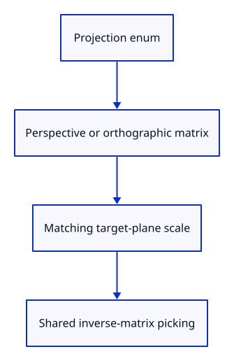

# 24a · Build perspective and orthographic camera matrices

**Typing: 26–51 minutes.** [Estimate](typing-load.md).

Add Projection to Camera and choose the matching matrix. Give orthographic projection the same target-plane half-height as perspective: distance × tan(30°).

## Type

Continue from [Run Fit through the command line](24-fit.md). [Save or recover your work](recovery.md).

### 1. `src/camera.rs`

Name the projection choices with an enum; derive copying and equality for this small value.

<details>
<summary>Locate the existing block</summary>

```rust
pub struct Ray {
```

</details>

Replace that block with:

```rust
--8<-- "journey/code/25-projection-01.rs"
```

### 2. `src/camera.rs`

Projection belongs to the view, alongside its orientation and size. It is not a property of an object.

<details>
<summary>Locate the existing block</summary>

```rust
    pub aspect: f64,
```

</details>

Replace that block with:

```rust
--8<-- "journey/code/25-projection-02.rs"
```

### 3. `src/camera.rs`

Start with the perspective view you already know. Reset view will restore this default too.

<details>
<summary>Locate the existing block</summary>

```rust
            aspect: 640.0 / 480.0,
```

</details>

Replace that block with:

```rust
--8<-- "journey/code/25-projection-03.rs"
```

### 4. `src/camera.rs`

Use the shared angle so fitting and drawing cannot quietly use different fields of view.

<details>
<summary>Locate the existing block</summary>

```rust
        let half_y = 30.0_f64.to_radians();
```

</details>

Replace that block with:

```rust
--8<-- "journey/code/25-projection-04.rs"
```

### 5. `src/camera.rs`

Choose the projection matrix; match orthographic size at the target plane and retain visible depth in 0–1.

<details>
<summary>Locate the existing block</summary>

```rust
        let projection = Xform::perspective(60.0_f64.to_radians(), self.aspect, near, far);
```

</details>

Replace that block with:

```rust
--8<-- "journey/code/25-projection-06.rs"
```

### 6. `src/projection_tests.rs`

Check target-plane scale, depth-independent size and parallel picking rays.

Create the file and type:

```rust
--8<-- "journey/code/24a-projection-tests.rs"
```

### 7. `src/lib.rs`

Register the new checks without changing the production browser entry point.

<details>
<summary>Locate the existing block</summary>

```rust
#[cfg(test)]
mod fit_tests;
#[cfg(test)]
mod navigation_tests;
#[cfg(test)]
mod gesture_tests;
```

</details>

Replace that block with:

```rust
--8<-- "journey/code/25-projection-fullscreen-1.rs"
```

## Run and check

In your project:

```sh
cd workspace/journey
REGEN_PROTO=0 cargo build --lib --locked --target wasm32-unknown-unknown -j4
REGEN_PROTO=0 CARGO_BUILD_JOBS=4 trunk serve --port 8780
```

Open `http://127.0.0.1:8780/`. Keep an existing Trunk server running; saving rebuilds it.

Run the state checks. Switching preserves target-plane scale; orthographic size ignores depth and its pick rays are parallel.

**Verified checkpoint in Chrome.**


[Verification scope](release.md).

Run the state checks on your computer from your project folder:

```sh
REGEN_PROTO=0 cargo test --lib --locked --target host-tuple -j4
```

<details>
<summary>Code explanation and diagram</summary>

Projection is a small Copy enum. Inverse-matrix picking remains shared: perspective rays spread out, while orthographic rays have separate origins and parallel directions.

Projection enum → camera matrix → drawing and inverse-matrix rays.



Why can one picking method support both projections?

It inverts the selected camera matrix. The resulting near and far points define the correct ray for that matrix.

Study estimate, including typing and experiments: 0.75–1.25 hours.

</details>

<details>
<summary>Optional experiment</summary>

Compare the native depth test in both modes and predict which point becomes larger in perspective.

</details>

<details>
<summary>Check and save your work</summary>

Restore experimental edits, then run from `session_viewer`:

```sh
npm --prefix ../session_tests run course -- check 24a-projection
npm --prefix ../session_tests run course -- save 24a-projection
```

Source comparison leaves your project untouched. [Save and recovery instructions](recovery.md).

</details>

<details>
<summary>Viewer coverage and verification</summary>

Drawing and picking consume the same selected camera matrix. Later lessons add tighter fitting, named views and reversed depth without putting view choices into document history.

Native checks establish projection scale and ray geometry; GPU readback draws orthographic geometry. Chrome retains the existing perspective Fit command route until mode commands are connected.

[Full validation scope](release.md).

</details>
